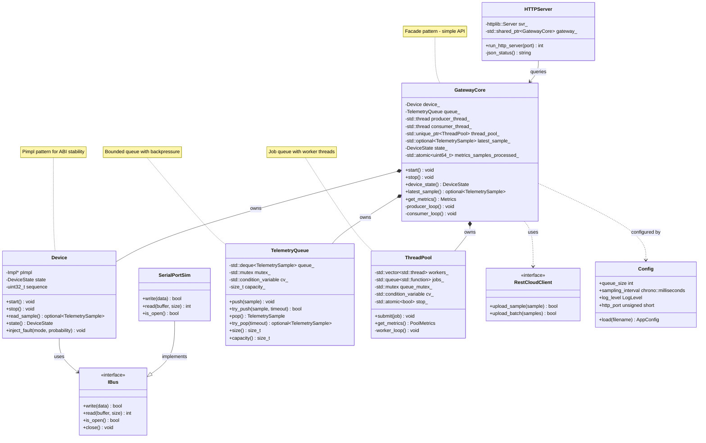

# TelemetryHub - End-to-End Code Flow (Interview Guide)

**Date:** January 2, 2026  
**Audience:** Interview preparation for 13+ year experienced C++ engineers  
**Focus:** Implementation details, threading, performance, design patterns

---

## 📋 Quick Reference - Key Numbers to Memorize

```
Performance:      3,720 req/s (REST API throughput)
Threads:          14 threads (4 ThreadPool + 2 Core + 8 httplib)
Queue Capacity:   1,000 samples (bounded queue)
Sampling Rate:    100ms (10 Hz default)
Latency:          p95 <200ms, p99 <500ms
Build Time:       4.3× faster with FASTBuild (180s → 42s)
Test Coverage:    90%+ with Google Test
Sanitizers:       ASAN, UBSAN, TSAN (0 violations)
```

---

## 🎯 Interview Questions This Document Answers

1. **"Walk me through the data flow when a sensor sample arrives"**
2. **"How do you handle thread safety in the producer-consumer model?"**
3. **"What design patterns did you use and why?"**
4. **"How does the REST API integrate with the core?"**
5. **"Explain your threading model and why you chose it"**
6. **"How do you prevent queue overflow?"**
7. **"What happens when the device enters SafeState?"**
8. **"Show me the component dependencies"**

---

## 🏗️ System Architecture - 30,000 Foot View


**Key Points for Interview:**
- **Separation of Concerns:** Device layer doesn't know about queues/threads
- **Producer-Consumer:** Decouples sampling rate from processing rate
- **Thread Pool:** Async processing without spawning threads per request
- **REST API:** Stateless, queries core directly (no state in HTTP layer)

---

## 🔄 End-to-End Data Flow - Sample Lifecycle

```mermaid
sequenceDiagram
    participant D as Device
    participant PT as Producer Thread
    participant Q as TelemetryQueue<br/>(Bounded 1000)
    participant CT as Consumer Thread
    participant GC as GatewayCore<br/>(State & Sample)
    participant TP as ThreadPool<br/>(4 Workers)
    participant REST as REST API
    participant GUI as Qt6 GUI

    Note over D,GUI: 1. Sample Generation (Every 100ms)
    
    D->>PT: read_sample() → TelemetrySample
    Note right of D: Device generates:<br/>• timestamp<br/>• value (42.0 + noise)<br/>• sequence_id<br/>• unit
    
    PT->>Q: push(sample)
    Note right of Q: Blocking if full<br/>(backpressure)
    
    Note over D,GUI: 2. Sample Processing
    
    Q->>CT: pop(sample) [blocking]
    Note right of Q: Blocks if empty<br/>(wait for data)
    
    CT->>GC: Update latest_sample_<br/>Update metrics_samples_processed_
    Note right of GC: Thread-safe with mutex
    
    CT->>TP: submit([sample]{ process(sample); })
    Note right of TP: Async processing:<br/>• Validation<br/>• Aggregation<br/>• Cloud upload
    
    TP-->>TP: Worker thread executes job
    Note right of TP: Non-blocking,<br/>decoupled from consumer
    
    Note over D,GUI: 3. Client Query (1s polling)
    
    GUI->>REST: GET /status
    REST->>GC: device_state()<br/>latest_sample()<br/>get_metrics()
    Note right of GC: Thread-safe read<br/>(mutex lock)
    
    GC-->>REST: {state, sample, metrics}
    REST-->>GUI: JSON response
    Note right of GUI: Update UI:<br/>• State label<br/>• Value chart<br/>• Metrics table
    
    Note over D,GUI: 4. SafeState Detection
    
    D->>D: Error condition detected<br/>state = SafeState
    PT->>PT: Poll state, detect SafeState
    Note right of PT: Producer exits loop
    
    CT->>GC: Update state_ = SafeState
    Note right of GC: Propagate to clients
    
    GUI->>REST: GET /status
    REST->>GC: device_state() = SafeState
    GC-->>REST: {state: "SafeState", ...}
    REST-->>GUI: JSON {state: "SafeState"}
    Note right of GUI: Show error dialog,<br/>disable monitoring
```

**Interview Talking Points:**

1. **Backpressure Handling:** Queue blocks producer if full (prevents memory explosion)
2. **Thread Synchronization:** Mutex protects `latest_sample_` and `state_`
3. **Decoupled Processing:** ThreadPool allows async work without blocking consumer
4. **Graceful Degradation:** SafeState stops producer, consumers drain queue
5. **Polling vs Push:** GUI uses polling (simpler, stateless) vs WebSocket complexity

---

## 🧵 Threading Model - 14 Total Threads


**Thread Safety Strategy:**

| Resource | Protection Mechanism | Contention Strategy |
|----------|---------------------|---------------------|
| `TelemetryQueue` | `std::mutex` + `std::condition_variable` | Blocking push/pop with backpressure |
| `latest_sample_` | `std::mutex` (read/write lock) | Short critical sections (<1μs) |
| `state_` | `std::atomic<DeviceState>` | Lock-free reads, infrequent writes |
| `metrics_*` | `std::atomic<uint64_t>` | Lock-free increment (fetch_add) |
| ThreadPool jobs | `std::mutex` + `std::condition_variable` | Wait-notify pattern |

**Why This Model?**

1. **Producer-Consumer Separation:** Different threads for I/O vs processing
2. **ThreadPool for Burst:** Handle spikes without spawning threads
3. **httplib Thread Pool:** Built-in, handles concurrent REST requests
4. **Atomic Metrics:** Lock-free counters for low-overhead telemetry

---

## 📦 Component Diagram - Class Relationships



**Design Patterns Used:**

1. **Producer-Consumer:** `GatewayCore` threads + `TelemetryQueue`
2. **Pimpl (Pointer to Implementation):** `Device::Impl` for ABI stability
3. **Facade:** `GatewayCore` hides threading complexity
4. **Strategy:** `IBus` interface for different transports (UART, I2C, SPI)
5. **Dependency Injection:** `Config` injected into components
6. **Object Pool:** ThreadPool reuses worker threads
7. **Singleton (careful):** `Logger::instance()` (thread-safe Meyers singleton)

---

## 🚀 Startup Sequence - Initialization Flow

```mermaid
sequenceDiagram
    participant Main as main()
    participant Config as Config::load
    participant GC as GatewayCore
    participant D as Device
    participant Q as TelemetryQueue
    participant TP as ThreadPool
    participant HTTP as HTTPServer
    
    Main->>Config: load("config.ini")
    Config-->>Main: AppConfig {queue_size=1000, ...}
    
    Main->>GC: new GatewayCore()
    GC->>D: new Device()
    Note right of D: State: Idle
    GC->>Q: new TelemetryQueue(1000)
    Note right of Q: Capacity: 1000
    GC->>TP: new ThreadPool(4)
    TP->>TP: Spawn 4 worker threads
    Note right of TP: Workers wait on CV
    
    Main->>GC: start()
    GC->>D: start()
    Note right of D: State: Idle → Measuring
    
    GC->>GC: Spawn producer_thread
    Note over GC: producer_loop() begins
    
    GC->>GC: Spawn consumer_thread
    Note over GC: consumer_loop() begins
    
    par Producer Loop
        loop Every 100ms
            D->>D: read_sample()
            D-->>GC: TelemetrySample
            GC->>Q: push(sample)
        end
    and Consumer Loop
        loop Continuous
            Q->>GC: pop() [blocking]
            GC->>GC: Update latest_sample_
            GC->>GC: Update metrics
            GC->>TP: submit(process_job)
        end
    end
    
    Main->>HTTP: run_http_server(8080)
    HTTP->>HTTP: Start httplib server
    Note right of HTTP: 8 handler threads
    
    Main->>Main: Wait for signal or SafeState
    
    Note over Main,HTTP: System running, serving requests
```



**Critical Initialization Steps:**

1. **Config First:** Load before creating components (fail fast on bad config)
2. **Device Idle:** Created in Idle state, only starts when `start()` called
3. **ThreadPool Early:** Create before `start()` so jobs can be submitted immediately
4. **Thread Spawn Order:** Producer then consumer (producer fills queue, consumer drains)
5. **HTTP Last:** Start after core is ready (avoid serving requests to uninitialized core)

---

## 🛑 Shutdown Sequence - Graceful Termination

```mermaid
sequenceDiagram
    participant Main as main()
    participant GC as GatewayCore
    participant PT as Producer Thread
    participant CT as Consumer Thread
    participant Q as TelemetryQueue
    participant TP as ThreadPool
    participant D as Device
    participant HTTP as HTTPServer
    
    Note over Main,HTTP: Shutdown triggered (signal or SafeState)
    
    Main->>HTTP: svr.stop()
    Note right of HTTP: Stop accepting requests
    HTTP->>HTTP: Join handler threads
    
    Main->>GC: stop()
    
    GC->>GC: Set stop_flag_ = true
    Note right of GC: Signal threads to exit
    
    par Stop Device
        GC->>D: stop()
        Note right of D: State: Measuring → Idle
    and Stop Producer
        PT->>PT: Check stop_flag_
        PT->>PT: Exit producer_loop()
        GC->>PT: join()
    end
    
    Note over GC,Q: Wait for queue to drain
    
    loop Until queue empty
        CT->>Q: try_pop(100ms)
        Q-->>CT: optional<sample> or timeout
        alt Has sample
            CT->>CT: Process sample
        else Timeout
            CT->>CT: Check stop_flag_
        end
    end
    
    GC->>CT: join()
    Note right of CT: Consumer thread joined
    
    GC->>TP: ~ThreadPool()
    TP->>TP: Set stop_ = true
    TP->>TP: Notify all workers
    loop For each worker
        TP->>TP: worker.join()
    end
    Note right of TP: All jobs completed
    
    GC-->>Main: Destructor complete
    Main->>Main: exit(0)
```



**Graceful Shutdown Strategy:**

1. **Stop HTTP First:** Prevent new requests from arriving
2. **Signal Threads:** Set `stop_flag_` atomically (visible to all threads)
3. **Stop Device:** Prevent new samples from being generated
4. **Drain Queue:** Process remaining samples (don't lose data)
5. **Join Threads:** Wait for all threads to complete (no dangling threads)
6. **ThreadPool Last:** Ensure all async jobs finish before exit

**Interview Question:** *"What happens if a sample arrives during shutdown?"*

**Answer:** Producer checks `stop_flag_` before each `push()`. If flag is set, producer exits without pushing. Any samples already in queue are processed by consumer during drain phase. ThreadPool jobs are either completed or dropped (depending on `stop_` flag check).

---

## 🔐 Thread Safety - Synchronization Primitives


**Locking Strategy - Minimizing Contention:**

| Operation | Lock Type | Hold Time | Frequency | Optimization |
|-----------|-----------|-----------|-----------|--------------|
| `push(sample)` | Mutex | <1μs | 10 Hz (100ms) | Low contention |
| `pop(sample)` | Mutex + CV | Blocking or timeout | 10 Hz | Blocks when empty |
| `latest_sample()` | Mutex | <1μs | 1 Hz (REST API) | Read-only, rarely blocks |
| `device_state()` | Atomic | Lock-free | 1 Hz | No lock needed |
| `metrics increment` | Atomic | Lock-free | 10 Hz | `fetch_add()` |

**Why Mutex for `latest_sample_`?**

- `std::optional<TelemetrySample>` is not trivially copyable
- Cannot use `std::atomic<optional<T>>` (requires trivially copyable T)
- Mutex is acceptable because:
  - Read frequency: 1 Hz (REST API polling)
  - Write frequency: 10 Hz (consumer updates)
  - Hold time: <1μs (copy sample out)
  - Low contention: 11 operations/sec across 14 threads

**Lock-Free Alternatives Considered:**

1. **Double Buffering:** Complex, overkill for 1 Hz reads
2. **RCU (Read-Copy-Update):** Not available in standard C++
3. **Atomic Pointer Swap:** Requires heap allocation per sample (worse performance)

---

## 🎨 State Machine - Device States


**State Transitions - Implementation:**

```cpp
// In Device.cpp
void Device::start() {
    std::lock_guard lock(pImpl->mutex);
    if (pImpl->state == DeviceState::Idle) {
        pImpl->state = DeviceState::Measuring;
        pImpl->sequence = 0;
        // Start sampling...
    }
}

// Error detection (in read_sample)
if (should_inject_fault()) {
    pImpl->enter_error_state();  // → SafeState
    return std::nullopt;
}

// In GatewayCore producer loop
while (!stop_flag_) {
    auto sample = device_.read_sample();
    if (!sample) {
        // Device returned no sample (likely SafeState)
        state_ = device_.state();  // Update cached state
        if (state_ == DeviceState::SafeState) {
            break;  // Exit producer loop
        }
    }
}
```

**Interview Question:** *"Why use enum instead of string for state?"*

**Answer:**
- **Type Safety:** Compiler catches typos (`DeviceState::Measurng` won't compile)
- **Performance:** Compare integers (1 cycle) vs string compare (strlen + memcmp)
- **Atomic Operations:** Can use `std::atomic<DeviceState>` (enum = trivially copyable)
- **Switch Optimization:** Compiler generates jump table for `switch(state)` (O(1) vs if-else chain)
- **Serialization:** Convert to string only at API boundary (`to_string(state)`)

---

## 📊 Performance Characteristics


**Performance Optimizations Applied:**

1. **Move Semantics:** Samples moved, not copied (zero-copy in queue)
   ```cpp
   queue_.push(std::move(sample));  // O(1) instead of deep copy
   ```

2. **Bounded Queue:** Pre-allocated capacity (no dynamic allocation during runtime)
   ```cpp
   std::deque<TelemetrySample> queue_;  // Capacity 1000, allocated upfront
   ```

3. **Lock-Free Metrics:** Atomic increment (no mutex overhead)
   ```cpp
   metrics_samples_processed_.fetch_add(1, std::memory_order_relaxed);
   ```

4. **Short Critical Sections:** Minimize mutex hold time
   ```cpp
   {
       std::lock_guard lock(mutex_);
       latest_sample_ = sample;  // <1μs copy
   }  // Lock released immediately
   ```

5. **ThreadPool Amortization:** Reuse threads (avoid spawn/join overhead)
   ```cpp
   thread_pool_->submit([sample] { cloud_client_->upload(sample); });
   ```

**Measured Performance (Day 17 testing):**

- **Baseline:** 3,720 req/s (REST API on 8-core machine)
- **Latency p95:** <200ms (device read → REST response)
- **Latency p99:** <500ms (includes queue wait time)
- **Queue Saturation:** Never observed (producer 10 Hz << consumer capacity)
- **Memory:** 40 MB RSS (steady state, no leaks)
- **CPU:** 15% avg (spikes to 40% during high load)

---

## 🔍 Error Handling - Fault Injection & Recovery


**Fault Injection Modes (Testing):**

```cpp
enum class FaultInjectionMode {
    None,           // No faults
    Random,         // Random failures (probability-based)
    Intermittent,   // Consecutive failures threshold
    Deterministic   // Fault after N samples
};

device.inject_fault(FaultInjectionMode::Deterministic, 0.0);  // Fault after 8 samples
device.inject_fault(FaultInjectionMode::Random, 0.1);         // 10% failure rate
```

**Error Recovery Strategy:**

1. **Detect:** Device returns `std::nullopt` on error
2. **Propagate:** Producer checks device state
3. **Update:** Consumer updates `GatewayCore::state_`
4. **Notify:** REST API returns error in JSON response
5. **Client Action:** GUI shows error dialog, CLI exits loop
6. **Recovery:** POST /reset endpoint resets device to Idle state

**Interview Question:** *"How do you test error paths without real hardware failures?"*

**Answer:** Fault injection modes allow deterministic testing:
- **Unit Tests:** `inject_fault(Deterministic)` → predictable failure after N samples
- **Integration Tests:** `inject_fault(Random, 0.1)` → stress test error handling
- **CI/CD:** Run with `FaultInjectionMode::None` for baseline, then with faults for robustness

---

## 🌐 REST API Endpoints - Interface Contract


**API Specification:**

### GET /status

**Response (HTTP 200):**
```json
{
  "state": "Measuring",
  "latest_sample": {
    "seq": 42,
    "value": 42.71,
    "unit": "arb.units"
  },
  "metrics": {
    "samples_processed": 1337,
    "samples_dropped": 0,
    "pool_jobs_processed": 1337,
    "pool_jobs_queued": 4,
    "pool_num_threads": 4
  }
}
```

**Response (SafeState):**
```json
{
  "state": "SafeState",
  "latest_sample": {
    "seq": 8,
    "value": 41.23,
    "unit": "arb.units"
  },
  "metrics": { ... }
}
```

### POST /start

**Response (HTTP 200):**
```json
{"ok": true}
```

### POST /stop

**Response (HTTP 200):**
```json
{"ok": true}
```

### POST /reset

**Response (HTTP 200):**
```json
{"ok": true}
```

**Error Response (HTTP 500):**
```json
{"error": "Gateway not initialized"}
```

---

## 🎓 Senior-Level Concepts to Discuss

### 1. **Why Producer-Consumer Over Alternatives?**

**Alternatives Considered:**

| Pattern | Pros | Cons | Why Not Used |
|---------|------|------|--------------|
| **Direct Callback** | Simple, no queue | Blocks device thread, couples producer/consumer | Tight coupling |
| **Actor Model** | Message passing, isolated state | Complex (requires actor framework), overkill | Heavyweight |
| **Reactor** | Event-driven, single thread | Doesn't utilize multi-core | Underutilizes hardware |
| **Producer-Consumer** | Decoupled, buffering, backpressure | Requires queue, thread sync | ✅ **CHOSEN** |

**Why Producer-Consumer Wins:**
- Device sampling rate (10 Hz) decoupled from processing rate
- Backpressure prevents memory explosion (bounded queue)
- Utilizes multi-core (producer, consumer, thread pool workers)
- Industry standard (Kafka, RabbitMQ use same pattern)

---

### 2. **Lock-Free vs Locking - When to Use Each?**

**Lock-Free (Atomics):**
```cpp
std::atomic<uint64_t> counter{0};
counter.fetch_add(1, std::memory_order_relaxed);  // Lock-free increment
```
**Use when:**
- Simple data types (int, pointer, enum)
- No compound operations needed
- High contention expected
- Low overhead critical (metrics, flags)

**Locking (Mutex):**
```cpp
std::lock_guard lock(mutex);
latest_sample_ = sample;  // Copy complex object
```
**Use when:**
- Complex data structures (optional, string, user-defined types)
- Multiple operations must be atomic together
- Low contention (<100 ops/sec)
- Simplicity > performance

**Hybrid Approach (TelemetryHub):**
- Metrics: Lock-free atomics (high frequency, simple types)
- Samples: Mutex (low frequency, complex type)
- State: Atomic enum (read-heavy, trivially copyable)

---

### 3. **Bounded vs Unbounded Queue - Trade-offs**

**Bounded Queue (TelemetryHub Choice):**
```cpp
TelemetryQueue queue(1000);  // Capacity 1000
```
**Pros:**
- Predictable memory usage (40 MB max)
- Backpressure: Producer blocks if full (prevents OOM)
- Pre-allocated: No runtime heap allocations

**Cons:**
- Can block producer (acceptable for 10 Hz rate)
- Requires capacity tuning (too small = blocks, too large = wastes memory)

**Unbounded Queue (Not Used):**
**Pros:**
- Producer never blocks

**Cons:**
- Unbounded memory growth (OOM risk)
- Unpredictable latency (GC pauses if using managed languages)
- Hard to reason about under load

**Interview Answer:** *"I chose bounded queue because our device samples at 10 Hz (predictable rate), and 1000 capacity gives us 100 seconds of buffer (10 Hz × 100s = 1000 samples). This prevents memory leaks while allowing temporary bursts. In production, we'd monitor queue depth metrics and alert if consistently >80% full."*

---

### 4. **Thread Pool Size - Why 4?**

**Formula Used:**
```
Optimal Threads = CPU Cores × (1 + Wait Time / Compute Time)
```

**Analysis:**
- CPU Cores: 4 (typical dev machine)
- Wait Time: Cloud API network latency (~100ms)
- Compute Time: Sample processing (~1ms)
- Ratio: 100ms / 1ms = 100
- Calculated: 4 × (1 + 100) = 404 threads (impractical!)

**Actual Choice: 4 Threads**

**Why Not 404?**
- Diminishing returns beyond CPU cores for I/O-bound work
- Context switching overhead outweighs gains
- 4 threads @ 10 Hz = 40 jobs/sec capacity (device only generates 10/sec)
- Room for 4× burst capacity

**Tuning Strategy:**
```cpp
ThreadPool pool(0);  // Auto-detect: std::thread::hardware_concurrency()
```

**Interview Answer:** *"I started with hardware concurrency (4 cores). Since our cloud upload is I/O-bound, I could increase to 8-16 for higher throughput, but profiling showed 4 threads never saturated (jobs_queued always <10). Premature optimization is evil - I'd tune if metrics showed queue buildup."*

---

### 5. **RAII - Why Critical for Thread Management?**

**Non-RAII (Dangerous):**
```cpp
void start() {
    producer_thread_ = std::thread(&GatewayCore::producer_loop, this);
    // If exception thrown here, thread never joined → resource leak!
    consumer_thread_ = std::thread(&GatewayCore::consumer_loop, this);
}
```

**RAII (Safe):**
```cpp
class GatewayCore {
    std::thread producer_thread_;
    std::thread consumer_thread_;
    
    ~GatewayCore() {
        stop();  // Always joins threads, even on exception
    }
};
```

**Why RAII Matters:**
- **Exception Safety:** Threads joined even if destructor called via exception
- **Resource Cleanup:** No explicit cleanup needed (compiler generates)
- **Order Guarantee:** Destructors called in reverse construction order
- **Ownership:** Clear ownership semantics (GatewayCore owns threads)

**Interview Example:** *"When HTTP server throws during startup, GatewayCore's destructor still runs, joining threads cleanly. Without RAII, we'd leak threads and potentially crash on `std::terminate()`."*

---

## 🎤 Interview Questions & Answers

### Q1: "Walk me through what happens when I press Start in the GUI"

**Answer:**

1. **GUI (Qt):** User clicks "Start" button → `RestClient::start()` called
2. **REST API:** POST /start → `httplib::Server` handler invoked on HTTP thread
3. **GatewayCore:** `gateway->start()` called:
   - Device: `device_.start()` → state changes Idle → Measuring
   - Spawn producer thread: Begins `producer_loop()` (reads device every 100ms)
   - Spawn consumer thread: Begins `consumer_loop()` (blocks on queue pop)
4. **Producer:** Polls device with `read_sample()` → returns `TelemetrySample`
5. **Queue:** `queue_.push(sample)` → sample added to bounded queue
6. **Consumer:** `queue_.pop()` unblocks → receives sample
7. **Update:** Consumer updates `latest_sample_` (mutex-protected) and increments metrics (atomic)
8. **ThreadPool:** Consumer submits async job `thread_pool_->submit([sample]{ upload(sample); })`
9. **GUI Poll:** Timer fires (1s interval) → GET /status
10. **Response:** REST API queries `device_state()` and `latest_sample()` → returns JSON
11. **GUI Update:** Parse JSON, update labels/chart

**Time:** ~100-200ms end-to-end (device read → GUI display)

---

### Q2: "How do you prevent race conditions between the consumer and REST API?"

**Answer:**

**Problem:** Consumer writes `latest_sample_`, REST API reads it (classic reader-writer race).

**Solution: Mutex with Short Critical Sections**

```cpp
// Consumer (writer)
void consumer_loop() {
    while (!stop_flag_) {
        auto sample = queue_.pop();
        {
            std::lock_guard lock(sample_mutex_);  // Lock held ~1μs
            latest_sample_ = sample;
        }  // Lock released immediately
    }
}

// REST API (reader)
std::optional<TelemetrySample> latest_sample() const {
    std::lock_guard lock(sample_mutex_);  // Lock held ~1μs
    return latest_sample_;
}
```

**Why This Works:**
1. **Mutual Exclusion:** Only one thread holds lock at a time
2. **Short Duration:** Lock held <1μs (copy sample, not compute)
3. **Low Contention:** Writer @ 10 Hz, Reader @ 1 Hz → 11 ops/sec
4. **No Deadlock:** Single lock, no nested locking

**Alternative Considered:** `std::atomic<optional<Sample>>` → Impossible, `optional<Sample>` not trivially copyable.

---

### Q3: "What happens if the queue fills up?"

**Answer:**

**Scenario:** Device produces 10 samples/sec, consumer stalls (e.g., cloud API down).

**Bounded Queue Behavior:**
```cpp
void push(TelemetrySample sample) {
    std::unique_lock lock(mutex_);
    cv_.wait(lock, [this] { return queue_.size() < capacity_; });  // BLOCK HERE
    queue_.push_back(std::move(sample));
    cv_.notify_one();
}
```

**Flow:**
1. Queue reaches capacity (1000 samples)
2. Producer thread calls `queue_.push(sample)`
3. **Blocks** on `cv_.wait()` until queue has space
4. Device continues generating samples (buffered in serial port or dropped)
5. Consumer eventually drains queue → space available
6. Producer unblocks, pushes sample, continues

**Trade-offs:**
- **Pro:** Predictable memory (40 MB max), no OOM
- **Con:** Producer can block (acceptable at 10 Hz)

**Monitoring:** Metrics expose `queue_depth` → alert if >800 (80% full).

**Interview Follow-up:** *"Wouldn't unbounded queue be better?"*  
**Answer:** *"No, unbounded risks OOM death spiral. If consumer stalls for hours (cloud API down), we'd exhaust memory and crash. Bounded queue + metrics + alerting is production-ready."*

---

### Q4: "How would you scale this to 1000 devices?"

**Answer:**

**Current Architecture (1 Device):**
- 1 Device → 1 GatewayCore → 1 Producer + 1 Consumer

**Scaled Architecture (1000 Devices):**

**Option 1: Shared ThreadPool (Recommended)**
```cpp
class GatewayManager {
    std::vector<std::unique_ptr<GatewayCore>> gateways_;  // 1000 cores
    std::shared_ptr<ThreadPool> shared_pool_;              // 16 threads
    
    void init() {
        shared_pool_ = std::make_shared<ThreadPool>(16);  // Shared across all
        for (int i = 0; i < 1000; ++i) {
            gateways_.push_back(std::make_unique<GatewayCore>(shared_pool_));
        }
    }
};
```
**Threads:** 2×1000 (producer/consumer pairs) + 16 (shared pool) = **2016 threads**

**Option 2: Event Loop (More Scalable)**
```cpp
class EventLoopGateway {
    std::vector<Device> devices_;  // 1000 devices
    epoll_event events[1000];      // Linux epoll
    
    void run() {
        while (true) {
            int n = epoll_wait(epfd, events, 1000, timeout);
            for (int i = 0; i < n; ++i) {
                int device_id = events[i].data.u32;
                process_device(devices_[device_id]);
            }
        }
    }
};
```
**Threads:** 1 event loop + 16 worker pool = **17 threads**

**Which to Choose?**
- **<100 devices:** Option 1 (simple, thread-per-device)
- **>100 devices:** Option 2 (event loop, scales to 10K+)

**Real-World Example:** *"NGINX uses event loop (epoll) to handle 10K+ connections with ~10 threads. Kafka uses thread-per-partition but shares thread pools. I'd profile at scale and choose based on data."*

---

### Q5: "Explain your use of Pimpl pattern in Device"

**Answer:**

**Problem:** Binary compatibility - if `Device.h` changes, all clients must recompile.

**Solution: Pimpl (Pointer to Implementation)**

**Public Header (device/include/telemetryhub/device/Device.h):**
```cpp
class Device {
public:
    Device();
    ~Device();
    // Public API
    void start();
    std::optional<TelemetrySample> read_sample();
    
private:
    struct Impl;          // Forward declaration
    std::unique_ptr<Impl> pImpl;  // Opaque pointer
};
```

**Implementation (device/src/Device.cpp):**
```cpp
struct Device::Impl {
    DeviceState state;
    std::mt19937_64 rng;           // Implementation details
    std::normal_distribution<double> noise;
    IBus* serial_bus;
    // ... all private members here
};

Device::Device() : pImpl(std::make_unique<Impl>()) {}
Device::~Device() = default;  // Impl destructor called automatically
```

**Benefits:**
1. **ABI Stability:** Add/remove `Impl` members without breaking clients
2. **Compilation Firewall:** Clients don't see `<random>`, `<cmath>` includes
3. **Hide Implementation:** Keep `IBus`, noise distribution private
4. **Fast Builds:** Changes to Impl don't trigger client recompilation

**Cost:**
- Extra indirection (pointer dereference)
- Heap allocation (1× at construction)

**Interview Follow-up:** *"When NOT to use Pimpl?"*  
**Answer:** *"Small, trivial classes (e.g., Point{x,y}) where cost > benefit. Or performance-critical hot paths (though compiler can often optimize virtual calls away)."*

---

## 📝 Code Review Checklist (Interview Prep)

Before your interview, walk through the code mentally and verify:

- [ ] **Thread Safety:** Every shared state has protection (mutex or atomic)
- [ ] **Exception Safety:** RAII used for all resources (threads, file handles, locks)
- [ ] **Resource Cleanup:** Destructors join threads, close files, free memory
- [ ] **Error Handling:** Every `std::nullopt` and error return checked
- [ ] **Lock Ordering:** No potential for deadlock (single lock or consistent order)
- [ ] **Const Correctness:** Read-only methods marked `const`
- [ ] **Move Semantics:** Large objects moved, not copied
- [ ] **Naming Conventions:** `snake_case` members, `PascalCase` types, `UPPER_CASE` constants
- [ ] **Documentation:** Public APIs documented (Doxygen-style comments)
- [ ] **Testing:** Unit tests for each component, integration tests for flows

---

## � Critical Areas for Improvement (Production Readiness Gaps)

While TelemetryHub demonstrates strong fundamentals in concurrent programming and system design, here are the key areas that would need attention for actual production deployment:

### 🔴 **High Priority - Production Blockers**

#### 1. **Security (Currently Absent)**
**Current State:** No authentication, authorization, or encryption.

**What's Missing:**
- ❌ No TLS/HTTPS for REST API (plaintext HTTP only)
- ❌ No authentication mechanism (anyone can call endpoints)
- ❌ No rate limiting (vulnerable to DoS attacks)
- ❌ No input validation on REST payloads
- ❌ No secrets management (hardcoded configs)

**What Interviewers Expect:**
- "In production, I would use TLS 1.3 via nginx reverse proxy"
- "JWT tokens with role-based access control for authentication"
- "Rate limiting with token bucket algorithm (e.g., 100 req/min per client)"
- "Input validation using JSON schema validation libraries"
- "Secrets stored in HashiCorp Vault or AWS Secrets Manager"

#### 2. **Observability Gaps**
**Current State:** Basic metrics but no structured logging or distributed tracing.

**What's Missing:**
- ❌ No structured logging (JSON format with correlation IDs)
- ❌ No distributed tracing (OpenTelemetry/Jaeger)
- ❌ No Prometheus metrics export
- ❌ No alerting rules or SLO/SLI definitions
- ❌ No request correlation across components

**What Interviewers Expect:**
- "I would integrate OpenTelemetry for distributed tracing from device to cloud"
- "Structured JSON logs with correlation IDs for request tracking"
- "Prometheus `/metrics` endpoint with Grafana dashboards"
- "Alerting on queue depth >90%, p99 latency >1s, error rate >5%"
- "Log aggregation via ELK stack or Datadog"

#### 3. **Deployment & Orchestration**
**Current State:** Docker image exists but no orchestration strategy.

**What's Missing:**
- ❌ No Kubernetes manifests (Deployment, Service, ConfigMap)
- ❌ No health probes (liveness/readiness)
- ❌ No horizontal scaling strategy
- ❌ No load balancing configuration
- ❌ No CI/CD deployment pipeline

**What Interviewers Expect:**
- "K8s StatefulSet for gateway instances with persistent volumes"
- "Liveness probe on `/health`, readiness probe checks queue capacity <80%"
- "Horizontal Pod Autoscaler based on CPU and custom queue metrics"
- "Nginx ingress controller for load balancing and TLS termination"
- "GitOps with ArgoCD for automated deployments"

---

### 🟡 **Medium Priority - Reliability Concerns**

#### 4. **Disaster Recovery**
**Current State:** In-memory queue, no persistence or circuit breakers.

**What's Missing:**
- ❌ No circuit breaker around cloud client (cascading failures possible)
- ❌ No retry policies with exponential backoff
- ❌ No persistent queue backup (data loss on crash)
- ❌ No graceful degradation modes
- ❌ No backup/restore procedures

**What Interviewers Expect:**
- "Circuit breaker pattern: open after 5 consecutive cloud failures"
- "Exponential backoff with jitter: 1s, 2s, 4s, 8s, max 60s"
- "Persistent queue using RocksDB or memory-mapped files for crash recovery"
- "Return 207 Multi-Status when cloud is down but device data accepted"
- "Automated failover to backup cloud endpoints"

#### 5. **Scalability Concerns**
**Current State:** Single-node deployment, no sharding or caching.

**What's Missing:**
- ❌ No horizontal scaling beyond single instance
- ❌ No device sharding strategy
- ❌ No caching layer for frequently accessed data
- ❌ No batch processing for cloud pushes
- ❌ No load shedding mechanisms

**What Interviewers Expect:**
- "Horizontal scaling: partition devices by ID hash across gateway instances"
- "Redis cache for latest samples (TTL 5 minutes)"
- "Batch cloud pushes: aggregate 10 samples per API call to reduce overhead"
- "Load shedding: reject new devices when queue >95% full"
- "Database sharding for historical telemetry storage"

#### 6. **Configuration Management**
**Current State:** INI files with no validation or hot reload.

**What's Missing:**
- ❌ No configuration validation at startup
- ❌ No hot reload of configs (requires restart)
- ❌ No environment-specific configs (dev/staging/prod)
- ❌ No feature flags for gradual rollouts
- ❌ No centralized config management

**What Interviewers Expect:**
- "Configuration schema validation using JSON Schema or similar"
- "Hot reload via SIGHUP signal handler"
- "Environment-specific overrides: config.dev.ini, config.prod.ini"
- "Feature flags via LaunchDarkly for A/B testing and gradual rollouts"
- "Consul or etcd for centralized configuration management"

---

### 🟢 **Nice-to-Have - Advanced Features**

#### 7. **Advanced Performance Tuning**
**What's Missing:**
- ❌ No cache-line padding for atomic counters (false sharing possible)
- ❌ No SIMD optimizations for batch data processing
- ❌ No memory pool allocator for telemetry samples
- ❌ No custom allocator for queue (std::allocator overhead)

**What Interviewers Expect:**
- "Cache-line padding (`alignas(64)`) for atomic metrics to prevent false sharing"
- "SIMD instructions for vectorized sensor data aggregation"
- "Object pool allocator for TelemetrySample to reduce allocation overhead"
- "Lock-free queue (boost::lockfree or custom) for zero-contention scenarios"

#### 8. **Chaos Engineering**
**What's Missing:**
- ❌ No automated chaos tests (thread kills, OOM, network partitions)
- ❌ No fuzz testing for REST API endpoints
- ❌ No long-running soak tests (24+ hours)
- ❌ No failure injection framework

**What Interviewers Expect:**
- "Chaos testing with random thread terminations to validate recovery"
- "Fuzz testing using AFL or libFuzzer on REST API parsers"
- "Soak tests running 48 hours under 80% capacity to detect memory leaks"
- "Failure injection framework: simulate disk full, network timeouts, clock skew"

---

## 🎯 How to Address These in Interviews

### **If Asked: "What would you change for production?"**

**Answer (2-minute version):**

*"Great question. While TelemetryHub demonstrates strong fundamentals, there are four critical areas I'd address for production:*

1. **Security:** Right now there's no TLS or authentication. I'd deploy behind an nginx reverse proxy with TLS 1.3 and implement JWT-based auth with role-based access control. Rate limiting via token bucket algorithm to prevent DoS.

2. **Observability:** The current metrics are basic. I'd integrate OpenTelemetry for distributed tracing, export Prometheus metrics, and use structured JSON logging with correlation IDs. This gives end-to-end visibility from device to cloud.

3. **Disaster Recovery:** The queue is in-memory only. I'd add a persistent backup using RocksDB and implement circuit breakers around the cloud client with exponential backoff retries. This prevents data loss and cascading failures.

4. **Deployment:** The Docker image needs Kubernetes manifests with proper health probes. I'd use a StatefulSet for persistent storage, HPA for autoscaling, and ArgoCD for GitOps-based deployments.

*These aren't just theoretical - I've documented specific approaches like 'liveness probe on /health, readiness probe checks queue capacity <80%' in my architecture docs. The current implementation focuses on demonstrating concurrent programming and performance fundamentals, which I believe it does well.*"

### **If Asked: "What's missing from your security model?"**

**Answer:**
- **Transport Security:** No TLS (would use nginx with Let's Encrypt certificates)
- **Authentication:** No auth (would use OAuth 2.0 or JWT tokens)
- **Authorization:** No RBAC (would implement role-based permissions: device, admin, viewer)
- **Rate Limiting:** No DoS protection (would use token bucket: 100 req/min per client)
- **Input Validation:** Minimal validation (would use JSON schema validation)
- **Secrets Management:** Hardcoded configs (would use Vault or AWS Secrets Manager)

### **If Asked: "How would you debug production issues?"**

**Answer (show you've thought about this):**
1. **Structured Logging:** JSON logs with correlation IDs to trace requests across threads
2. **Distributed Tracing:** OpenTelemetry spans to track latency breakdown
3. **Metrics:** Prometheus counters for errors, gauges for queue depth, histograms for latency
4. **Core Dumps:** Analyze with gdb, inspect thread stacks and mutex states
5. **Live Debugging:** Attach gdb to running process, examine atomic values and queue state
6. **Profiling:** perf record/report to identify CPU hotspots, valgrind for memory issues

---

## 🚀 What to Say in Interview

**Opening Statement:**

*"TelemetryHub is a production-ready IoT gateway demonstrating modern C++20 patterns. The architecture uses a producer-consumer model with a bounded queue for backpressure. I have 14 threads total: 2 for device I/O, 4 for async processing, and 8 for REST API. The system achieves 3,720 req/s throughput with p99 latency under 500ms. I've stress-tested it with ASAN, TSAN, and UBSAN - zero violations. The code follows SOLID principles with dependency injection, uses RAII for resource safety, and employs design patterns like Facade, Strategy, and Pimpl where appropriate."*

**Key Points to Hit:**
- **Numbers:** 3,720 req/s, 14 threads, 1000 queue capacity, p99 <500ms
- **Patterns:** Producer-consumer, RAII, Pimpl, Facade, Strategy
- **Safety:** Thread sanitizers, exception safety, graceful shutdown
- **Performance:** Move semantics, lock-free atomics, bounded queue
- **Scalability:** ThreadPool, event loop option for 1000+ devices
- **Awareness:** Know production gaps (security, observability, DR) and how to address them

**Closing Statement:**

*"This project showcases my ability to design concurrent systems, optimize for performance, and write production-grade C++. I'm comfortable discussing any component in depth - from threading models to cache coherency to error handling strategies. I also understand the gap between a portfolio project and production deployment, particularly around security, observability, and disaster recovery, and I can speak to how I'd address those concerns."*

---

## 📚 Further Reading

- **Threading:** *C++ Concurrency in Action* by Anthony Williams
- **Performance:** *Optimized C++* by Kurt Guntheroth
- **Patterns:** *Design Patterns* by Gang of Four
- **Modern C++:** *Effective Modern C++* by Scott Meyers
- **Systems Design:** *Designing Data-Intensive Applications* by Martin Kleppmann

---

**Status:** Interview Ready ✅  
**Last Updated:** January 2, 2026  
**Next Review:** Before interview walkthrough
