# TelemetryHub - Component Interactions & Design Patterns

**Date:** January 2, 2026  
**Purpose:** Deep dive into component relationships, design patterns, and interaction flows  
**Audience:** Interview preparation - system design discussion

---

## 🎯 Component Interaction Matrix

| Component | Depends On | Used By | Pattern | Thread Safety |
|-----------|-----------|---------|---------|---------------|
| **Device** | IBus, DeviceUtils | GatewayCore (producer thread) | Pimpl, Strategy | Internal mutex |
| **IBus** | None (interface) | Device | Strategy (interface) | N/A |
| **SerialPortSim** | IBus (inherits) | Device | Strategy (impl) | Not thread-safe (single writer) |
| **TelemetryQueue** | None | GatewayCore (producer & consumer) | Producer-Consumer | Mutex + CV |
| **GatewayCore** | Device, Queue, ThreadPool | REST API, CLI | Facade | Mutex (sample), Atomic (state, metrics) |
| **ThreadPool** | None | GatewayCore (consumer thread) | Object Pool | Mutex + CV |
| **RestCloudClient** | ICloudClient | ThreadPool jobs | Strategy (interface) | Thread-safe (httplib) |
| **HTTPServer** | GatewayCore | Qt GUI, external clients | N/A | Thread-safe (httplib pool) |
| **Config** | None | main(), GatewayCore | Dependency Injection | Immutable after load |
| **Logger** | None | All components | Singleton (Meyers) | Thread-safe (mutex) |

---

## 🔄 Interaction Diagrams by Scenario

### Scenario 1: Happy Path - Normal Sampling

```mermaid
sequenceDiagram
    autonumber
    participant Main
    participant GC as GatewayCore
    participant PT as Producer Thread
    participant D as Device
    participant Q as Queue
    participant CT as Consumer Thread
    participant TP as ThreadPool
    participant HTTP as REST API
    
    Note over Main,HTTP: System Startup
    Main->>GC: new GatewayCore()
    GC->>D: new Device()
    GC->>Q: new Queue(1000)
    GC->>TP: new ThreadPool(4)
    
    Main->>GC: start()
    GC->>D: start()
    Note right of D: State: Idle → Measuring
    GC->>GC: Spawn producer_thread
    GC->>GC: Spawn consumer_thread
    
    Note over Main,HTTP: Normal Operation (Every 100ms)
    loop Every 100ms
        PT->>D: read_sample()
        D-->>PT: TelemetrySample {seq, value, timestamp}
        PT->>Q: push(sample) [may block if full]
        Note right of Q: queue size: 0 → 1
    end
    
    loop Continuous
        Q->>CT: pop() [blocks if empty]
        Note right of Q: queue size: 1 → 0
        CT->>GC: Update latest_sample_ (mutex lock)
        CT->>GC: metrics_samples_processed_.fetch_add(1)
        CT->>TP: submit([sample] { upload_to_cloud(sample); })
        Note right of TP: Job queued, worker will execute
    end
    
    Note over Main,HTTP: Client Query (1s interval)
    HTTP->>GC: device_state()
    GC-->>HTTP: DeviceState::Measuring (atomic read)
    HTTP->>GC: latest_sample()
    Note right of GC: Lock sample_mutex_ (~1μs)
    GC-->>HTTP: optional<TelemetrySample>
    HTTP->>GC: get_metrics()
    GC-->>HTTP: {samples_processed, queue_depth, ...}
    HTTP-->>HTTP: Build JSON response
```

**Key Interactions:**
1. **Main → GatewayCore:** One-time initialization, RAII ownership
2. **Producer → Device:** Polling interface, returns `optional` (can be empty on error)
3. **Producer → Queue:** Blocking push with backpressure
4. **Queue → Consumer:** Blocking pop, wakes on condition variable
5. **Consumer → GatewayCore:** Short critical section for state update
6. **Consumer → ThreadPool:** Fire-and-forget async job
7. **REST API → GatewayCore:** Thread-safe query interface

---

### Scenario 2: Queue Full - Backpressure

```mermaid
sequenceDiagram
    participant PT as Producer Thread
    participant Q as Queue<br/>(size=1000/1000)
    participant CT as Consumer Thread<br/>(STALLED)
    participant Cloud as Cloud API<br/>(DOWN)
    
    Note over PT,Cloud: Queue is FULL (1000 samples)
    
    PT->>Q: push(sample)
    Note right of Q: Queue full, producer BLOCKS
    Q->>Q: cv_.wait(lock, []{size < capacity})
    Note right of Q: Thread sleeping on CV
    
    Note over PT,Cloud: Consumer Recovers
    
    Cloud->>Cloud: Network recovers
    CT->>Q: pop()
    Note right of Q: size: 1000 → 999
    Q->>Q: cv_.notify_one()
    Note right of Q: Wake blocked producer
    
    PT->>Q: push(sample) completes
    Note right of Q: size: 999 → 1000 again
    PT->>PT: Continue normal operation
```



**Design Decision Rationale:**

**Why block producer instead of dropping samples?**
- **Data Loss Prevention:** Every sample is valuable (e.g., critical sensor reading)
- **Bounded Memory:** Queue won't grow unbounded and OOM
- **Backpressure Signal:** Tells device to slow down (if hardware supports)
- **Graceful Degradation:** System slows but doesn't crash

**Alternative Considered:** Ring buffer (overwrite oldest)
- **Pros:** Producer never blocks
- **Cons:** Silent data loss, hard to debug

**Interview Answer:** *"I chose blocking over dropping because in IoT/telemetry, every sample can be critical (e.g., medical device, industrial safety). Bounded queue prevents OOM while blocking provides backpressure. We monitor `queue_depth` metrics and alert if consistently >80% full."*

---

### Scenario 3: SafeState Detection & Propagation


**Error Propagation Flow:**

1. **Detection:** Device internal check (hardware error, fault injection, timeout)
2. **Signaling:** Return `std::nullopt` from `read_sample()`
3. **Producer:** Polls state, detects `SafeState`, exits loop
4. **Core Update:** Atomic state write (lock-free, visible to all threads)
5. **Consumer:** Drains queue, then exits
6. **API:** Returns error in JSON (no special error channel needed)
7. **Client:** Polls REST API, detects error, shows UI notification

**Why Not Exceptions for Control Flow?**
- Exceptions are for **exceptional** situations, not normal control flow
- SafeState is **expected** condition (designed failure mode)
- Performance: Exception unwinding is expensive
- Clarity: `optional<T>` makes error case explicit in return type

---

### Scenario 4: Concurrent REST API Requests


**Thread Contention Analysis:**

| Operation | Lock Type | Hold Time | Contention | Throughput Impact |
|-----------|-----------|-----------|------------|-------------------|
| `device_state()` | Atomic | 0 (lock-free) | None | Zero |
| `get_metrics()` | Atomic counters | 0 (lock-free) | None | Zero |
| `latest_sample()` | Mutex | <1μs | Low (1 Hz × N clients) | Minimal |

**Why Low Contention?**

1. **Read Frequency:** Clients poll at 1 Hz (humans can't perceive <100ms updates)
2. **Write Frequency:** Consumer updates at 10 Hz
3. **Total Operations:** (10 writes + N reads) per second
4. **Lock Hold Time:** <1μs (just copy sample struct)
5. **Throughput:** 3,720 req/s measured (8 HTTP threads × ~465 req/s/thread)

**Scalability Calculation:**
```
Lock Hold Time: 1μs
Operations/sec: 10 writes + 1000 reads = 1010 ops/sec
Total Lock Time: 1010 × 1μs = 1.01ms/sec = 0.1% CPU
```

**Conclusion:** Mutex is not a bottleneck until ~100,000 req/sec (far beyond current load).

---

## 🎨 Design Patterns Deep Dive

### Pattern 1: Producer-Consumer with Bounded Queue


**When to Use:**
- Decoupling producers from consumers (different rates)
- Buffering for burst traffic
- Backpressure mechanism

**TelemetryHub Application:**
- Producer: Device sampling (10 Hz)
- Consumer: Processing + cloud upload (variable rate)
- Capacity: 1000 samples (100 seconds buffer at 10 Hz)

---

### Pattern 2: Facade (GatewayCore)


**Benefits:**
1. **Simplicity:** Client sees 4 methods, not 100+ internal details
2. **Encapsulation:** Threading, queue, device internals hidden
3. **Testability:** Mock GatewayCore interface, not individual components
4. **Maintenance:** Change internals without breaking clients

**Interview Question:** *"Why not expose Device directly to REST API?"*

**Answer:** *"Tight coupling. If I change Device from simulator to real hardware (UART, I2C), REST API would break. Facade (GatewayCore) provides stability - internal changes don't ripple to clients. Also hides threading: REST API doesn't need to know about producer/consumer threads."*

---

### Pattern 3: Strategy (IBus Interface)


**Benefits:**
1. **Open/Closed Principle:** Add new bus types without modifying Device
2. **Testability:** Inject `MockBus` for unit tests (no real hardware needed)
3. **Runtime Selection:** Choose bus type from config file
4. **Hardware Abstraction:** Device doesn't know if it's talking to UART, I2C, or simulator

**Example Usage:**
```cpp
// Production
auto uart = std::make_unique<UARTBus>("/dev/ttyUSB0", 9600);
Device device(uart.get());

// Testing
auto mock = std::make_unique<MockBus>();
EXPECT_CALL(mock, read(_)).WillOnce(Return(42));
Device device(mock.get());
```

---

### Pattern 4: Pimpl (Device Implementation)


**Benefits:**

1. **ABI Stability:**
   ```cpp
   // Device.h (public header)
   class Device {
       struct Impl;  // Forward declaration only
       std::unique_ptr<Impl> pImpl;
   };
   
   // Device.cpp (implementation)
   struct Device::Impl {
       std::mt19937_64 rng;  // Can change without breaking clients
       // Add/remove members freely
   };
   ```

2. **Compilation Firewall:**
   - Client code doesn't see `#include <random>`, `#include <cmath>`
   - Reduces compilation dependencies
   - Faster builds (clients don't recompile when Impl changes)

3. **Hide Implementation Details:**
   - `std::mt19937_64`, `std::normal_distribution` not in public API
   - Internal state machine hidden
   - Only public interface visible

**Cost:**
- Extra indirection (pointer dereference) - usually <1% performance impact
- Heap allocation (1× at construction)

**When to Use:**
- Library code (ABI stability matters)
- Large classes (compilation time matters)
- Hide complex dependencies

**When NOT to Use:**
- Small, trivial classes (Point, Vector2D)
- Performance-critical hot paths (though compiler can inline)

---

### Pattern 5: Object Pool (ThreadPool)

```mermaid
sequenceDiagram
    participant Client
    participant Pool as ThreadPool
    participant W1 as Worker 1
    participant W2 as Worker 2
    participant W3 as Worker 3
    participant W4 as Worker 4
    
    Note over Pool,W4: Initialization (Spawn Threads)
    Pool->>W1: spawn worker_loop()
    Pool->>W2: spawn worker_loop()
    Pool->>W3: spawn worker_loop()
    Pool->>W4: spawn worker_loop()
    W1->>W1: Wait on CV (idle)
    W2->>W2: Wait on CV (idle)
    W3->>W3: Wait on CV (idle)
    W4->>W4: Wait on CV (idle)
    
    Note over Pool,W4: Submit Job
    Client->>Pool: submit([]{task1();})
    Pool->>Pool: jobs_.push(task1)
    Pool->>Pool: cv_.notify_one()
    W1->>W1: Wake up, pop job
    W1->>W1: Execute task1()
    
    Client->>Pool: submit([]{task2();})
    Pool->>Pool: jobs_.push(task2)
    Pool->>Pool: cv_.notify_one()
    W2->>W2: Wake up, pop job
    W2->>W2: Execute task2()
    
    W1->>W1: Task complete, back to idle
    W2->>W2: Task complete, back to idle
    
    Note over Pool,W4: Reuse: No thread spawn/join overhead
```

**Benefits:**
1. **Amortize Thread Cost:** Spawn 4 threads once, reuse forever
2. **Bounded Resources:** Limit concurrent work (prevent resource exhaustion)
3. **Predictable Performance:** No sudden thread creation spikes

**Alternative (Naive):**
```cpp
void process_sample(Sample s) {
    std::thread([s]{ upload_to_cloud(s); }).detach();  // BAD!
}
// Problems:
// - Unbounded threads (1000 samples = 1000 threads = OOM)
// - No control over concurrency
// - Thread creation overhead per sample (~100μs each)
```

**ThreadPool (Better):**
```cpp
ThreadPool pool(4);
void process_sample(Sample s) {
    pool.submit([s]{ upload_to_cloud(s); });  // GOOD!
}
// Benefits:
// - Max 4 concurrent uploads
// - Thread reuse (no creation overhead)
// - Backpressure if job queue fills
```

---

## 🔐 Synchronization Primitives Comparison

| Primitive | Use Case | Performance | Complexity | Example (TelemetryHub) |
|-----------|----------|-------------|------------|------------------------|
| **std::atomic** | Lock-free counters, flags | Fastest (lock-free) | Low | `metrics_samples_processed_`, `state_` |
| **std::mutex** | Protect complex data | Fast (<1μs lock hold) | Medium | `sample_mutex_` (protects `optional<Sample>`) |
| **std::condition_variable** | Wait/notify patterns | Good (thread sleep) | Medium | Queue `not_full_`, `not_empty_` |
| **std::shared_mutex** | Many readers, few writers | Varies (read-biased) | High | Not used (simple mutex sufficient) |
| **Spinlock** | Very short critical sections | Can be fastest | High | Not used (mutex adequate) |

**Decision Tree:**

```
Is the data trivially copyable (int, enum, pointer)?
├─ YES: Use std::atomic (lock-free)
└─ NO: Is hold time <10μs?
    ├─ YES: Use std::mutex
    └─ NO: Redesign to reduce critical section
```

**TelemetryHub Choices:**

1. **Metrics (atomic):**
   ```cpp
   std::atomic<uint64_t> metrics_samples_processed_;
   metrics_samples_processed_.fetch_add(1, std::memory_order_relaxed);
   ```
   - **Why:** Simple counter, trivially copyable, high frequency (10 Hz)

2. **Latest Sample (mutex):**
   ```cpp
   std::mutex sample_mutex_;
   std::optional<TelemetrySample> latest_sample_;
   
   {
       std::lock_guard lock(sample_mutex_);
       latest_sample_ = sample;  // Copy ~100 bytes
   }
   ```
   - **Why:** `optional<TelemetrySample>` not trivially copyable, low frequency (1 Hz reads)

3. **State (atomic enum):**
   ```cpp
   std::atomic<DeviceState> state_;
   state_.store(DeviceState::Measuring, std::memory_order_release);
   auto s = state_.load(std::memory_order_acquire);
   ```
   - **Why:** Enum is trivially copyable, read-heavy (1 Hz), write-rare (state changes)

---

## 💡 Common Interview Questions

### Q: "Why use condition variables instead of busy-wait?"

**Busy-Wait (Bad):**
```cpp
void consumer_loop() {
    while (!stop_flag_) {
        while (queue_.empty()) {
            // CPU spinning at 100%!
        }
        auto sample = queue_.pop();
        process(sample);
    }
}
```
**Problems:**
- **CPU Waste:** 100% CPU usage while waiting
- **Power:** Battery drain on embedded devices
- **Context Switching:** Other threads starved

**Condition Variable (Good):**
```cpp
void consumer_loop() {
    while (!stop_flag_) {
        std::unique_lock lock(mutex_);
        cv_.wait(lock, [this]{ return !queue_.empty() || stop_flag_; });
        // Thread sleeps here, 0% CPU
        if (!queue_.empty()) {
            auto sample = queue_.pop_front();
            lock.unlock();  // Release early
            process(sample);
        }
    }
}
```
**Benefits:**
- **0% CPU:** Thread sleeps, OS scheduler doesn't wake it
- **Instant Wake:** Producer calls `cv_.notify_one()` → consumer wakes immediately
- **Power Efficient:** Critical for battery-powered IoT devices

---

### Q: "How would you add a circuit breaker for cloud uploads?"

**Pattern:** Circuit Breaker (from Hystrix, Resilience4j)

**States:**
1. **Closed:** Normal operation, requests go through
2. **Open:** Failures exceeded threshold, requests fail-fast
3. **Half-Open:** After timeout, try one request to test recovery

**Implementation:**
```cpp
class CircuitBreaker {
    enum State { Closed, Open, HalfOpen };
    std::atomic<State> state_{Closed};
    std::atomic<int> failure_count_{0};
    std::chrono::steady_clock::time_point open_time_;
    
    const int threshold_ = 5;  // Open after 5 failures
    const std::chrono::seconds timeout_{30};  // Try again after 30s
    
public:
    bool can_execute() {
        auto now = std::chrono::steady_clock::now();
        auto s = state_.load();
        
        if (s == Open && (now - open_time_) > timeout_) {
            state_ = HalfOpen;  // Try recovery
            return true;
        }
        return s != Open;
    }
    
    void on_success() {
        failure_count_ = 0;
        state_ = Closed;
    }
    
    void on_failure() {
        if (++failure_count_ >= threshold_) {
            state_ = Open;
            open_time_ = std::chrono::steady_clock::now();
        }
    }
};

// Usage in ThreadPool job
circuit_breaker_.can_execute() ? cloud_upload(sample) : log_skip();
```

**Benefits:**
- **Fail Fast:** Don't waste time retrying when cloud is down
- **Recovery:** Automatically retry after timeout
- **Metrics:** Track open/closed time for monitoring

---

## 🎓 Summary - Key Takeaways

**Design Patterns:**
- Producer-Consumer: Decouple sampling from processing
- Facade: Simple API hides complexity
- Strategy: IBus interface for hardware abstraction
- Pimpl: ABI stability for Device
- Object Pool: ThreadPool for thread reuse

**Thread Safety:**
- Atomics: Lock-free for simple types (state, metrics)
- Mutex: Short critical sections for complex types (sample)
- Condition Variables: Wait/notify for queue coordination
- RAII: Guaranteed cleanup even with exceptions

**Performance:**
- Move Semantics: Zero-copy sample transfer
- Bounded Queue: Predictable memory, backpressure
- Lock-Free Reads: State and metrics
- Short Critical Sections: <1μs mutex hold time

**Scalability:**
- ThreadPool: Reuse threads, limit concurrency
- Event Loop: Future scaling to 1000+ devices
- Metrics: Monitor queue depth, alert on saturation

**Error Handling:**
- Optional: Explicit error returns (`std::optional<T>`)
- SafeState: Designed failure mode
- Graceful Shutdown: Drain queue, join threads
- Circuit Breaker: Fail-fast pattern for external dependencies

---

**Interview Ready?** ✅

You can now explain:
- Component interactions for any scenario
- Design pattern choices and alternatives
- Thread synchronization strategies
- Performance optimizations
- Scalability considerations
- Error handling approaches

**Next:** Practice whiteboarding these diagrams and explaining rationale! 🚀
