# Embedded Systems Skills in TelemetryHub - Interview Guide
**Bridging Embedded Background to Backend Development**

## Executive Summary

**Your Situation:** 13 years embedded experience (automotive, industrial) pivoting to C++ backend  
**Interview Challenge:** Demonstrate embedded skills are **transferable** to backend, not obsolete  
**This Document:** Maps embedded concepts in your TelemetryHub codebase to interview talking points

---

## Why This Matters (Interview Context)

**Interviewer's Fear:**
> "This candidate has 13 years of embedded (STM32, CAN bus, I²C), but we need backend (REST APIs, threading, Redis). Will they adapt?"

**Your Pitch:**
> "My embedded background is an **asset**, not a gap. Embedded taught me hardware constraints, real-time requirements, and resource optimization - all critical for high-performance backend. TelemetryHub demonstrates this transfer: I built a gateway with 3,720 req/s throughput using the same principles I used in automotive safety systems (bounded resources, fault tolerance, state machines)."

---

## Embedded Skills → Backend Skills Mapping

| Embedded Skill | Backend Equivalent | TelemetryHub Example |
|----------------|-------------------|----------------------|
| **I²C/SPI/UART** | Serial protocols, binary framing | SerialPortSim (UART simulation) |
| **State machines** | Device lifecycle, error handling | Device.cpp (Idle → Measuring → SafeState) |
| **Interrupt handling** | Async I/O, event-driven | QNetworkAccessManager (async HTTP) |
| **DMA transfers** | Zero-copy, move semantics | TelemetryQueue (move-only push) |
| **Hardware timers** | QTimer, std::chrono | MainWindow (1s polling timer) |
| **RTOS tasks** | std::thread, producer-consumer | GatewayCore (producer/consumer threads) |
| **Memory constraints** | Bounded queues, backpressure | TelemetryQueue (1000 capacity, drop-oldest) |
| **Watchdog timers** | Circuit breaker, health checks | set_failure_threshold() (SafeState after N errors) |
| **Bit manipulation** | Binary protocols, flags | SerialPortSim (byte-level I/O) |
| **Power management** | Resource pooling, sleep/wake | ThreadPool (cv_.wait() → ~0% CPU idle) |
| **Real-time constraints** | Latency budgets, profiling | 1.72ms p95 (validated with k6) |
| **Safety-critical** | Fault tolerance, fail-safe | Circuit breaker, bounded resources |

---

## Detailed Examples (Code Walkthrough for Interviews)

### 1. Serial Communication (UART Simulation)

**Embedded Background:**
- STM32 UART (RS-232, RS-485)
- I²C for sensor calibration
- CAN bus for automotive

**TelemetryHub Implementation:**

**File:** [`device/src/SerialPortSim.cpp`](../device/src/SerialPortSim.cpp)

```cpp
class SerialPortSim : public IBus {
public:
    bool write(const std::vector<std::uint8_t>& data) override;
    bool read(std::vector<std::uint8_t>& out, std::size_t max_len) override;
    
    void inject_command(const std::string& command);
    std::optional<std::string> get_response();
    
private:
    std::queue<std::uint8_t> input_buffer_;   // RX buffer
    std::queue<std::uint8_t> output_buffer_;  // TX buffer
    std::mutex mutex_;                        // Thread-safe
    static constexpr size_t MAX_BUFFER_SIZE = 4096;
};

bool SerialPortSim::write(const std::vector<std::uint8_t>& data) {
    std::lock_guard<std::mutex> lock(mutex_);
    
    // Buffer overflow check (like hardware FIFO)
    if (output_buffer_.size() + data.size() > MAX_BUFFER_SIZE) {
        return false;  // UART overrun error
    }
    
    for (auto byte : data) {
        output_buffer_.push(byte);
    }
    
    return true;
}

bool SerialPortSim::read(std::vector<std::uint8_t>& out, std::size_t max_len) {
    std::lock_guard<std::mutex> lock(mutex_);
    
    if (input_buffer_.empty()) {
        return false;  // No data available (like UART status register)
    }
    
    out.clear();
    std::size_t bytes_to_read = std::min(max_len, input_buffer_.size());
    
    for (std::size_t i = 0; i < bytes_to_read; ++i) {
        out.push_back(input_buffer_.front());
        input_buffer_.pop();
    }
    
    return true;
}
```

**Interview Talking Points:**

**Q: "You have UART experience. How does that apply to backend?"**

**A:**
> "In embedded, I worked with STM32 UART hardware - limited 256-byte FIFOs, interrupt-driven I/O, and strict timing. In TelemetryHub, I simulated this with `SerialPortSim`: fixed-size buffers (4096 bytes), thread-safe access with mutex, and the same `read()/write()` byte-oriented API. The principles are identical:
> 
> - **Buffer management** - Check for overflow before writing (like hardware FIFO full check)
> - **Byte-level I/O** - Work with `uint8_t` buffers, not strings
> - **Error handling** - Return false on overflow (like UART overrun flag)
> - **Thread safety** - Mutex protects buffers (like disabling interrupts)
> 
> This abstraction (IBus interface) means I could swap SerialPortSim for real Linux /dev/ttyUSB0 without changing Device.cpp. That's the same portability I practiced in embedded (HAL layers for different microcontrollers)."

---

### 2. State Machine (Safety-Critical Device Lifecycle)

**Embedded Background:**
- IEC 62443 safety states (Normal → Fault → SafeState)
- Automotive ASIL-D state machines
- Fail-safe transitions

**TelemetryHub Implementation:**

**File:** [`device/src/Device.cpp`](../device/src/Device.cpp)

```cpp


**Code Implementation:**

```cpp
enum class DeviceState {
    Idle,        // Initial state, not measuring
    Measuring,   // Normal operation
    Error,       // Recoverable error
    SafeState    // Safety state - requires reset
};

class Device {
public:
    DeviceState state() const { return impl_->state; }
    
    void start() {
        if (impl_->state != DeviceState::Idle) return;
        impl_->state = DeviceState::Measuring;
        impl_->reset_sequence();
    }
    
    void enter_safe_state() {
        impl_->state = DeviceState::SafeState;
        // Cannot auto-recover - requires explicit reset
    }
    
    bool reset() {
        // Only reset from SafeState/Error, not from Measuring
        if (impl_->state == DeviceState::Measuring) return false;
        
        impl_->state = DeviceState::Idle;
        impl_->reset_sequence();
        return true;
    }
};

// State transition logic (from producer_loop)
void GatewayCore::producer_loop() {
    while (running_) {
        auto state = device_.state();
        
        if (state != DeviceState::Measuring) {
            // Device not measuring - stop producing
            queue_.shutdown();
            break;
        }
        
        // Check for consecutive failures (circuit breaker)
        if (consecutive_read_failures_ > max_consecutive_failures_) {
            device_.enter_safe_state();  // Force SafeState
            break;
        }
        
        // Attempt read
        auto sample = device_.read_sample();
        if (!sample.has_value()) {
            consecutive_read_failures_++;
            continue;
        }
        
        consecutive_read_failures_ = 0;  // Success - reset counter
        queue_.push(std::move(*sample));
        
        std::this_thread::sleep_for(sample_interval_);
    }
}
```

**State Diagram:**

```mermaid
flowchart TB
    Idle1["⚪ Idle State"]
    Measuring["🟢 Measuring State\n(Active data collection)"]
    Idle2["⚪ Idle State\n(After stop)"]
    SafeState["🟠 SafeState\n(Circuit breaker tripped)"]
    Error["🔴 Error State\n(Transient failure)"]
    
    Idle1 -->|"start()\nOperator command"| Measuring
    Measuring -->|"N consecutive failures\n(Circuit Breaker)"| SafeState
    Measuring -->|"Single failure\n(Transient)"| Error
    Error -->|"Retry successful"| Measuring
    Error -->|"Too many retries"| SafeState
    Measuring -->|"stop()\nNormal shutdown"| Idle2
    SafeState -->|"reset()\nManual intervention"| Idle1
    
    Note1["🛡️ Circuit Breaker:\nAfter 3 consecutive failures,\nautomatically enter SafeState\nto prevent cascade failures"]
    Note2["🔧 Manual Reset Required:\nSafeState cannot auto-recover.\nOperator must investigate\nand explicitly reset()"]
    
    SafeState -.-> Note1
    SafeState -.-> Note2
    
    classDef idleStyle fill:#e0e0e0,stroke:#757575,stroke-width:2px,color:#000
    classDef measuringStyle fill:#4caf50,stroke:#2e7d32,stroke-width:3px,color:#fff
    classDef safeStyle fill:#ff9800,stroke:#e65100,stroke-width:3px,color:#fff
    classDef errorStyle fill:#f44336,stroke:#c62828,stroke-width:2px,color:#fff
    classDef noteStyle fill:#fff9c4,stroke:#f57f17,stroke-width:2px,color:#000
    
    class Idle1,Idle2 idleStyle
    class Measuring measuringStyle
    class SafeState safeStyle
    class Error errorStyle
    class Note1,Note2 noteStyle
```



**Interview Talking Points:**

**Q: "Your embedded experience is safety-critical (IEC 62443). How does that apply here?"**

**A:**
> "In automotive and industrial control systems, I implemented safety state machines compliant with IEC 62443 and ASIL-D. TelemetryHub uses the same principles:
> 
> - **SafeState is a latch** - Once entered, requires manual reset (operator intervention). No auto-recovery, just like safety-critical systems.
> - **Circuit breaker pattern** - After 3 consecutive read failures, force SafeState. This prevents cascading failures (don't keep hammering a broken device).
> - **Explicit state transitions** - Only valid transitions allowed (can't go Measuring → Idle without stop()).
> - **Deterministic behavior** - Every state has defined entry/exit conditions.
> 
> In embedded, a SafeState might disable motor output. In backend, it stops data processing and returns HTTP 503. The pattern is the same: **fail-safe, not fail-silent**."

---

### 3. Memory Management (Bounded Resources)

**Embedded Background:**
- 64KB RAM on STM32F4
- No dynamic allocation (MISRA-C rules)
- Stack vs heap trade-offs

```mermaid
flowchart LR
    subgraph Embedded["🔴 Embedded (STM32F4)"]
        direction TB
        E1["💾 64KB Total RAM"]
        E2["🚫 No malloc/new\n(MISRA-C rule)"]
        E3["📏 Stack: 8KB\n(fixed at compile)"]
        E4["📦 Static arrays\n(compile-time size)"]
        E5["⚡ Guaranteed: No OOM\n(all allocations upfront)"]
    end
    
    subgraph Backend["🟽 TelemetryHub (Backend)"]
        direction TB
        B1["💾 ~Unlimited RAM\n(GBs available)"]
        B2["✅ Dynamic allocation OK\n(std::vector, std::queue)"]
        B3["🔒 BUT: Bounded queue\n(max 1000 samples)"]
        B4["📊 Memory = 64KB\n(predictable, not unlimited)"]
        B5["⚡ Embedded discipline:\nPrevent OOM proactively"]
    end
    
    Embedded -->|"Principle:\nBounded resources"| Backend
    
    Philosophy["🧠 Philosophy Transfer:\nEmbedded: Must bound (no choice)\nBackend: Should bound (by design)\n\nResult: Predictable memory,\nno surprise OOM at 3am!"]
    
    classDef embeddedStyle fill:#ffebee,stroke:#c62828,stroke-width:3px,color:#000
    classDef backendStyle fill:#e8f5e9,stroke:#388e3c,stroke-width:3px,color:#000
    classDef philosophyStyle fill:#fff9c4,stroke:#f57f17,stroke-width:2px,color:#000
    
    class E1,E2,E3,E4,E5 embeddedStyle
    class B1,B2,B3,B4,B5 backendStyle
    class Philosophy philosophyStyle
```



**TelemetryHub Implementation:**

**File:** [`gateway/src/TelemetryQueue.cpp`](../gateway/src/TelemetryQueue.cpp)

```cpp
class TelemetryQueue {
public:
    void set_capacity(size_t max_size) { max_size_ = max_size; }
    
    void push(TelemetrySample&& sample) {
        std::lock_guard lock(mutex_);
        
        // Bounded resource - never exceed max_size_
        if (max_size_ > 0 && queue_.size() >= max_size_) {
            queue_.pop();  // Drop oldest sample (backpressure)
            // In production: samples_dropped_++
        }
        
        queue_.emplace(std::move(sample));
    }
    
private:
    std::queue<TelemetrySample> queue_;
    size_t max_size_ = 1000;  // Hard limit (like embedded RAM)
    std::mutex mutex_;
    std::condition_variable cv_;
};
```

**Interview Talking Points:**

**Q: "You come from embedded with strict memory limits. How does that help in backend?"**

**A:**
> "Embedded taught me **bounded resource thinking**. On STM32F4, I had 192KB RAM total - every allocation mattered. I never used unbounded data structures (std::vector without reserve(), malloc in loops).
> 
> In TelemetryHub, I apply the same discipline:
> 
> - **Bounded queue (1000 capacity)** - Prevents OOM if producer is 10× faster than consumer. In embedded, this was a hardware FIFO (256 bytes). In backend, it's a design choice.
> - **Drop-oldest strategy** - When full, discard old data to make room. Same as circular buffers in embedded.
> - **Move semantics** - Zero-copy push (`std::move`). In embedded, I used pointers to avoid memcpy. In C++17, I use move semantics.
> - **No unbounded growth** - Memory usage is O(1), not O(n). Critical for long-running backend services (weeks of uptime).
> 
> Many backend engineers don't think about this until they hit OOM in production. My embedded background makes this instinctive."

---

### 4. Real-Time Constraints (Latency Budgets)

**Embedded Background:**
- 1ms control loop for motor control
- 10μs interrupt response (STM32 EXTI)
- Profiling with oscilloscope + logic analyzer

**TelemetryHub Implementation:**

**File:** [`gateway/src/ThreadPool.cpp`](../gateway/src/ThreadPool.cpp)

```cpp
void ThreadPool::worker_loop() {
    while (true) {
        std::function<void()> job;
        
        {
            std::unique_lock lock(queue_mutex_);
            cv_.wait(lock, [this] {
                return stop_.load() || !jobs_.empty();
            });
            
            if (stop_ && jobs_.empty()) return;
            
            job = std::move(jobs_.front());
            jobs_.pop();
        }
        
        if (job) {
            // MEASURE LATENCY (like embedded profiling)
            auto start = std::chrono::steady_clock::now();
            
            job();  // Execute work
            
            auto end = std::chrono::steady_clock::now();
            auto duration_us = std::chrono::duration_cast<std::chrono::microseconds>(
                end - start).count();
            
            // Update metrics (atomic - lock-free)
            jobs_processed_.fetch_add(1, std::memory_order_relaxed);
            total_processing_time_us_.fetch_add(duration_us, std::memory_order_relaxed);
        }
    }
}

ThreadPool::Metrics ThreadPool::get_metrics() const {
    Metrics m;
    m.jobs_processed = jobs_processed_.load();
    
    // Calculate average processing time
    uint64_t total_jobs = m.jobs_processed;
    if (total_jobs > 0) {
        uint64_t total_us = total_processing_time_us_.load();
        m.avg_processing_ms = static_cast<double>(total_us) / total_jobs / 1000.0;
    }
    
    return m;
}
```

**Load Testing Results (Validated):**
```
Virtual Users: 100 (concurrent connections)
Requests: 365,781 (98 seconds)
Throughput: 3,720 req/s
Latency p50: 0.85ms
Latency p95: 1.72ms
Latency p99: 2.34ms
Errors: 0 (100% success rate)
```

**Interview Talking Points:**

**Q: "Embedded has hard real-time constraints. Backend is soft real-time. How do you adapt?"**

**A:**
> "In embedded, I had **hard deadlines** - 1ms control loop for motor control, 10μs interrupt response. Miss the deadline → system fails. I profiled with oscilloscope and logic analyzer, measuring every microsecond.
> 
> Backend is **soft real-time** - 1.72ms p95 latency (validated with k6). Miss by 10ms → user experience degrades, but system doesn't fail. However, the **measurement discipline** is the same:
> 
> - **Measure everything** - Every job in ThreadPool is timed (`std::chrono::steady_clock`). In embedded, I used hardware timers (TIM2 on STM32).
> - **Track p50/p95/p99** - Not just average. In embedded, I cared about worst-case (p100). In backend, I target p99 < 5ms.
> - **Lock-free metrics** - Use `std::atomic` for counters (10ns overhead). In embedded, I used lock-free SPSC queues.
> - **Validate under load** - k6 test with 100 VUs. In embedded, I stress-tested with burst CAN messages (1000 frames/sec).
> 
> The transition from **hard → soft real-time is easier** than most people think. The instincts are the same."

---

### 5. Power Management → Resource Efficiency

**Embedded Background:**
- STM32 sleep modes (WFI, STOP, STANDBY)
- Interrupt-driven (wake on event)
- Battery-powered devices (milliwatts matter)

**TelemetryHub Implementation:**

**File:** [`gateway/src/ThreadPool.cpp`](../gateway/src/ThreadPool.cpp) - Worker sleep

```mermaid
sequenceDiagram
    autonumber
    participant Worker as 🟽 Worker Thread
    participant CV as 🔔 Condition Variable (cv_)
    participant Queue as 📦 Job Queue
    participant Producer as 🔵 Producer
    
    Note over Worker: Idle - no jobs
    Worker->>CV: cv_.wait(lock, predicate)
    Note over Worker,CV: 😴 SLEEP (CPU ~0%)\nLike STM32 WFI instruction
    Note over Worker: Waiting for interrupt...
    
    Producer->>Queue: push(job)
    Queue->>CV: cv_.notify_one()
    Note over CV: 🔔 WAKE UP!\nLike GPIO interrupt
    
    CV->>Worker: Wake up (~1μs latency)
    Note over Worker: ⚡ ACTIVE (CPU 100%)
    Worker->>Queue: pop() job
    Worker->>Worker: Execute job
    Note over Worker: Job processing...\n(0.8ms average)
    
    Worker->>CV: cv_.wait(lock, predicate)
    Note over Worker: 😴 Back to SLEEP\n(CPU ~0% again)
    
    rect rgb(255, 249, 196)
        Note over Worker,Producer: 💡 Embedded Parallel:\nSTM32 WFI (Wait For Interrupt):\n- Sleep: 3mA (vs 30mA active)\n- Wake: 10μs on GPIO interrupt\n- Battery life: 1 year\n\nBackend cv_.wait():\n- Sleep: ~0% CPU (vs 100% busy-wait)\n- Wake: ~1μs on notify\n- Server cost: $0 for idle threads
    end
```



```cpp
void ThreadPool::worker_loop() {
    while (true) {
        std::function<void()> job;
        
        {
            std::unique_lock lock(queue_mutex_);
            
            // SLEEP (like STM32 WFI instruction)
            cv_.wait(lock, [this] {
                return stop_.load() || !jobs_.empty();
            });
            // CPU usage: ~0% while sleeping
            // Wake-up latency: ~1μs (condition variable)
        }
        
        // ... execute job ...
    }
}
```

**Interview Talking Points:**

**Q: "Your power management experience doesn't apply to backend servers with unlimited power, right?"**

**A:**
> "Wrong! Power management in embedded taught me **resource efficiency**, which directly applies to backend:
> 
> **Embedded (STM32):**
> - Sleep when idle (WFI instruction) → CPU at 3mA instead of 30mA
> - Interrupt-driven wake-up → React in 10μs, no busy-wait
> - Battery life: 1 year on coin cell
> 
> **Backend (TelemetryHub):**
> - Condition variable (`cv_.wait()`) → CPU at ~0% when idle (like WFI)
> - Wake-up on data arrival → React in ~1μs, no busy-wait
> - Server cost: 4 idle worker threads = 0% CPU (instead of 400% busy-wait)
> 
> Many backend engineers write `while(queue.empty()) {}` (busy-wait) → 100% CPU doing nothing. In embedded, that's **catastrophic** (battery dead in 1 hour). In backend, it's **expensive** (AWS charges for CPU-hours).
> 
> My embedded instinct: **Never waste resources, even when abundant**. This makes systems scalable and cost-effective."

---

### 6. Interrupt Handling → Async I/O

**Embedded Background:**
- STM32 EXTI (external interrupt)
- NVIC priority levels (0-15)
- ISR (interrupt service routine) constraints

**TelemetryHub Implementation:**

**File:** [`gui/src/RestClient.cpp`](../gui/src/RestClient.cpp) - Async HTTP

```cpp
class RestClient : public QObject {
    Q_OBJECT
public:
    void getStatus(std::function<void(const QJsonObject&, const QString&)> callback) {
        QNetworkRequest req(base_.toString() + "/status");
        
        // NON-BLOCKING (like registering ISR)
        QNetworkReply* reply = nam_->get(req);
        
        // Connect signal to slot (like ISR handler)
        connect(reply, &QNetworkReply::finished, this, [reply, callback]() {
            // This executes when HTTP response arrives (async)
            if (reply->error() == QNetworkReply::NoError) {
                QJsonDocument doc = QJsonDocument::fromJson(reply->readAll());
                callback(doc.object(), QString());
            } else {
                callback(QJsonObject(), reply->errorString());
            }
            reply->deleteLater();
        });
    }
    
private:
    QNetworkAccessManager* nam_;  // Async HTTP engine
    QUrl base_;
};
```

**Interview Talking Points:**

**Q: "You have interrupt experience. How does that map to backend async I/O?"**

**A:**
> "Interrupts in embedded are **hardware-driven async events**. When GPIO pin goes high (button press), CPU jumps to ISR (interrupt service routine), handles it, and returns. You **never busy-wait** (`while(!button_pressed) {}`) because that wastes CPU.
> 
> Backend async I/O is the same concept:
> 
> **Embedded (STM32 UART interrupt):**
> ```c
> // Register ISR (like connecting signal)
> HAL_UART_Receive_IT(&huart1, rx_buffer, 1);
> 
> // Async callback (like slot)
> void HAL_UART_RxCpltCallback(UART_HandleTypeDef *huart) {
>     // Data arrived! Process it.
>     process_byte(rx_buffer[0]);
> }
> ```
> 
> **Backend (Qt async HTTP):**
> ```cpp
> // Non-blocking request (like registering ISR)
> QNetworkReply* reply = nam_->get(request);
> 
> // Async callback (like ISR)
> connect(reply, &QNetworkReply::finished, [reply]() {
>     // HTTP response arrived! Process it.
>     process_json(reply->readAll());
> });
> ```
> 
> The pattern is identical: **register callback, return immediately, get notified when event occurs**. In embedded, the event is hardware (UART RX). In backend, it's network I/O (HTTP response). Both keep CPU free for other work while waiting."

---

### 7. DMA Transfers → Zero-Copy / Move Semantics

**Embedded Background:**
- STM32 DMA (Direct Memory Access)
- Zero-copy ADC → RAM
- Avoid memcpy in ISRs (too slow)

**TelemetryHub Implementation:**

**File:** [`gateway/src/TelemetryQueue.cpp`](../gateway/src/TelemetryQueue.cpp)

```cpp
void TelemetryQueue::push(TelemetrySample&& sample) {
    //                               ^^ rvalue reference (move-only)
    {
        std::lock_guard lock(mutex_);
        
        if (max_size_ > 0 && queue_.size() >= max_size_) {
            queue_.pop();
        }
        
        // NO COPY - Just pointer/resource transfer (like DMA)
        queue_.emplace(std::move(sample));
        //             ^^^^^^^^^^
        // Equivalent to DMA: Transfer ownership without memcpy
    }
    cv_.notify_one();
}

// Usage in producer
void GatewayCore::producer_loop() {
    while (running_) {
        auto sample = device_.read_sample();
        
        // Move sample to queue (zero-copy)
        queue_.push(std::move(sample));  // No memcpy!
    }
}
```

**Interview Talking Points:**

**Q: "You mention DMA experience. That's hardware-specific. How does it apply to software?"**

**A:**
> "DMA (Direct Memory Access) taught me **zero-copy thinking**. In embedded, I configured DMA to transfer ADC samples directly to RAM without CPU involvement. Why? Because `memcpy()` is expensive:
> 
> - **1000-byte buffer:** ~200 CPU cycles to copy
> - **At 1kHz sampling:** 200,000 cycles/sec wasted (5% of 4MHz CPU!)
> 
> In C++17, **move semantics** are the software equivalent:
> 
> **Embedded (DMA - zero-copy):**
> ```c
> // ADC samples written directly to buffer (no CPU copy)
> HAL_ADC_Start_DMA(&hadc1, adc_buffer, 1000);
> ```
> 
> **Backend (Move semantics - zero-copy):**
> ```cpp
> // Sample transferred to queue (no memcpy)
> queue_.push(std::move(sample));  // Just pointer/ownership transfer
> ```
> 
> At 3,720 req/s, if each sample is 64 bytes:
> - **Copy:** 3,720 × 64 = 238KB/sec of memcpy → ~10% CPU overhead
> - **Move:** 3,720 × 8 = 30KB/sec of pointer swaps → ~0.1% CPU overhead
> 
> Move semantics give me **100× efficiency improvement** for large objects. This is critical for high-performance backend, just like DMA is critical for embedded."

---

### 8. Watchdog Timer → Circuit Breaker / Health Checks

**Embedded Background:**
- STM32 IWDG (Independent Watchdog)
- Must pet watchdog every 1s or system resets
- Detects firmware hangs

**TelemetryHub Implementation:**

**File:** [`gateway/src/GatewayCore.cpp`](../gateway/src/GatewayCore.cpp)

```cpp
class GatewayCore {
public:
    // Configure circuit breaker (like setting watchdog timeout)
    void set_failure_threshold(int max_failures) { 
        max_consecutive_failures_ = max_failures; 
    }
    
private:
    void producer_loop() {
        while (running_) {
            auto sample = device_.read_sample();
            
            if (!sample.has_value()) {
                consecutive_read_failures_++;
                
                // Circuit breaker triggered (like watchdog timeout)
                if (consecutive_read_failures_ > max_consecutive_failures_) {
                    device_.enter_safe_state();  // Force SafeState
                    break;
                }
                
                continue;
            }
            
            consecutive_read_failures_ = 0;  // Reset counter (like petting watchdog)
            queue_.push(std::move(*sample));
        }
    }
    
    int consecutive_read_failures_ = 0;
    int max_consecutive_failures_ = 3;  // Default threshold
};
```

**Health Check Endpoint:**
```cpp
// From http_server.cpp
svr.Get("/health", [](const Request&, Response& res) {
    // Like watchdog status register
    if (g_gateway->device_state() == DeviceState::Measuring) {
        res.status = 200;  // OK
        res.set_content("{\"status\":\"healthy\"}", "application/json");
    } else {
        res.status = 503;  // Service Unavailable
        res.set_content("{\"status\":\"degraded\"}", "application/json");
    }
});
```

**Interview Talking Points:**

**Q: "You mention watchdog timers. That's embedded-specific hardware. What's the backend equivalent?"**

**A:**
> "Watchdog timers detect **stuck firmware** - if you don't pet the watchdog every 1s, the system resets. This prevents silent failures (firmware hung in infinite loop).
> 
> Backend has the same problem: **stuck services**. The patterns are identical:
> 
> **Embedded (Watchdog):**
> ```c
> while (1) {
>     process_data();
>     HAL_IWDG_Refresh(&hiwdg);  // Pet watchdog (reset timeout)
>     // If process_data() hangs → watchdog triggers reset
> }
> ```
> 
> **Backend (Circuit Breaker):**
> ```cpp
> while (running_) {
>     auto sample = device_.read_sample();
>     if (sample.has_value()) {
>         consecutive_failures_ = 0;  // Reset counter (like petting watchdog)
>     } else {
>         consecutive_failures_++;
>         if (consecutive_failures_ > 3) {
>             enter_safe_state();  // Force degradation (like watchdog reset)
>         }
>     }
> }
> ```
> 
> **Health Check Endpoint** is like reading watchdog status:
> - `GET /health` → 200 OK (system healthy)
> - `GET /health` → 503 Service Unavailable (system degraded)
> 
> In production, Kubernetes uses this to detect and restart failed pods. It's the **same fault detection principle** I used in embedded, just implemented in software instead of hardware."

---

## Industry Patterns from Embedded → Backend

### Pattern 1: Hardware Abstraction Layer (HAL) → Interface-Based Design

**Embedded:**
```c
// HAL for different STM32 variants
typedef struct {
    void (*init)(void);
    void (*read)(uint8_t* data, size_t len);
    void (*write)(const uint8_t* data, size_t len);
} UART_HAL;

// Different implementations for different chips
UART_HAL stm32f4_uart = { ... };
UART_HAL stm32f7_uart = { ... };
```

**Backend (TelemetryHub):**
```cpp
// Interface for different communication protocols
class IBus {
public:
    virtual bool write(const std::vector<std::uint8_t>& data) = 0;
    virtual bool read(std::vector<std::uint8_t>& out, std::size_t max_len) = 0;
    virtual ~IBus() = default;
};

// Different implementations
class SerialPortSim : public IBus { ... };  // Simulation
class RealSerialPort : public IBus { ... }; // Linux /dev/ttyUSB0
class CANBusAdapter : public IBus { ... };  // CAN over SocketCAN
```

**Interview Point:**
> "In embedded, I used HAL (Hardware Abstraction Layer) to write portable code across STM32 variants. In backend, I use **interface-based design** (`IBus`, `ICloudClient`) for the same reason: swap implementations without changing business logic. The pattern is identical - **program to interfaces, not implementations**."

---

### Pattern 2: Circular Buffer (Embedded) → Bounded Queue (Backend)

**Embedded:**
```c
typedef struct {
    uint8_t buffer[256];  // Fixed size (RAM constraint)
    uint8_t head;
    uint8_t tail;
    bool full;
} circular_buffer_t;

void circular_buffer_push(circular_buffer_t* cb, uint8_t data) {
    cb->buffer[cb->head] = data;
    cb->head = (cb->head + 1) % 256;
    
    if (cb->full) {
        cb->tail = (cb->tail + 1) % 256;  // Drop oldest (overwrite)
    }
    
    cb->full = (cb->head == cb->tail);
}
```

**Backend (TelemetryHub):**
```cpp
class TelemetryQueue {
public:
    void push(TelemetrySample&& sample) {
        std::lock_guard lock(mutex_);
        
        if (max_size_ > 0 && queue_.size() >= max_size_) {
            queue_.pop();  // Drop oldest (same as circular buffer overwrite)
        }
        
        queue_.emplace(std::move(sample));
    }
    
private:
    std::queue<TelemetrySample> queue_;
    size_t max_size_ = 1000;  // Bounded (like embedded buffer)
};
```

**Interview Point:**
> "Circular buffers are everywhere in embedded - UART FIFOs, ADC buffers, CAN mailboxes. They're bounded (fixed size) with drop-oldest policy. TelemetryHub's bounded queue is the **same pattern**, just with modern C++ (std::queue, mutex, condition_variable). The trade-offs are identical: **bounded memory usage, but data loss under overload**."

---

## Summary: Your Competitive Advantage

**What Embedded Gives You:**
1. ✅ **Resource discipline** - Never unbounded data structures
2. ✅ **Fault tolerance** - State machines, circuit breakers, fail-safe
3. ✅ **Real-time thinking** - Latency budgets, profiling, p99 targets
4. ✅ **Hardware-level understanding** - Serial protocols, interrupts, DMA
5. ✅ **Production mindset** - Ships in cars/factories → must work 24/7

**What Backend Needs:**
1. ✅ **Bounded resources** - Prevent OOM in long-running services
2. ✅ **Fault tolerance** - Handle network errors, database failures
3. ✅ **Low latency** - Sub-5ms p99 for user experience
4. ✅ **I/O handling** - Async HTTP, database connections
5. ✅ **Reliability** - 99.9% uptime, graceful degradation

**The Overlap is 80%+.** Your embedded background is an **asset**, not a gap.

---

## Interview Soundbite (30 seconds)

> "My 13 years of embedded experience (STM32, automotive, IEC 62443) directly applies to high-performance backend. TelemetryHub demonstrates this: I built a gateway with **3,720 req/s throughput** and **1.72ms p95 latency** using the same principles I used in safety-critical systems - **bounded resources** (1000-capacity queue like hardware FIFOs), **circuit breaker** (SafeState after N failures like watchdog timers), **zero-copy** (move semantics like DMA), and **real-time measurement** (per-job latency tracking like oscilloscope profiling). Embedded taught me to **never waste resources** and **always plan for failure** - both critical for production backend."

---

**Date:** December 31, 2025  
**Version:** 1.0  
**Target:** Addressing "embedded → backend" pivot concerns in technical interviews
