```mermaid
flowchart LR
    P["🔵 Producer Thread<br/>(Device I/O)<br/>100ms interval"]
    Q["📦 TelemetryQueue<br/>(Bounded: 1000)<br/>mutex + cv"]
    C["🟣 Consumer Thread<br/>(Dispatcher)"]
    TP["⚙️ ThreadPool<br/>(4 Workers)"]
    
    P -->|"push()<br/>std::move"| Q
    Q -->|"pop()<br/>blocking"| C
    C -->|"submit(job)"| TP
    
    classDef producerStyle fill:#e3f2fd,stroke:#1976d2,stroke-width:2px,color:#000
    classDef queueStyle fill:#fce4ec,stroke:#c2185b,stroke-width:3px,color:#000
    classDef consumerStyle fill:#f3e5f5,stroke:#7b1fa2,stroke-width:2px,color:#000
    classDef poolStyle fill:#fff3e0,stroke:#f57c00,stroke-width:2px,color:#000
    
    class P producerStyle
    class Q queueStyle
    class C consumerStyle
    class TP poolStyle
```

```mermaid
flowchart TB
    subgraph TP["⚙️ ThreadPool (4 Workers)"]
        direction TB
        JQ["📋 Job Queue<br/>(std::queue)<br/>mutex protected"]
        
        subgraph Workers["Worker Threads (Pre-Created)"]
            direction LR
            W1["Worker 0<br/>🛌 cv.wait()"]
            W2["Worker 1<br/>🛌 cv.wait()"]
            W3["Worker 2<br/>🛌 cv.wait()"]
            W4["Worker 3<br/>🛌 cv.wait()"]
        end
        
        JQ -->|"Wake one<br/>notify_one()"| Workers
    end
    
    Submit["submit(job)<br/>From consumer"] -->|"lock + push"| JQ
    Workers -->|"Execute<br/>job()"| Metrics["📊 Atomic Metrics<br/>jobs_processed++<br/>total_time += duration"]
    
    classDef queueStyle fill:#fce4ec,stroke:#c2185b,stroke-width:2px,color:#000
    classDef workerStyle fill:#e8f5e9,stroke:#388e3c,stroke-width:2px,color:#000
    classDef submitStyle fill:#e3f2fd,stroke:#1976d2,stroke-width:2px,color:#000
    classDef metricStyle fill:#fff3e0,stroke:#f57c00,stroke-width:2px,color:#000
    
    class JQ queueStyle
    class W1,W2,W3,W4 workerStyle
    class Submit submitStyle
    class Metrics metricStyle
```

# Industry Design Patterns in TelemetryHub
**C++ Backend, Telemetry, Qt - Senior Interview Reference**

## Overview

This document catalogs **industry-standard patterns** used in TelemetryHub that demonstrate senior-level architecture knowledge. Each pattern includes:
- ✅ What it is (definition)
- ✅ Where we use it (code reference)
- ✅ Why it matters (interview value)
- ✅ Trade-offs (shows mature thinking)

---

## Table of Contents

### Concurrency Patterns
1. [Producer-Consumer](#1-producer-consumer-pattern)
2. [Thread Pool](#2-thread-pool-pattern)
3. [Lock-Free Programming (Atomics)](#3-lock-free-programming)

### Reliability Patterns
4. [Circuit Breaker](#4-circuit-breaker-pattern)
5. [Bounded Queue (Backpressure)](#5-bounded-queue-backpressure)
6. [Health Check Endpoint](#6-health-check-endpoint)

### Design Patterns (GoF)
7. [Dependency Injection](#7-dependency-injection)
8. [Interface-Based Design (Strategy)](#8-interface-based-design-strategy-pattern)
9. [State Machine](#9-state-machine-pattern)
10. [Observer (Qt Signals/Slots)](#10-observer-pattern-qt-signalsslots)

### Resource Management
11. [RAII (Resource Acquisition Is Initialization)](#11-raii-resource-acquisition-is-initialization)
12. [Object Pool (Thread Pool)](#12-object-pool-thread-pool)
13. [Move Semantics (Zero-Copy)](#13-move-semantics-zero-copy)

### API Design
14. [RESTful API](#14-restful-api-design)
15. [Async Request-Response](#15-async-request-response-pattern)

---

## Concurrency Patterns

### 1. Producer-Consumer Pattern

**What It Is:**
Classic concurrency pattern where producers generate work, consumers process it, decoupled via a queue.

**Where We Use It:**



**Code Reference:**
- [`gateway/src/GatewayCore.cpp`](../gateway/src/GatewayCore.cpp) - `producer_loop()`, `consumer_loop()`
- [`gateway/src/TelemetryQueue.cpp`](../gateway/src/TelemetryQueue.cpp) - `push()`, `pop()`

**Key Implementation Details:**
```cpp
// Producer (Device I/O)
void GatewayCore::producer_loop() {
    while (running_) {
        auto sample = device_.read_sample();
        queue_.push(std::move(sample));  // Enqueue
        std::this_thread::sleep_for(sample_interval_);
    }
}

// Consumer (Processing)
void GatewayCore::consumer_loop() {
    while (running_) {
        auto sample = queue_.pop();  // Dequeue (blocking)
        if (!sample) break;
        
        thread_pool_->submit([sample]() {
            process(sample);
        });
    }
}
```

**Why It Matters (Interview):**
- ✅ **Decouples I/O speed from processing speed** - Device reads at 100ms intervals, processing takes 0.8ms
- ✅ **Enables parallelism** - Producer doesn't block waiting for consumer
- ✅ **Industry standard** - Used in Kafka, RabbitMQ, Redis Streams

**Trade-offs:**
- ⚠️ Adds latency (queue depth × processing time)
- ⚠️ Requires thread synchronization (mutex + condition variable)
- ✅ Worth it: Scales to multiple consumers, handles bursty traffic

**Interview Soundbite:**
> "I use producer-consumer to decouple device I/O from processing. The producer thread reads samples at 100ms intervals, the consumer processes via thread pool. If processing temporarily slows down (e.g., cloud API latency), the queue absorbs the burst. This is the same pattern used in Kafka for stream processing."

---

### 2. Thread Pool Pattern

**What It Is:**
Pre-created worker threads that execute submitted jobs from a queue. Amortizes thread creation cost.

**Where We Use It:**



**Code Reference:**
- [`gateway/src/ThreadPool.cpp`](../gateway/src/ThreadPool.cpp) - `ThreadPool` class

**Key Implementation Details:**
```cpp
class ThreadPool {
public:
    ThreadPool(size_t num_threads) {
        for (size_t i = 0; i < num_threads; ++i) {
            workers_.emplace_back(&ThreadPool::worker_loop, this);
        }
    }
    
    void submit(std::function<void()> job) {
        {
            std::lock_guard lock(queue_mutex_);
            jobs_.push(std::move(job));
        }
        cv_.notify_one();  // Wake one worker
    }
    
private:
    void worker_loop() {
        while (true) {
            std::function<void()> job;
            
            {
                std::unique_lock lock(queue_mutex_);
                cv_.wait(lock, [this] { return stop_ || !jobs_.empty(); });
                
                if (stop_ && jobs_.empty()) return;
                
                job = std::move(jobs_.front());
                jobs_.pop();
            }
            
            if (job) job();  // Execute outside lock
        }
    }
    
    std::vector<std::thread> workers_;
    std::queue<std::function<void()>> jobs_;
    std::mutex queue_mutex_;
    std::condition_variable cv_;
    std::atomic<bool> stop_{false};
};
```

**Why It Matters (Interview):**
- ✅ **Amortizes thread creation cost** - Create 4 threads once, reuse forever (vs creating 3,720 threads/sec)
- ✅ **Controls concurrency** - 4 threads = bounded CPU usage, prevents thrashing
- ✅ **Industry standard** - Java's `ExecutorService`, C++ `asio::thread_pool`

**Performance Impact:**
```
Thread creation cost: ~1ms per std::thread
At 3,720 req/s with per-request threads: 3.72 seconds of CPU wasted per second!
With thread pool: 0 overhead (threads created once at startup)
```

**Trade-offs:**
- ⚠️ Fixed thread count (can't dynamically scale like worker process pool)
- ⚠️ Jobs must be CPU-bound (not good for blocking I/O)
- ✅ Perfect for: Compute-heavy tasks (JSON parsing, compression, encryption)

**Interview Soundbite:**
> "I use a thread pool with 4 workers for CPU-bound processing. Thread creation is expensive (~1ms), so creating threads per request at 3,720 req/s would waste 3.72 CPU-seconds per second! The pool amortizes this cost - create 4 threads once, reuse forever. Workers sleep in `cv_.wait()` at ~0% CPU when idle, wake up in ~1μs when work arrives."

---

### 3. Lock-Free Programming

**What It Is:**
Using atomic operations (CPU instructions) instead of mutexes for synchronization. Enables concurrent access without blocking.

```mermaid
flowchart LR
    subgraph Writers["✍️ Writer Threads (4 workers)"]
        W1["Worker 1\nfetch_add(1)"] 
        W2["Worker 2\nfetch_add(1)"]
        W3["Worker 3\nfetch_add(1)"]
        W4["Worker 4\nfetch_add(1)"]
    end
    
    subgraph Atomic["⚛️ Atomic Counter\nstd::atomic<uint64_t>"]
        Counter["jobs_processed_\n(Lock-Free)"]
    end
    
    subgraph Readers["👁️ Reader Thread (HTTP)"]
        R1["GET /metrics\nload()"]
    end
    
    W1 -->|"~10ns\nNo blocking"| Counter
    W2 -->|"~10ns\nNo blocking"| Counter
    W3 -->|"~10ns\nNo blocking"| Counter
    W4 -->|"~10ns\nNo blocking"| Counter
    Counter -->|"~10ns\nNo waiting"| R1
    
    Comparison["🐌 Mutex: ~100ns (contended)\nvs\n⚡ Atomic: ~10ns\n= 10× faster!"]
    
    classDef writerStyle fill:#e3f2fd,stroke:#1976d2,stroke-width:2px,color:#000
    classDef atomicStyle fill:#4caf50,stroke:#2e7d32,stroke-width:3px,color:#fff
    classDef readerStyle fill:#f3e5f5,stroke:#7b1fa2,stroke-width:2px,color:#000
    classDef compareStyle fill:#fff9c4,stroke:#f57f17,stroke-width:2px,color:#000
    
    class W1,W2,W3,W4 writerStyle
    class Counter atomicStyle
    class R1 readerStyle
    class Comparison compareStyle
```



**Where We Use It:**
- Metrics counters (`samples_processed_`, `jobs_processed_`)
- Control flags (`running_`, `stop_`)

**Code Reference:**
- [`gateway/src/ThreadPool.cpp`](../gateway/src/ThreadPool.cpp) - Atomic metrics
- [`gateway/src/GatewayCore.cpp`](../gateway/src/GatewayCore.cpp) - Atomic flags

**Key Implementation Details:**
```cpp
class ThreadPool {
private:
    std::atomic<uint64_t> jobs_processed_{0};
    std::atomic<uint64_t> total_processing_time_us_{0};
    
    void worker_loop() {
        // ... execute job ...
        
        // Lock-free increment (atomic CPU instruction)
        jobs_processed_.fetch_add(1, std::memory_order_relaxed);
        total_processing_time_us_.fetch_add(duration_us, std::memory_order_relaxed);
        //                                   ^^^^^^^^^^^^^^^^^^^^^^^^^
        //                                   Relaxed: No synchronization, just atomicity
    }
};

// Reading metrics (also lock-free)
ThreadPool::Metrics ThreadPool::get_metrics() const {
    Metrics m;
    m.jobs_processed = jobs_processed_.load(std::memory_order_relaxed);
    uint64_t total_us = total_processing_time_us_.load(std::memory_order_relaxed);
    
    if (m.jobs_processed > 0) {
        m.avg_processing_ms = static_cast<double>(total_us) / m.jobs_processed / 1000.0;
    }
    
    return m;
}
```

**Why It Matters (Interview):**
- ✅ **10× faster than mutex** - Atomic: ~10ns, Mutex: ~100ns (contended)
- ✅ **No blocking** - Readers never wait for writers
- ✅ **Scalable** - Performance doesn't degrade with thread count

**Memory Ordering Explained:**
```cpp
// memory_order_relaxed: Fastest, only guarantees atomicity (no ordering)
// Use for: Independent counters (order doesn't matter)
samples_.fetch_add(1, std::memory_order_relaxed);

// memory_order_acquire/release: Synchronization (happens-before)
// Use for: Producer-consumer handoff
queue_ready_.store(true, std::memory_order_release);  // Producer
if (queue_ready_.load(std::memory_order_acquire)) {  // Consumer
    // Guaranteed to see producer's writes
}

// memory_order_seq_cst: Strongest, total ordering (slowest)
// Use for: When you need global consistency (rare)
```

**Trade-offs:**
- ⚠️ Limited operations (no complex data structures)
- ⚠️ Requires understanding of memory models
- ✅ Worth it: Hot path (updated on every request)

**Interview Soundbite:**
> "I use lock-free atomics for metrics counters. These are updated on **every sample** (hot path), so mutex overhead adds up. At 3,720 req/s, a mutex (~100ns) costs 372μs/sec. Atomics with `memory_order_relaxed` (~10ns) cost 37μs/sec - **10× faster**. I use relaxed ordering because counter order doesn't matter - I only care about final sum."

---

## Reliability Patterns

### 4. Circuit Breaker Pattern

**What It Is:**
Fault tolerance pattern that stops operations after threshold failures, preventing cascade failures.

**Where We Use It:**
- Device read failures trigger SafeState after 3 consecutive errors

**Code Reference:**
- [`gateway/src/GatewayCore.cpp`](../gateway/src/GatewayCore.cpp) - `producer_loop()`, `set_failure_threshold()`

**Key Implementation Details:**
```cpp
class GatewayCore {
public:
    void set_failure_threshold(int max_failures) {
        max_consecutive_failures_ = max_failures;
    }
    
private:
    void producer_loop() {
        while (running_) {
            auto sample = device_.read_sample();
            
            if (!sample.has_value()) {
                consecutive_read_failures_++;
                
                // Circuit breaker: After N failures, stop trying
                if (consecutive_read_failures_ > max_consecutive_failures_) {
                    device_.enter_safe_state();  // Open circuit
                    queue_.shutdown();
                    break;
                }
                
                continue;
            }
            
            consecutive_read_failures_ = 0;  // Reset on success
            queue_.push(std::move(*sample));
        }
    }
    
    int consecutive_read_failures_ = 0;
    int max_consecutive_failures_ = 3;  // Default threshold
};
```

**Circuit States:**

```mermaid
stateDiagram-v2
    [*] --> Closed
    
    Closed: 🟢 Closed (Normal Operation)
    Closed: All device reads proceed
    Closed: consecutive_failures = 0
    
    Open: 🔴 Open (Circuit Tripped)
    Open: Device reads blocked
    Open: SafeState entered
    Open: Returns error immediately
    
    HalfOpen: 🟡 Half-Open (Testing)
    HalfOpen: Limited test reads
    HalfOpen: Checking recovery
    
    Closed --> Open: 3 consecutive failures\nCircuit breaker trips
    Open --> HalfOpen: Manual reset()\nOperator intervention
    HalfOpen --> Closed: Test read succeeds\nService recovered
    HalfOpen --> Open: Test read fails\nStill broken
    
    note right of Closed
        Normal state: Device working
        Every failure increments counter
        Success resets counter to 0
    end note
    
    note right of Open
        Fail-fast mode:
        Don't hammer broken device
        Prevents cascade failures
        Saves CPU (no tight retry loop)
    end note
    
    note right of HalfOpen
        TelemetryHub simplification:
        We skip Half-Open state.
        Manual reset goes directly
        from Open → Closed
    end note
    
    classDef closedStyle fill:#4caf50,stroke:#2e7d32,stroke-width:3px,color:#fff
    classDef openStyle fill:#f44336,stroke:#c62828,stroke-width:3px,color:#fff
    classDef halfOpenStyle fill:#ff9800,stroke:#e65100,stroke-width:2px,color:#fff
    
    class Closed closedStyle
    class Open openStyle
    class HalfOpen halfOpenStyle
```



**Why It Matters (Interview):**
- ✅ **Prevents cascade failures** - Don't hammer a failing service
- ✅ **Fail-fast** - Return errors quickly instead of burning CPU
- ✅ **Industry standard** - Netflix Hystrix, Polly (.NET), Resilience4j (Java)

**Real-World Example:**
```
Database connection fails:
- Without circuit breaker: Every request waits 30s for timeout → 100% CPU, 30s latency
- With circuit breaker: After 3 timeouts, immediately return error → 0.1ms latency
```

**Trade-offs:**
- ⚠️ Requires manual reset (no auto-recovery)
- ⚠️ Can be too aggressive (transient errors might recover)
- ✅ Appropriate for: Safety-critical systems (deliberate operator intervention)

**Interview Soundbite:**
> "I implement a circuit breaker for device communication. After 3 consecutive read failures, the gateway enters SafeState and stops attempting reads. This prevents **cascade failures** - if the device is truly broken, we don't want to burn CPU in a tight retry loop at 10Hz. The operator must explicitly reset (manual intervention), which is appropriate for safety-critical telemetry. This is the same pattern used by Netflix Hystrix for microservice fault tolerance."

---

### 5. Bounded Queue (Backpressure)

**What It Is:**
Queue with fixed capacity that implements backpressure when producers overwhelm consumers.

**Where We Use It:**
- TelemetryQueue (1000 sample capacity)

**Code Reference:**
- [`gateway/src/TelemetryQueue.cpp`](../gateway/src/TelemetryQueue.cpp) - `push()` with overflow handling

**Key Implementation Details:**


```cpp
class TelemetryQueue {
public:
    void set_capacity(size_t max_size) { max_size_ = max_size; }
    
    void push(TelemetrySample&& sample) {
        {
            std::lock_guard lock(mutex_);
            
            if (shutdown_) return;
            
            // BACKPRESSURE: Drop oldest when full
            if (max_size_ > 0 && queue_.size() >= max_size_) {
                queue_.pop();  // Discard oldest sample
                // metrics_samples_dropped_++;
            }
            
            queue_.emplace(std::move(sample));
        }
        cv_.notify_one();
    }
    
private:
    std::queue<TelemetrySample> queue_;
    size_t max_size_ = 1000;  // Hard limit (bounded resource)
};
```

**Backpressure Strategies:**

| Strategy | Behavior | Use Case |
|----------|----------|----------|
| **Drop Oldest** (TelemetryHub) | Discard old samples, keep latest | Real-time telemetry (recent data > historical) |
| **Drop Newest** | Reject incoming, keep historical | Audit logs (completeness matters) |
| **Block Producer** | Wait for space | Guaranteed delivery (e.g., financial transactions) |
| **Return Error (HTTP 503)** | Signal overload to client | Web APIs (let client retry) |

**Why It Matters (Interview):**
- ✅ **Prevents OOM** - Memory bounded: 1000 × 64 bytes ≈ 64KB (not unbounded)
- ✅ **Liveness over completeness** - System keeps running, but loses old data
- ✅ **Industry pattern** - Kafka (retention policy), Redis (maxmemory-policy)

**Performance Impact:**
```
Without bounded queue:
  Producer: 10,000 samples/sec
  Consumer:  1,000 samples/sec
  Result: Queue grows 9,000/sec → OOM in 2 minutes (at 64 bytes/sample)

With bounded queue (1000 capacity):
  Result: Queue stabilizes at 1000, drops 9,000/sec oldest
  Memory: 64KB constant (bounded)
```

**Trade-offs:**
- ⚠️ Data loss (dropped samples)
- ⚠️ No backpressure signal to producer (could add)
- ✅ Appropriate for: Streaming telemetry (recent data matters most)

**Interview Soundbite:**
> "I use a bounded queue (1000 capacity) for backpressure. If the producer is 10× faster than the consumer, the queue will fill up. Instead of crashing with OOM, I drop the **oldest** samples (FIFO eviction). This prioritizes **liveness over completeness** - the system keeps running, but loses historical data. For real-time telemetry, recent samples are more valuable than old ones. This is the same strategy Redis uses with `maxmemory-policy allkeys-lru`."

---

### 6. Health Check Endpoint

**What It Is:**
HTTP endpoint that reports service health status. Used by load balancers, monitoring systems, Kubernetes.

**Where We Use It:**
- `GET /health` returns service status

**Code Reference:**
- [`gateway/src/http_server.cpp`](../gateway/src/http_server.cpp) - Health check handler

**Key Implementation Details:**
```cpp
// Health check endpoint
svr.Get("/health", [](const Request&, Response& res) {
    // Check gateway state
    auto state = g_gateway->device_state();
    
    if (state == DeviceState::Measuring) {
        res.status = 200;  // OK
        res.set_content(R"({"status":"healthy","state":"measuring"})", 
                        "application/json");
    } else if (state == DeviceState::Idle) {
        res.status = 200;  // OK but not producing
        res.set_content(R"({"status":"healthy","state":"idle"})", 
                        "application/json");
    } else {
        res.status = 503;  // Service Unavailable
        res.set_content(R"({"status":"degraded","state":"safestate"})", 
                        "application/json");
    }
});
```

**Why It Matters (Interview):**
- ✅ **Observability** - External systems can detect failures
- ✅ **Automation** - Kubernetes restarts pods on 503 responses
- ✅ **Industry standard** - Every production service needs this

**Response Codes:**
```
200 OK:                 Service healthy, accepting traffic
503 Service Unavailable: Service degraded, stop sending traffic
429 Too Many Requests:   Overloaded, retry with backoff
```

**Advanced: Health Check with Dependencies:**
```cpp
svr.Get("/health", [](const Request&, Response& res) {
    bool gateway_ok = (g_gateway->device_state() == DeviceState::Measuring);
    bool queue_ok = (g_gateway->queue_depth() < 900);  // <90% full
    bool cloud_ok = cloud_client_->ping();  // Check cloud connectivity
    
    if (gateway_ok && queue_ok && cloud_ok) {
        res.status = 200;
        res.set_content(R"({"status":"healthy"})", "application/json");
    } else {
        res.status = 503;
        res.set_content(R"({
            "status":"degraded",
            "gateway":")" + (gateway_ok ? "ok" : "error") + R"(",
            "queue":")" + (queue_ok ? "ok" : "full") + R"(",
            "cloud":")" + (cloud_ok ? "ok" : "unreachable") + R"("
        })", "application/json");
    }
});
```

**Trade-offs:**
- ⚠️ Health check itself can fail (catch exceptions)
- ⚠️ Deep checks are expensive (cache for 1s)
- ✅ Balance: Quick shallow check + periodic deep check

**Interview Soundbite:**
> "I expose a `/health` endpoint that returns HTTP 200 when the gateway is `Measuring` (healthy) and 503 when in `SafeState` (degraded). This enables **automated monitoring** - Kubernetes can restart the pod on repeated 503s, load balancers can remove unhealthy instances from rotation. In production, I'd add dependency checks (database reachable? Redis responding?) to catch partial failures."

---

## Design Patterns (GoF)

### 7. Dependency Injection

**What It Is:**
Pass dependencies via constructor/setter instead of hardcoding, enabling testability and flexibility.

**Where We Use It:**
- Cloud client injection into GatewayCore

**Code Reference:**
- [`gateway/include/telemetryhub/gateway/GatewayCore.h`](../gateway/include/telemetryhub/gateway/GatewayCore.h) - `set_cloud_client()`

**Key Implementation Details:**
```cpp
// Interface (dependency abstraction)
class ICloudClient {
public:
    virtual void push_sample(const TelemetrySample& sample) = 0;
    virtual void push_status(DeviceState state) = 0;
    virtual ~ICloudClient() = default;
};

// GatewayCore depends on interface, not implementation
class GatewayCore {
public:
    void set_cloud_client(std::shared_ptr<ICloudClient> client, size_t interval = 4) {
        cloud_client_ = std::move(client);
        cloud_sample_interval_ = std::max<size_t>(1, interval);
    }
    
private:
    std::shared_ptr<ICloudClient> cloud_client_;  // Injected dependency
};

// Usage: Inject concrete implementation
auto cloud = std::make_shared<RestCloudClient>("http://cloud-api.example.com");
gateway_core.set_cloud_client(cloud);

// In tests: Inject mock
auto mock = std::make_shared<MockCloudClient>();
gateway_core.set_cloud_client(mock);
EXPECT_CALL(*mock, push_sample(_)).Times(10);
```

**Why It Matters (Interview):**
- ✅ **Testability** - Inject mock in tests, real client in production
- ✅ **Flexibility** - Swap implementations (REST → gRPC → Kafka) without changing GatewayCore
- ✅ **Industry standard** - Spring (Java), ASP.NET Core (C#), Google Guice

**Alternatives:**
```cpp
// ❌ BAD: Hardcoded dependency
class GatewayCore {
    RestCloudClient client_;  // Can't swap, can't test
};

// ✅ GOOD: Dependency injection
class GatewayCore {
    std::shared_ptr<ICloudClient> client_;  // Interface, swappable
};
```

**Trade-offs:**
- ⚠️ More boilerplate (interface + implementations)
- ⚠️ Runtime polymorphism overhead (virtual function call)
- ✅ Worth it: Tests run 100× faster with mocks vs real HTTP

**Interview Soundbite:**
> "I use dependency injection for the cloud client. GatewayCore depends on the `ICloudClient` interface, not `RestCloudClient` directly. In production, I inject the REST implementation. In tests, I inject a mock with `EXPECT_CALL` assertions. This makes the system **testable** (mock cloud failures) and **flexible** (swap to Kafka later). It's the same pattern used by Spring Framework and ASP.NET Core."

---

### 8. Interface-Based Design (Strategy Pattern)

**What It Is:**
Define interfaces (pure virtual classes) and program to them, not concrete implementations. Enables swapping algorithms/implementations at runtime.

**Where We Use It:**
- `ICloudClient` interface with `RestCloudClient` implementation
- `IBus` interface with `SerialPortSim` implementation

**Code Reference:**
- [`gateway/include/telemetryhub/gateway/ICloudClient.h`](../gateway/include/telemetryhub/gateway/ICloudClient.h)
- [`device/include/telemetryhub/device/BusInterface.h`](../device/include/telemetryhub/device/BusInterface.h)

**Key Implementation Details:**
```cpp
// Interface (pure virtual)
class IBus {
public:
    virtual bool write(const std::vector<std::uint8_t>& data) = 0;
    virtual bool read(std::vector<std::uint8_t>& out, std::size_t max_len) = 0;
    virtual ~IBus() = default;
};

// Concrete implementations
class SerialPortSim : public IBus {
    bool write(const std::vector<std::uint8_t>& data) override;
    bool read(std::vector<std::uint8_t>& out, std::size_t max_len) override;
};

class RealSerialPort : public IBus {
    bool write(const std::vector<std::uint8_t>& data) override;
    bool read(std::vector<std::uint8_t>& out, std::size_t max_len) override;
};

// Device depends on interface
class Device {
public:
    void set_bus(IBus* bus) { impl_->serial_bus = bus; }
    
private:
    struct Impl {
        IBus* serial_bus = nullptr;  // Interface, not concrete
    };
};

// Usage: Swap implementations
Device device;

// Development: Use simulator
SerialPortSim sim;
device.set_bus(&sim);

// Production: Use real hardware
RealSerialPort real("/dev/ttyUSB0");
device.set_bus(&real);
```

**Why It Matters (Interview):**
- ✅ **Portability** - Same code works with sim/hardware/CAN/I2C
- ✅ **Testability** - Use sim in tests, real hardware in production
- ✅ **Open-Closed Principle** - Open for extension (new implementations), closed for modification (Device.cpp unchanged)

**GoF Strategy Pattern:**
```
Context: Device
Strategy Interface: IBus
Concrete Strategies: SerialPortSim, RealSerialPort, CANBusAdapter
```

**Trade-offs:**
- ⚠️ Virtual function overhead (~5ns per call)
- ⚠️ More files/classes to maintain
- ✅ Worth it: Flexibility far outweighs overhead

**Interview Soundbite:**
> "I use interface-based design for communication protocols. Device depends on `IBus` interface, not `SerialPortSim`. This lets me swap implementations - simulator in tests, real `/dev/ttyUSB0` in production, CAN bus for automotive. Same pattern as embedded HAL (Hardware Abstraction Layer). It's the **Strategy pattern** from GoF - define a family of algorithms (serial, CAN, I2C), encapsulate each one, and make them interchangeable."

---

### 9. State Machine Pattern

**What It Is:**
Model object lifecycle as states with defined transitions. Ensures valid state progressions, simplifies error handling.

**Where We Use It:**
- Device lifecycle (Idle → Measuring → SafeState)

**Code Reference:**
- [`device/src/Device.cpp`](../device/src/Device.cpp) - State machine implementation

**Key Implementation Details:**
```cpp
enum class DeviceState {
    Idle,        // Initial state
    Measuring,   // Active sampling
    Error,       // Recoverable error
    SafeState    // Safety latch - requires manual reset
};

class Device {
public:
    void start() {
        // Transition: Idle → Measuring
        if (impl_->state != DeviceState::Idle) return;  // Invalid transition
        impl_->state = DeviceState::Measuring;
        impl_->reset_sequence();
    }
    
    void stop() {
        // Transition: Measuring → Idle
        if (impl_->state != DeviceState::Measuring) return;
        impl_->state = DeviceState::Idle;
    }
    
    void enter_safe_state() {
        // Transition: Any → SafeState (latch)
        impl_->state = DeviceState::SafeState;
    }
    
    bool reset() {
        // Transition: SafeState/Error → Idle (manual intervention)
        if (impl_->state == DeviceState::Measuring) return false;
        impl_->state = DeviceState::Idle;
        impl_->reset_sequence();
        return true;
    }
    
    DeviceState state() const { return impl_->state; }
};
```

**State Transition Diagram:**
```
       ┌───────┐
       │ Idle  │◀────────────┐
       └───┬───┘             │
           │                 │
       start()           reset()
           │                 │
           ▼                 │
    ┌────────────┐           │
    │ Measuring  │           │
    └─────┬──────┘           │
          │                  │
       stop()                │
          │                  │
          ▼                  │
       ┌───────┐             │
       │ Idle  │─────────────┘
       └───────┘
           │
      N failures
           │
           ▼
     ┌──────────┐
     │SafeState │──(reset)───▶ (back to Idle)
     └──────────┘
```

**Why It Matters (Interview):**
- ✅ **Safety-critical systems** - Prevents invalid transitions (can't go Measuring → SafeState → Measuring without reset)
- ✅ **Clear semantics** - Every state has defined behavior
- ✅ **Industry standard** - Communication protocols (TCP), UI flows, embedded systems

**Advanced: State Pattern (GoF):**
```cpp
// Full GoF State pattern (for complex state machines)
class State {
public:
    virtual void start(Device*) = 0;
    virtual void stop(Device*) = 0;
    virtual ~State() = default;
};

class IdleState : public State {
    void start(Device* device) override {
        device->transition_to(new MeasuringState());
    }
};

class MeasuringState : public State {
    void stop(Device* device) override {
        device->transition_to(new IdleState());
    }
};
```

**Trade-offs:**
- ⚠️ Enum-based: Simple but state logic scattered
- ⚠️ GoF State pattern: Cleaner but more overhead
- ✅ TelemetryHub: Enum is fine for simple machine (4 states)

**Interview Soundbite:**
> "I model the device lifecycle as a state machine: Idle → Measuring → SafeState. Each state has defined transitions - you can't go from SafeState to Measuring without explicit reset (operator intervention). This is critical for **safety-critical systems** - the same pattern I used in automotive (IEC 62443) and industrial control. State machines prevent invalid transitions (e.g., starting a device that's already running) and make behavior predictable."

---

### 10. Observer Pattern (Qt Signals/Slots)

**What It Is:**
Define one-to-many dependency: when one object changes state, all dependents are notified automatically.

**Where We Use It:**
- Qt GUI: Button clicks, timer timeouts, network responses

**Code Reference:**
- [`gui/src/MainWindow.cpp`](../gui/src/MainWindow.cpp) - Signal/slot connections

**Key Implementation Details:**
```cpp
class MainWindow : public QMainWindow {
    Q_OBJECT  // Required for signals/slots
    
signals:
    // Signals (events to observe)
    void deviceStateChanged(const QString& newState);
    void errorOccurred(const QString& message);
    
private slots:
    // Slots (observers that react to signals)
    void onStartClicked() {
        client_->sendStart([this](bool ok, const QString& err) {
            if (!ok) {
                emit errorOccurred(err);  // Notify observers
            }
        });
    }
    
    void onRefresh() {
        client_->getStatus([this](const QJsonObject& json, const QString& err) {
            QString state = json["state"].toString();
            if (state != lastState_) {
                emit deviceStateChanged(state);  // Notify observers
                lastState_ = state;
            }
        });
    }
};

// Usage: Connect signals to slots
connect(startButton_, &QPushButton::clicked, 
        this, &MainWindow::onStartClicked);

connect(refreshTimer_, &QTimer::timeout, 
        this, &MainWindow::onRefresh);

connect(this, &MainWindow::deviceStateChanged,
        this, &MainWindow::logStateChange);
```

**Why It Matters (Interview):**
- ✅ **Decoupling** - Button doesn't know about MainWindow, just emits signal
- ✅ **One-to-many** - One signal can trigger multiple slots (logging, UI update, alarm)
- ✅ **Type-safe** - Qt's moc (meta-object compiler) checks signal/slot signatures at compile-time

**Observer Pattern (Classic GoF):**
```cpp
// Without Qt (manual observer pattern)
class Subject {
public:
    void attach(Observer* obs) { observers_.push_back(obs); }
    
    void notify() {
        for (auto* obs : observers_) {
            obs->update(this);
        }
    }
    
private:
    std::vector<Observer*> observers_;
};

class Observer {
public:
    virtual void update(Subject* subject) = 0;
};
```

**Qt's Advantages:**
```
✅ Type-safe (compile-time checks)
✅ Thread-safe (Qt::QueuedConnection for cross-thread)
✅ Auto-disconnect (when object deleted)
✅ Lambda support (connect(button, &QPushButton::clicked, [](){ ... }))
```

**Trade-offs:**
- ⚠️ Requires moc (meta-object compiler) - not plain C++
- ⚠️ Virtual function overhead (small)
- ✅ Worth it: Extremely clean API, widely used

**Interview Soundbite:**
> "I use Qt's signals/slots mechanism, which is a **type-safe observer pattern**. When a button is clicked, it emits a `clicked` signal. I connect this to a slot (observer) that handles the event. The button doesn't know about the slot - they're decoupled. This enables one-to-many: one `deviceStateChanged` signal can trigger multiple observers (UI update, logger, alarm). Qt's implementation is superior to manual observer pattern - compile-time type checking, automatic cleanup, and thread-safe cross-thread signals."

---

## Resource Management

### 11. RAII (Resource Acquisition Is Initialization)

**What It Is:**
C++ idiom where resource lifetime is tied to object lifetime. Constructor acquires, destructor releases. No manual cleanup needed.

**Where We Use It:**
- Mutex locking (`std::lock_guard`, `std::unique_lock`)
- Thread cleanup (ThreadPool destructor joins workers)
- QPointer lifetime management (Qt GUI)

**Code Reference:**
- All mutex usage: `std::lock_guard<std::mutex> lock(mutex_);`
- [`gateway/src/ThreadPool.cpp`](../gateway/src/ThreadPool.cpp) - Destructor

**Key Implementation Details:**
```cpp
// Example 1: Mutex locking (built-in RAII)
void TelemetryQueue::push(TelemetrySample&& sample) {
    {
        std::lock_guard lock(mutex_);  // Acquire lock (RAII)
        queue_.emplace(std::move(sample));
    }  // Destructor automatically releases lock (even on exception!)
    cv_.notify_one();
}

// Example 2: Thread pool cleanup
class ThreadPool {
public:
    ~ThreadPool() {  // RAII: Destructor releases resources
        // Signal workers to stop
        {
            std::lock_guard lock(queue_mutex_);
            stop_ = true;
        }
        cv_.notify_all();
        
        // Wait for all workers (RAII: guarantee cleanup)
        for (auto& worker : workers_) {
            if (worker.joinable()) {
                worker.join();
            }
        }
    }  // Guaranteed: All threads joined before object destroyed
};

// Example 3: Custom RAII wrapper
class FileHandle {
public:
    FileHandle(const char* path) {
        fd_ = open(path, O_RDONLY);  // Acquire resource
        if (fd_ < 0) throw std::runtime_error("Failed to open file");
    }
    
    ~FileHandle() {
        if (fd_ >= 0) close(fd_);  // Release resource
    }
    
    // Delete copy, allow move (RAII semantics)
    FileHandle(const FileHandle&) = delete;
    FileHandle& operator=(const FileHandle&) = delete;
    FileHandle(FileHandle&& other) : fd_(other.fd_) { other.fd_ = -1; }
    
    int get() const { return fd_; }
    
private:
    int fd_;
};

// Usage: No manual cleanup!
void read_file() {
    FileHandle file("/etc/passwd");  // Opens file
    // ... use file.get() ...
}  // Automatically closes, even on exception
```

**Why It Matters (Interview):**
- ✅ **Exception-safe** - Resource released even if exception thrown
- ✅ **No leaks** - Impossible to forget cleanup (compiler enforces)
- ✅ **Core C++ idiom** - Smart pointers, locks, file handles all use RAII

**RAII Examples in Standard Library:**
```cpp
std::lock_guard<std::mutex> lock(mutex_);     // Auto-unlock
std::unique_ptr<T> ptr = std::make_unique<T>(); // Auto-delete
std::ifstream file("data.txt");               // Auto-close
std::thread t(&worker_func);                  // Auto-join (or terminate)
```

**Trade-offs:**
- ⚠️ Requires understanding of C++ object lifetime
- ⚠️ Move semantics needed for transferring ownership
- ✅ Gold standard: Prevents 99% of resource leaks

**Interview Soundbite:**
> "I use RAII everywhere - mutex locks, smart pointers, thread cleanup. In `TelemetryQueue::push()`, I use `std::lock_guard` to acquire the mutex. When the guard goes out of scope (even on exception), the destructor automatically releases the lock. This is **exception-safe** and **leak-proof** - the compiler enforces cleanup. ThreadPool's destructor is another example: it joins all worker threads before destruction. This is the core C++ idiom - **resource lifetime tied to object lifetime**. No manual `unlock()` or `join()` needed."

---

### 12. Object Pool (Thread Pool)

**What It Is:**
Pre-create expensive objects, reuse them instead of creating/destroying repeatedly. Amortizes allocation cost.

**Where We Use It:**
- Thread pool (4 pre-created threads)

**Code Reference:**
- [`gateway/src/ThreadPool.cpp`](../gateway/src/ThreadPool.cpp)

**Key Implementation Details:**
```cpp
class ThreadPool {
public:
    ThreadPool(size_t num_threads) {
        workers_.reserve(num_threads);
        
        // PRE-CREATE all threads (object pool initialization)
        for (size_t i = 0; i < num_threads; ++i) {
            workers_.emplace_back(&ThreadPool::worker_loop, this);
        }
    }
    
    void submit(std::function<void()> job) {
        // Submit to pool (no thread creation)
        {
            std::lock_guard lock(queue_mutex_);
            jobs_.push(std::move(job));
        }
        cv_.notify_one();  // Wake one worker from pool
    }
    
private:
    std::vector<std::thread> workers_;  // Object pool
};
```

**Why It Matters (Interview):**
- ✅ **Amortizes cost** - Thread creation (~1ms) done once, not per request
- ✅ **Bounded resources** - 4 threads = predictable CPU usage
- ✅ **Industry pattern** - Database connection pools, TCP connection pools

**Performance Impact:**
```
Scenario: 3,720 requests/sec

Without pool (create thread per request):
  3,720 × 1ms = 3.72 seconds of CPU per second (impossible!)
  
With pool (4 pre-created threads):
  0ms thread creation per request (already created)
  Result: 3,720 req/s sustainable
```

**Object Pool vs Factory:**
```
Factory:         Create new object on demand, destroy after use
Object Pool:     Pre-create objects, reuse (return to pool after use)

Use Factory:     Cheap objects (< 1μs to create)
Use Pool:        Expensive objects (threads, DB connections, SSL contexts)
```

**Trade-offs:**
- ⚠️ Fixed pool size (can't dynamically grow)
- ⚠️ Complexity (lifecycle management)
- ✅ Worth it: 1000× speedup for expensive objects

**Interview Soundbite:**
> "ThreadPool is an **object pool pattern**. I pre-create 4 worker threads at startup and reuse them for all jobs. This amortizes the thread creation cost (~1ms) - create once, use forever. At 3,720 req/s, creating threads per request would require 3.72 **CPU-seconds per second**, which is impossible. Object pooling is used everywhere: database connection pools (avoid TCP handshake), SSL context pools (avoid expensive handshake), memory pools (avoid malloc overhead). The pattern: **pay upfront cost once, reuse repeatedly**."

---

### 13. Move Semantics (Zero-Copy)

**What It Is:**
C++11 feature that enables transferring resources (memory, file handles) instead of copying. Rvalue references (`T&&`) indicate moveable objects.

**Where We Use It:**
- TelemetryQueue push (move sample instead of copy)
- Lambda captures (move into thread pool jobs)

**Code Reference:**
- [`gateway/src/TelemetryQueue.cpp`](../gateway/src/TelemetryQueue.cpp) - `push(TelemetrySample&&)`
- [`gateway/src/ThreadPool.cpp`](../gateway/src/ThreadPool.cpp) - `submit(std::function<void()> job)`

**Key Implementation Details:**
```cpp
// Move-enabled push (rvalue reference)
void TelemetryQueue::push(TelemetrySample&& sample) {
    //                               ^^ rvalue reference (moveable)
    {
        std::lock_guard lock(mutex_);
        
        // Move into queue (no copy)
        queue_.emplace(std::move(sample));
        //             ^^^^^^^^^^
        // Casts to rvalue, enabling move constructor
    }
    cv_.notify_one();
}

// Usage
void producer_loop() {
    auto sample = device_.read_sample();  // Create sample
    queue_.push(std::move(sample));       // Move to queue (zero-copy)
    // sample is now empty (moved-from state)
}

// What happens internally:
struct TelemetrySample {
    std::string unit;  // Owns heap memory
    
    // Move constructor (steal resources)
    TelemetrySample(TelemetrySample&& other) noexcept
        : unit(std::move(other.unit))  // Steal string's buffer
    {
        // other.unit is now empty (no double-free)
    }
};
```

**Copy vs Move (Performance):**
```cpp
// BAD: Copy (memcpy entire object)
TelemetrySample sample;
sample.unit = "arb.units";  // Allocates heap memory
queue_.push(sample);        // COPY: memcpy value + string, malloc new buffer
// Cost: ~200 CPU cycles for copy + heap allocation

// GOOD: Move (transfer ownership)
TelemetrySample sample;
sample.unit = "arb.units";
queue_.push(std::move(sample));  // MOVE: Transfer pointer, no memcpy
// Cost: ~10 CPU cycles (just pointer swap)
```

**Why It Matters (Interview):**
- ✅ **100× faster** for large objects (no memcpy, no malloc)
- ✅ **Enables unique ownership** (`std::unique_ptr`)
- ✅ **Core modern C++** (C++11+) - standard library uses it everywhere

**Move Semantics in Standard Library:**
```cpp
std::unique_ptr<T> ptr = std::make_unique<T>();  // Move-only (can't copy)
std::vector<T> vec;
vec.push_back(std::move(obj));  // Move into vector (no copy)
std::thread t = std::move(other_thread);  // Transfer thread ownership
```

**Trade-offs:**
- ⚠️ Object left in "valid but unspecified" state (don't use after move)
- ⚠️ Must explicitly `std::move()` (compiler won't guess)
- ✅ Zero-cost abstraction: Same performance as C pointers

**Interview Soundbite:**
> "I use move semantics for zero-copy transfers. In `TelemetryQueue::push()`, I accept an rvalue reference (`TelemetrySample&&`) and move into the queue. At 3,720 samples/sec with 64-byte samples, **copying** would cost 238KB/sec of memcpy (~10% CPU). **Moving** just swaps pointers (~0.1% CPU) - **100× faster**. This is like DMA in embedded systems - transfer ownership, don't copy data. Move semantics enable `std::unique_ptr`, `std::thread`, and high-performance containers. It's the foundation of modern C++ zero-copy design."

---

## API Design

### 14. RESTful API Design

**What It Is:**
Architectural style for web services using HTTP methods (GET, POST) and stateless requests. Resources identified by URLs.

**Where We Use It:**
- Gateway HTTP API (GET /status, POST /start, etc.)

**Code Reference:**
- [`gateway/src/http_server.cpp`](../gateway/src/http_server.cpp) - REST endpoints

**Key Implementation Details:**
```cpp
void run_http_server(GatewayCore* gateway, const Config* cfg) {
    httplib::Server svr;
    
    // GET /status - Retrieve resource (idempotent, safe)
    svr.Get("/status", [gateway](const Request&, Response& res) {
        auto state = gateway->device_state();
        auto sample = gateway->latest_sample();
        
        nlohmann::json j = {
            {"state", device_state_to_string(state)},
            {"latest_sample", sample.has_value() ? sample_to_json(*sample) : nullptr}
        };
        
        res.set_content(j.dump(), "application/json");
    });
    
    // POST /start - Modify resource (idempotent)
    svr.Post("/start", [gateway](const Request&, Response& res) {
        gateway->start();
        res.set_content(R"({"result":"started"})", "application/json");
    });
    
    // POST /stop - Modify resource (idempotent)
    svr.Post("/stop", [gateway](const Request&, Response& res) {
        gateway->stop();
        res.set_content(R"({"result":"stopped"})", "application/json");
    });
    
    // GET /metrics - Retrieve metrics (idempotent, safe)
    svr.Get("/metrics", [gateway](const Request&, Response& res) {
        auto metrics = gateway->get_metrics();
        nlohmann::json j = {
            {"samples_processed", metrics.samples_processed},
            {"samples_dropped", metrics.samples_dropped},
            {"queue_depth", metrics.queue_depth},
            {"uptime_seconds", metrics.uptime_seconds}
        };
        res.set_content(j.dump(), "application/json");
    });
    
    // GET /health - Health check (idempotent, safe)
    svr.Get("/health", [gateway](const Request&, Response& res) {
        auto state = gateway->device_state();
        if (state == DeviceState::Measuring) {
            res.status = 200;
            res.set_content(R"({"status":"healthy"})", "application/json");
        } else {
            res.status = 503;
            res.set_content(R"({"status":"degraded"})", "application/json");
        }
    });
    
    svr.listen("0.0.0.0", cfg->port);
}
```

**REST Principles:**

| Principle | TelemetryHub Example | Why It Matters |
|-----------|---------------------|----------------|
| **Stateless** | No session cookies, auth in every request | Scalable (no server state) |
| **Uniform Interface** | Same HTTP methods for all resources | Easy to learn |
| **Resource-Based** | `/status`, `/metrics` (nouns, not verbs) | Clear semantics |
| **HTTP Methods** | GET (read), POST (modify), DELETE (remove) | Standard verbs |
| **JSON Format** | All responses are JSON | Language-agnostic |

**HTTP Status Codes:**
```
200 OK:                 Success
201 Created:            Resource created (POST)
400 Bad Request:        Invalid input
404 Not Found:          Resource doesn't exist
500 Internal Error:     Server crashed
503 Service Unavailable: Temporarily degraded
```

**Why It Matters (Interview):**
- ✅ **Industry standard** - Every web service uses REST
- ✅ **Interoperability** - Any HTTP client can use (curl, browser, Python, Qt)
- ✅ **Stateless** - Easy to scale horizontally (load balancer, no sticky sessions)

**RESTful vs RPC:**
```
RESTful:
  GET /users/123        (resource-oriented, nouns)
  POST /users           (create user)
  
RPC:
  POST /getUser {"id":123}  (action-oriented, verbs)
  POST /createUser {...}
```

**Trade-offs:**
- ⚠️ HTTP overhead (headers, parsing)
- ⚠️ Text format (JSON) larger than binary (Protobuf)
- ✅ Worth it: Human-readable, debuggable with curl, universally supported

**Interview Soundbite:**
> "I expose a RESTful HTTP API for the gateway. `GET /status` retrieves device state, `POST /start` begins measuring, `GET /metrics` returns performance data. The API is **stateless** (no sessions), uses **standard HTTP methods** (GET/POST), and returns **JSON** for interoperability. This enables any client (curl, Qt GUI, Python script) to interact with the gateway. REST is industry standard - every cloud API (AWS, Azure, GCP) is RESTful. The alternative (gRPC with Protobuf) would be faster but less accessible for ad-hoc testing."

---

### 15. Async Request-Response Pattern

**What It Is:**
Non-blocking API calls that return immediately and invoke a callback when the response arrives. Keeps UI responsive.

**Where We Use It:**
- Qt GUI: QNetworkAccessManager for async HTTP requests

**Code Reference:**
- [`gui/src/RestClient.cpp`](../gui/src/RestClient.cpp) - Async HTTP client
- [`gui/src/MainWindow.cpp`](../gui/src/MainWindow.cpp) - Callback handling

**Key Implementation Details:**
```cpp
class RestClient : public QObject {
    Q_OBJECT
public:
    // Async GET request (non-blocking)
    void getStatus(std::function<void(const QJsonObject&, const QString&)> callback) {
        QNetworkRequest req(base_.toString() + "/status");
        
        // Returns immediately (non-blocking)
        QNetworkReply* reply = nam_->get(req);
        
        // Callback invoked when response arrives (async)
        connect(reply, &QNetworkReply::finished, this, [reply, callback]() {
            if (reply->error() == QNetworkReply::NoError) {
                QJsonDocument doc = QJsonDocument::fromJson(reply->readAll());
                callback(doc.object(), QString());  // Success
            } else {
                callback(QJsonObject(), reply->errorString());  // Error
            }
            reply->deleteLater();  // Cleanup
        });
    }
    
private:
    QNetworkAccessManager* nam_;  // Async HTTP engine
};

// Usage: Non-blocking
void MainWindow::onRefresh() {
    // This returns immediately (doesn't block UI)
    client_->getStatus([this](const QJsonObject& json, const QString& err) {
        // This executes later when response arrives
        if (!err.isEmpty()) {
            statusBar()->showMessage("Error: " + err);
            return;
        }
        
        // Update UI with response
        stateLabel_->setText("State: " + json["state"].toString());
    });
    
    // UI remains responsive while request is in flight
}
```

**Sync vs Async:**
```cpp
// ❌ SYNC (BLOCKING - UI freezes)
void onRefresh_BAD() {
    QJsonObject json = client_->getStatusBlocking();  // BLOCKS for 100ms
    stateLabel_->setText("State: " + json["state"].toString());
    // UI frozen for 100ms - no mouse clicks, no updates
}

// ✅ ASYNC (NON-BLOCKING - UI responsive)
void onRefresh_GOOD() {
    client_->getStatus([this](const QJsonObject& json) {
        stateLabel_->setText("State: " + json["state"].toString());
    });
    // Returns immediately - UI still responsive
}
```

**Why It Matters (Interview):**
- ✅ **Responsive UI** - No freezing during network I/O
- ✅ **Parallel requests** - Can fire multiple requests, wait for all
- ✅ **Industry standard** - JavaScript Promises, C# async/await, Swift Combine

**Callback Hell (Problem):**
```cpp
// ❌ Callback hell (nested callbacks)
client_->getStatus([this](const QJsonObject& json1) {
    client_->getMetrics([this, json1](const QJsonObject& json2) {
        client_->getSomethingElse([this, json1, json2](const QJsonObject& json3) {
            // Hard to read, hard to error-handle
        });
    });
});
```

**Solution: Qt Futures (C++20-like):**
```cpp
// Better: Chain with Futures
client_->getStatusFuture()
    .then([](QJsonObject json1) { return client_->getMetricsFuture(); })
    .then([](QJsonObject json2) { updateUI(json2); });
```

**Trade-offs:**
- ⚠️ Callback hell (nested async calls)
- ⚠️ Lifetime management (use QPointer)
- ✅ Worth it: Responsive UI, better UX

**Interview Soundbite:**
> "I use async request-response for all network I/O in the Qt GUI. `QNetworkAccessManager` is non-blocking - the `getStatus()` call returns immediately, and my callback is invoked when the HTTP response arrives. This keeps the UI **responsive** - no freezing during 100ms network latency. I use `QPointer` to handle lifetime: if the user closes the window before the response arrives, the pointer becomes null and the callback safely returns. This is the same pattern as JavaScript Promises or C# async/await - **non-blocking I/O with callbacks**."

---

## Summary Table (Quick Reference)

| Pattern | Category | Where Used | Interview Value |
|---------|----------|-----------|----------------|
| Producer-Consumer | Concurrency | GatewayCore | ⭐⭐⭐⭐⭐ |
| Thread Pool | Concurrency | ThreadPool | ⭐⭐⭐⭐⭐ |
| Lock-Free Programming | Concurrency | Metrics | ⭐⭐⭐⭐ |
| Circuit Breaker | Reliability | Device failures | ⭐⭐⭐⭐⭐ |
| Bounded Queue | Reliability | TelemetryQueue | ⭐⭐⭐⭐ |
| Health Check | Reliability | /health endpoint | ⭐⭐⭐ |
| Dependency Injection | Design | Cloud client | ⭐⭐⭐⭐ |
| Interface-Based | Design | IBus, ICloudClient | ⭐⭐⭐⭐ |
| State Machine | Design | Device lifecycle | ⭐⭐⭐⭐ |
| Observer | Design | Qt Signals/Slots | ⭐⭐⭐⭐ |
| RAII | Resource | Locks, threads | ⭐⭐⭐⭐⭐ |
| Object Pool | Resource | ThreadPool | ⭐⭐⭐⭐ |
| Move Semantics | Resource | Zero-copy push | ⭐⭐⭐⭐ |
| RESTful API | API | HTTP endpoints | ⭐⭐⭐⭐⭐ |
| Async Request | API | Qt HTTP | ⭐⭐⭐⭐ |

---

## Interview Cheat Sheet (30-Second Soundbites)

**Concurrency:**
> "I use producer-consumer with thread pooling. Producer reads device at 100ms intervals, consumer processes via 4-worker pool. Bounded queue (1000 capacity) provides backpressure. Lock-free atomics track metrics (10ns overhead vs 100ns mutex). Result: 3,720 req/s @ 1.72ms p95."

**Reliability:**
> "I implement circuit breaker for fault tolerance. After 3 consecutive device failures, gateway enters SafeState (fail-safe, not fail-silent). Health check endpoint (`GET /health`) returns HTTP 503 when degraded, enabling automated monitoring (Kubernetes can restart pods)."

**Design:**
> "I use dependency injection and interface-based design. GatewayCore depends on `ICloudClient` interface, not concrete REST implementation. This enables testability (inject mock in tests) and flexibility (swap to Kafka later). Same pattern as Spring Framework."

**Resource Management:**
> "I apply RAII everywhere - mutex locks (`std::lock_guard`), thread cleanup (ThreadPool destructor joins workers), smart pointers (`std::unique_ptr`). RAII is exception-safe and leak-proof - resource lifetime tied to object lifetime. Thread pool is object pooling - create 4 threads once, reuse forever (amortizes 1ms creation cost)."

**API Design:**
> "I expose RESTful HTTP API (`GET /status`, `POST /start`, `GET /metrics`). Stateless design enables horizontal scaling. Qt GUI uses async request-response (QNetworkAccessManager) - non-blocking HTTP keeps UI responsive during 100ms network latency. Callbacks handle responses, QPointer prevents use-after-free."

---

**Date:** December 31, 2025  
**Version:** 1.0  
**Target:** Senior-level technical interview preparation  
**Patterns:** 15 industry-standard patterns with code examples and trade-offs
