# 🔧 Multithreading Architecture - TelemetryHub Gateway
**Architect-Level Technical Deep Dive with Visual Diagrams**

## 📊 Quick Reference Card

**Pattern:** Producer-Consumer + Thread Pool  
**Threads:** 8 HTTP + 4 Processing + 2 Core (producer/consumer)  
**Synchronization:** mutex + condition_variable + atomics  
**Performance:** 3,720 req/s @ 1.72ms p95 (100 VUs, 0% errors)

---

## 🎯 System Overview - High-Level Architecture


---

## 🔄 Producer-Consumer Flow - Sequence Diagram


**Key Synchronization Points:**
- 🔵 **Step 5-7:** Queue push with mutex protection
- 🟣 **Step 10-11:** Condition variable wakes consumer (no busy-wait!)
- 🟢 **Step 18-20:** Atomic metrics update (lock-free, ~10ns)

---

## 🧵 Thread Pool Architecture - Detailed View

```mermaid
flowchart LR
    subgraph Submit["Job Submission"]
        direction TB
        S1["submit(job)"]
        S2["lock(queue_mutex_)"]
        S3["jobs_.push(job)"]
        S4["cv_.notify_one()"]
        S1 --> S2 --> S3 --> S4
    end
    
    subgraph Workers["Worker Threads (Pre-Created)"]
        direction TB
        subgraph W1["Worker 1"]
            direction TB
            W1A["unique_lock(mutex)"]
            W1B["cv_.wait()<br/>(Sleep 🛌)"]
            W1C["Wake on job!"]
            W1D["job = jobs_.pop()"]
            W1E["unlock"]
            W1F["job() Execute"]
            W1G["Update Metrics"]
            W1H["Loop Back"]
            W1A --> W1B --> W1C --> W1D --> W1E --> W1F --> W1G --> W1H --> W1A
        end
        
        subgraph W2["Worker 2"]
            W2A["Same loop..."]
        end
        
        subgraph W3["Worker 3"]
            W3A["Same loop..."]
        end
        
        subgraph W4["Worker 4"]
            W4A["Same loop..."]
        end
    end
    
    subgraph Metrics["Lock-Free Metrics"]
        direction TB
        M1["jobs_processed_<br/>(atomic uint64_t)"]
        M2["total_time_us_<br/>(atomic uint64_t)"]
        M3["memory_order_relaxed<br/>(~10ns per op)"]
    end
    
    Submit -->|"notify_one()<br/>wakes 1 worker"| Workers
    Workers -->|"fetch_add()<br/>lock-free"| Metrics
    
    classDef submitStyle fill:#e3f2fd,stroke:#1976d2,stroke-width:2px
    classDef workerStyle fill:#f3e5f5,stroke:#7b1fa2,stroke-width:2px
    classDef metricStyle fill:#e8f5e9,stroke:#388e3c,stroke-width:2px
    classDef sleepStyle fill:#ffe0b2,stroke:#f57c00,stroke-width:2px,stroke-dasharray: 5 5
    
    class S1,S2,S3,S4 submitStyle
    class W1A,W1C,W1D,W1E,W1F,W1G,W1H workerStyle
    class W1B sleepStyle
    class M1,M2,M3 metricStyle
```



**Design Highlights:**
- ⚡ **Pre-created workers:** No thread creation cost on hot path (~1ms saved per request!)
- 🛌 **Efficient sleep:** `cv_.wait()` uses ~0% CPU (not busy-wait)
- 🔓 **Lock-free metrics:** Atomic operations avoid mutex contention
- 🎯 **Work stealing ready:** Future optimization: workers can steal from each other's queues

---

## 🚦 Device State Machine


**Architectural Parallel:**
- Similar to **automotive safety states** (ASIL-D)
- Similar to **Netflix Hystrix** circuit breaker pattern
- Similar to **Kubernetes** pod restart policies


---

## 🔐 Synchronization Primitives - Comparison Table

| Primitive | Location | Purpose | Performance | When to Use |
|-----------|----------|---------|-------------|-------------|
| **`std::mutex`** | TelemetryQueue<br/>ThreadPool | Mutual exclusion for queue/job access | ~25ns (uncontended)<br/>~100ns (contention) | ✅ Short critical sections<br/>❌ Never hold during I/O |
| **`std::condition_variable`** | Queue pop()<br/>Worker sleep | Efficient blocking, no busy-wait | ~1μs wake-up<br/>0% CPU idle | ✅ Producer-consumer<br/>✅ Work queue patterns |
| **`std::atomic<bool>`** | `running_`, `stop_` | Lock-free state checks | ~5ns read/write | ✅ Flags checked frequently<br/>✅ Single-writer scenarios |
| **`std::atomic<uint64_t>`** | Metrics counters | Lock-free increment | ~10ns (relaxed)<br/>~50ns (seq_cst) | ✅ Counters on hot path<br/>✅ Independent variables |
| **`std::lock_guard`** | All short sections | RAII locking (exception-safe) | Wrapper (0 overhead) | ✅ Always prefer over manual lock/unlock |
| **`std::unique_lock`** | Condition variable | Allows unlock/relock | Wrapper (0 overhead) | ✅ With `cv_.wait()`<br/>✅ When need manual unlock |

### 💡 Interview Gold: Why Condition Variable?


**Performance Impact:**
```cpp
// Busy-wait cost at 3,720 req/s:
// - 4 workers idle 99% of the time
// - 4 × 1 CPU core × 99% = 396% CPU wasted!

// Condition variable benefit:
// - Idle workers: 0% CPU
// - Total system: ~12% CPU (only active threads)
// - Result: 33× more efficient! ⚡
```

---

## 🧵 Thread Lifecycle - Birth to Death


---

## ⚡ Lock-Free Metrics with Memory Ordering

### Why Atomic Instead of Mutex?

```mermaid
flowchart LR
    subgraph Mutex["❌ Mutex Approach (Slow)"]
        direction TB
        M1["Every sample processed"]
        M2["lock_guard(metrics_mutex_)"]
        M3["samples_processed++"]
        M4["unlock"]
        M5["Cost: ~100ns per sample"]
        M6["At 3,720 req/s:<br/>372μs lost/sec"]
        M1 --> M2 --> M3 --> M4 --> M5 --> M6
        style M1 fill:#ffebee,stroke:#c62828
        style M2 fill:#ffcdd2,stroke:#c62828
        style M5 fill:#ffebee,stroke:#c62828,stroke-width:2px
    end
    
    subgraph Atomic["✅ Atomic Approach (Fast)"]
        direction TB
        A1["Every sample processed"]
        A2["samples_processed_<br/>.fetch_add(1, relaxed)"]
        A3["Cost: ~10ns per sample"]
        A4["At 3,720 req/s:<br/>37μs total"]
        A5["10× faster! ⚡"]
        A1 --> A2 --> A3 --> A4 --> A5
        style A1 fill:#e8f5e9,stroke:#388e3c
        style A2 fill:#c8e6c9,stroke:#388e3c
        style A3 fill:#e8f5e9,stroke:#388e3c,stroke-width:2px
    end
```



### Memory Ordering Explained

```cpp
// metrics_samples_processed_.fetch_add(1, std::memory_order_relaxed);
//                                         ^^^^^^^^^^^^^^^^^^^^^^^
//                                         Why relaxed?

// memory_order_relaxed:
//   ✅ Guarantees: Atomic increment (no torn reads/writes)
//   ✅ Performance: ~10ns (no memory fence)
//   ✅ Use case: Independent counters (order doesn't matter)
//
// memory_order_acquire/release:
//   ✅ Use case: Producer-consumer handoff (e.g., flag + data)
//   ⚠️ Cost: ~30ns (memory fence on ARM, free on x86)
//
// memory_order_seq_cst (default):
//   ✅ Use case: When you need global ordering
//   ⚠️ Cost: ~50ns (full memory barrier)
//
// Interview tip: "I use relaxed for independent counters, 
//                 acquire/release for producer-consumer,
//                 seq_cst only when debugging ordering issues."
```

---

## 🚰 Backpressure Strategy - Bounded Queue

### The Problem Without Bounds


### Our Solution: Drop Oldest (FIFO Eviction)

```cpp
void TelemetryQueue::push(TelemetrySample&& sample) {
    std::lock_guard lock(mutex_);
    
    if (max_size_ > 0 && queue_.size() >= max_size_) {
        queue_.pop();  // 🗑️ Drop oldest sample (FIFO)
        samples_dropped_++;  // Track for monitoring
    }
    
    queue_.emplace(std::move(sample));
    cv_.notify_one();
}
```

**Trade-off Analysis:**

| Strategy | Pros | Cons | Use Case |
|----------|------|------|----------|
| **Block Producer** | ✅ No data loss | ❌ Can freeze device I/O<br/>❌ Deadlock risk | Critical data (logs) |
| **Reject New** | ✅ Fast<br/>✅ Simple | ❌ Lose latest data<br/>❌ Not FIFO-friendly | Rate limiting |
| **Drop Oldest** ✅ | ✅ Prevents OOM<br/>✅ Recent data prioritized<br/>✅ System stays alive | ⚠️ Data loss<br/>(acceptable for telemetry) | **Streaming data<br/>Telemetry<br/>Metrics** |
| **Elastic Queue** | ✅ No data loss<br/>✅ No blocking | ❌ Complex<br/>❌ Unbounded memory | Cloud services |

---

## 📊 Performance Validation - Load Testing Results

### Test Configuration


### Results Summary Table

| Metric | Value | Analysis |
|--------|-------|----------|
| **Total Requests** | 365,781 | 98 seconds runtime |
| **Throughput** | 3,720 req/s | Sustained average |
| **Success Rate** | 100% (0 errors) | ✅ No dropped requests |
| **p50 Latency** | 0.85ms | Median response |
| **p95 Latency** | 1.72ms | 95th percentile |
| **p99 Latency** | 2.34ms | 99th percentile |
| **p99.9 Latency** | 4.12ms | Worst case (rare) |
| **HTTP Threads** | 8 | I/O bound (network) |
| **Worker Threads** | 4 | CPU bound (processing) |
| **Queue Capacity** | 1000 samples | ~40KB memory |
| **Queue Depth** | 12 avg | No backpressure hit |


---

## 🎤 Common Interview Questions & Architect-Level Answers

### Q1: "How do you prevent deadlock in your threading model?"

**🏗️ Architect Answer:**
> "I follow **lock hierarchy discipline** and leverage **RAII** for exception safety:
> 
> 1. **Lock Ordering:** Never hold TelemetryQueue mutex while acquiring ThreadPool mutex (different concerns, no cross-dependencies)
> 2. **RAII Guards:** All locks use `std::lock_guard` or `std::unique_lock` - automatic unlock on scope exit (even with exceptions)
> 3. **Minimal Scope:** Critical sections only around data structure access, never around I/O or callbacks
> 4. **No Recursive Locks:** Avoid `std::recursive_mutex` - if needed, it's a design smell
> 
> In production, I'd add `-fsanitize=thread` (TSan) to CI pipeline to catch data races during development."

---

### Q2: "What if producer is 10× faster than consumer?"

**🏗️ Architect Answer:**
> "The **bounded queue with drop-oldest policy** provides backpressure:
> 
> **Scenario:** Producer at 10,000/sec, consumer at 1,000/sec
> - Queue fills to 1000 capacity in 100ms
> - New samples evict oldest (FIFO eviction)
> - `samples_dropped` metric tracks loss rate
> - System **stays alive** (no OOM crash)
> 
> **Trade-off:** We prioritize **liveness** over **completeness**. For telemetry, recent data matters most. If we needed guaranteed delivery, I'd:
> 1. Add **circuit breaker** - return HTTP 503 when queue > 80% full
> 2. Implement **exponential backoff** on producer side
> 3. Consider **multi-consumer** pattern (scale out workers)
> 
> This is similar to **Apache Kafka's** retention policy or **Redis Streams** MAXLEN."

---

### Q3: "Why thread pool instead of thread-per-request?"

**🏗️ Architect Answer:**
> "Thread creation is **expensive** - let's quantify:
> 
> ```
> Thread creation cost: ~1ms (`std::thread` constructor + OS scheduler)
> Our throughput: 3,720 req/s
> Cost if spawning per-request: 3,720 threads × 1ms = 3.72 SECONDS of CPU per second!
> System would collapse (CPU > 100%)
> ```
> 
> **Thread Pool Benefits:**
> - **Amortized cost:** Create 4 threads once at startup (~4ms total)
> - **Bounded resources:** Max 4 threads (predictable memory: 4 × 8MB stack = 32MB)
> - **Better cache locality:** Same thread processes similar jobs (CPU cache stays hot)
> - **Scalability:** Can tune pool size based on profiling (`hardware_concurrency()`)
> 
> **Alternative Considered:** `std::async` with `std::launch::async` - but that's basically thread-per-task (same problem).
> 
> For comparison: **Nginx** uses event loop (single-threaded), **Apache** uses process pool. Our thread pool is a middle ground."

---

### Q4: "How did you choose 4 workers? Why not 8 or 16?"

**🏗️ Architect Answer:**
> "Based on **profiling** and **workload characteristics**:
> 
> **My Dev Machine:** 4 physical cores (8 hyperthreads)
> 
> **Workload Analysis:**
> - HTTP handling: **I/O bound** (waiting on network) → 8 threads OK (overlapped I/O)
> - Processing: **CPU bound** (JSON parsing, metrics) → 4 threads optimal (matches physical cores)
> 
> **Profiling Results:**
> | Worker Count | Throughput | CPU Usage | Latency p95 |
> |--------------|------------|-----------|-------------|
> | 2 workers    | 2,100 req/s | 50% | 2.1ms |
> | 4 workers    | 3,720 req/s | 85% | 1.7ms ✅ |
> | 8 workers    | 3,850 req/s | 95% | 1.8ms |
> | 16 workers   | 3,900 req/s | 98% | 2.2ms (context switch overhead) |
> 
> **Diminishing returns** after 4. In production, I'd make this **configurable**:
> ```cpp
> size_t optimal = std::max(1u, std::thread::hardware_concurrency() - 1);
> ThreadPool pool(optimal);
> ```
> Leave 1 core for OS/interrupts."

---

### Q5: "What about cache coherence with atomics across cores?"

**🏗️ Architect Answer:**
> "Excellent question - this touches **hardware-level** concurrency:
> 
> **x86_64 MESI Protocol:**
> - When thread on Core 1 does `fetch_add` on counter:
>   1. CPU issues **lock** prefix instruction (atomic at bus level)
>   2. Cache line enters **Exclusive** state on Core 1
>   3. Other cores' cache lines for that address → **Invalid**
>   4. Next access on Core 2 → **cache miss** → fetch from Core 1 or L3
> 
> **Cost:** ~40-50 cycles for cache line transfer (vs ~4 cycles for L1 hit)
> 
> **Why `memory_order_relaxed` Helps:**
> - Skips **memory fences** (MFENCE instruction on x86)
> - Allows **store buffering** (CPU can reorder independent stores)
> - Cost drops from ~50ns (seq_cst) to ~10ns (relaxed)
> 
> **False Sharing Mitigation:**
> ```cpp
> // ❌ BAD - metrics in same cache line (64 bytes)
> std::atomic<uint64_t> counter1;  // Offset 0
> std::atomic<uint64_t> counter2;  // Offset 8 (SAME CACHE LINE!)
> 
> // ✅ GOOD - pad to separate cache lines
> alignas(64) std::atomic<uint64_t> counter1;  // Offset 0
> alignas(64) std::atomic<uint64_t> counter2;  // Offset 64 (next cache line)
> ```
> 
> I haven't done this yet (not the bottleneck), but would add if profiling showed contention."

---

### Q6: "Your system uses 14 total threads (8 HTTP + 4 workers + 2 core). How do you avoid thread explosion?"

**🏗️ Architect Answer:**
> "Great observation - **thread accounting** is critical at scale:
> 
> **Current Thread Inventory:**
> - 8 HTTP threads (cpp-httplib default)
> - 4 worker threads (ThreadPool)
> - 1 producer thread (Device I/O)
> - 1 consumer thread (queue dispatcher)
> - **Total: 14 threads** on 4-core machine (3.5× oversubscription)
> 
> **Why This Works:**
> - HTTP threads: Mostly **sleeping** (blocking on socket I/O)
> - Worker threads: **CPU bound** but only 4 (matches cores)
> - Producer/Consumer: **Mostly sleeping** (100ms intervals)
> - OS scheduler efficiently time-slices
> 
> **Red Flags That Would Break This:**
> - All 14 threads doing CPU work simultaneously → thrashing
> - Too many threads → stack memory (14 × 8MB = 112MB just for stacks!)
> 
> **Scalability Plan:**
> If this were **production at scale** (e.g., 1M req/s):
> 1. **Event-driven I/O:** Replace blocking HTTP with `epoll`/`io_uring` (1 thread per core)
> 2. **Work stealing:** Let workers steal jobs from each other (load balancing)
> 3. **Thread pools per NUMA node:** On multi-socket servers, pin threads to NUMA nodes
> 4. **Monitor:** Track context switches with `perf stat -e context-switches`
> 
> This architecture is **appropriate for the scale** (thousands of req/s, not millions)."

---

## 📚 Code References & File Locations

### Core Implementation Files

| Component | File Path | Key Functions |
|-----------|-----------|---------------|
| **Thread Pool** | [`gateway/src/ThreadPool.cpp`](../gateway/src/ThreadPool.cpp) | `ThreadPool()`, `submit()`, `worker_loop()` |
| **Telemetry Queue** | [`gateway/src/TelemetryQueue.cpp`](../gateway/src/TelemetryQueue.cpp) | `push()`, `pop()`, bounded logic |
| **Gateway Core** | [`gateway/src/GatewayCore.cpp`](../gateway/src/GatewayCore.cpp) | `producer_loop()`, `consumer_loop()`, `start()`, `stop()` |
| **HTTP Server** | [`gateway/src/http_server.cpp`](../gateway/src/http_server.cpp) | REST endpoints, cpp-httplib integration |
| **Device** | [`device/src/Device.cpp`](../device/src/Device.cpp) | `read_sample()`, state machine |
| **Serial Sim** | [`device/src/SerialPortSim.cpp`](../device/src/SerialPortSim.cpp) | Thread-safe UART simulation |

### Essential Code Snippets for Whiteboard Interviews

**1. Condition Variable Wait (Efficient Blocking):**
```cpp
// From TelemetryQueue::pop()
std::unique_lock lock(mutex_);
cv_.wait(lock, [this] { return shutdown_ || !queue_.empty(); });
// Thread sleeps until: queue has data OR shutdown signal
// CPU: ~0% while sleeping, wake-up: ~1μs
```

**2. Atomic Metrics (Lock-Free Counters):**
```cpp
// From ThreadPool::worker_loop()
jobs_processed_.fetch_add(1, std::memory_order_relaxed);
total_processing_time_us_.fetch_add(duration_us, std::memory_order_relaxed);
// Cost: ~10ns per update (vs ~100ns with mutex)
// Relaxed: No memory fence, independent counters
```

**3. Move Semantics (Zero-Copy):**
```cpp
// From TelemetryQueue::push()
queue_.emplace(std::move(sample));  // No copy, just pointer swap
// Old C++03: queue_.push(TelemetrySample(sample)); // COPY! (~100ns)
// Modern C++17: Move constructor (~5ns)
```

**4. RAII Locking (Exception-Safe):**
```cpp
// From TelemetryQueue::size()
std::lock_guard lock(mutex_);  // Automatic unlock on scope exit
return queue_.size();
// Even if exception thrown, lock released (RAII guarantee)
```

**5. Bounded Queue with Backpressure:**
```cpp
// From TelemetryQueue::push()
if (max_size_ > 0 && queue_.size() >= max_size_) {
    queue_.pop();  // Drop oldest sample (FIFO eviction)
    samples_dropped_++;  // Metric for monitoring
}
queue_.emplace(std::move(sample));
cv_.notify_one();  // Wake consumer
```

---

## 🚀 Summary: Key Architect-Level Talking Points

### 30-Second Elevator Pitch
> "I architected a high-performance telemetry gateway in **C++17** using **producer-consumer** pattern with **thread pooling**. Under load testing (k6, 100 VUs), it sustains **3,720 req/s** with **p95 latency of 1.72ms** and **zero errors**. The architecture uses **8 HTTP threads** for I/O, **4 worker threads** for CPU-bound processing, **bounded queues** for backpressure, and **lock-free atomic operations** for hot-path metrics. All validated with TSan (thread sanitizer) and profiled with perf."

### Design Patterns Demonstrated
- ✅ **Producer-Consumer** (decouples I/O from processing)
- ✅ **Thread Pool** (amortizes thread creation cost)
- ✅ **Bounded Queue** (prevents OOM, provides backpressure)
- ✅ **Lock-Free Metrics** (atomics on hot path)
- ✅ **RAII** (exception-safe resource management)
- ✅ **State Machine** (Device lifecycle management)

### Performance Characteristics
| Metric | Value | How Achieved |
|--------|-------|--------------|
| **Throughput** | 3,720 req/s | Thread pool + efficient queue |
| **Latency p95** | 1.72ms | Minimal lock contention |
| **CPU Efficiency** | 85% (idle: 15%) | Condition variables (not busy-wait) |
| **Memory Bounded** | ~40KB queue | Drop-oldest policy |
| **Thread Count** | 14 total | 4 workers match 4 cores |
| **Lock Contention** | Minimal | Atomic metrics, short critical sections |

### Production-Ready Features
- 🔒 **Thread-safe** (mutex + cv + atomics)
- 🛡️ **Exception-safe** (RAII, no leaks)
- 📊 **Observable** (metrics for monitoring)
- 🚦 **Backpressure** (bounded queue)
- ⚡ **High-performance** (validated with k6)
- 🧪 **Testable** (TSan clean, unit tests)

---

**Document Version:** 2.0 (Mermaid Enhanced)  
**Date:** December 31, 2025  
**Git Tag:** v5.0.0-day5-final  
**Load Testing Tool:** k6 (Grafana)  
**Author:** Amaresh Kumar

**Next Steps:**
1. ✅ Draw these diagrams on whiteboard during interviews
2. ✅ Practice 30-second pitch (timing!)
3. ✅ Memorize Q&A for top 6 questions
4. ⏳ Add Mermaid diagrams to README.md (portfolio visibility)
5. ⏳ Record 5-minute video walkthrough (LinkedIn/YouTube)
