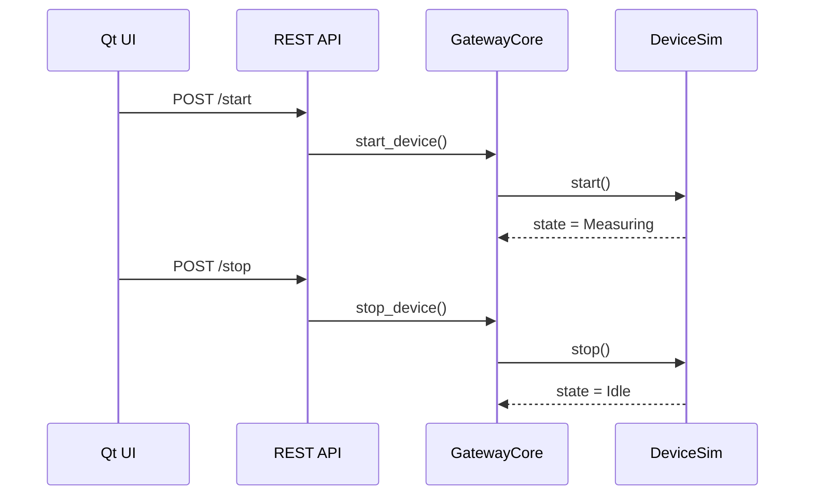

# TelemetryHub

**TelemetryHub** is a small, end-to-end system that simulates a real-world telemetry platform:

- A **virtual device** producing sensor data.
- A **gateway service** that collects, processes, and exposes the data.
- An optional **Qt desktop app** that monitors and controls the device.
- Backed by **C++20**, RAII, pImpl, CMake/CTest, threads, state machines, and basic secure coding practices.

The project is designed both as a **learning sandbox** and a **portfolio piece** that mirrors real work:
embedded devices, networking/REST, performance, testing, and clean architecture.

---

## Goals

- Practice **modern C++** (RAII, move semantics, pImpl, threading).
- Model **embedded / IoT** patterns: state machines, safe-state logic, simulated UART/serial.
- Implement **gateway & REST** concepts: producer–consumer queues, local API, optional cloud client.
- Build a **Qt desktop UI** for monitoring/controlling the simulated device.
- Demonstrate **tooling**: CMake, CTest, unit tests, profiling, and CI skeletons.
- Create a coherent **project story** you can use in interviews.

---

## Big Picture

At a high level:

- The **DeviceSim** behaves like a sensor/measurement device (e.g., industrial sensor, medical instrument).
- The **Gateway**:
  - Pulls samples from the device in a background thread.
  - Queues and processes them.
  - Exposes the latest data and state via a local REST API.
  - Optionally forwards data to a “cloud” client interface.
- The **GUI** periodically queries the gateway and lets a user start/stop measurements.

### High-Level Architecture

```mermaid
flowchart LR
    subgraph Device Layer
        D[DeviceSim\n(C++ library)]
    end

    subgraph Gateway Layer
        GC[GatewayCore\n(threads, queue)]
        Q[TelemetryQueue]
        REST[REST API\n(local HTTP)]
        CLOUD[ICloudClient\n(optional cloud)]
    end

    subgraph Presentation Layer
        GUI[Qt Desktop UI]
        CLI[Gateway CLI\n(console)]
    end

    D -- samples --> GC
    GC --> Q
    Q --> GC
    GC --> REST
    GC --> CLOUD
    GUI <-- HTTP/Client --> REST
    CLI --> GC
````

---

## Components

### 1. Device (DeviceSim)

Located in `device/`.

**Responsibilities**

* Simulates an embedded device with a clear state machine:

  * `Idle` → `Measuring` → `Error` → `SafeState` → `Idle` (etc.).
* Produces `TelemetrySample` objects with:

  * Timestamp
  * Value
  * Unit
  * Sequence ID
* Encapsulates implementation via **pImpl**:

  * Public header stays stable (ABI/API separation).
* Uses **RAII** helpers for any low-level resources (files, simulated serial, etc.).

**Key types**

* `telemetryhub::device::Device`
* `telemetryhub::device::DeviceState`
* `telemetryhub::device::TelemetrySample`
* `telemetryhub::device::FileHandle` (RAII wrapper for `FILE*`)

---

### 2. Gateway

Located in `gateway/`.

**Responsibilities**

* Owns a `Device` and controls it (start/stop, error handling, safe-state).
* Runs threads to:

  * Poll the device for new samples.
  * Push samples into a **TelemetryQueue**.
  * Pop samples and maintain the “latest” value.
* Exposes:

  * A local **REST API** for status and control.
  * Optional **cloud client** (`ICloudClient` interface) for pushing data upstream.
* Implements basic **security hygiene**:

  * Input validation on API calls.
  * Simple logging of errors and suspicious inputs.

**Key types**

* `telemetryhub::gateway::TelemetryQueue`

  * Thread-safe queue using `std::mutex` + `std::condition_variable`.
* `telemetryhub::gateway::GatewayCore`

  * Wraps the producer/consumer threads and links device ↔ queue ↔ API.
* `telemetryhub::gateway::ICloudClient` (interface)
* `telemetryhub::gateway::RestCloudClient` (dummy implementation, logs or calls HTTP)

---

### 3. GUI (Qt Desktop App)

Located in `gui/` (optional, controlled by `BUILD_GUI` option).

**Responsibilities**

* Polls the gateway for:

  * Current device state.
  * Latest telemetry value.
  * Error/safe-state information.
* Provides controls:

  * Start / stop measurement.
  * Optional “reset” or “simulate error” actions.
* Uses a worker mechanism (thread/timer) so:

  * The UI remains responsive.
  * Network / I/O is done off the main thread.

**Key types**

* `MainWindow` (QMainWindow subclass)
* Background task / timers to fetch and display telemetry.

---

### 4. Tests & Tools

Located in `tests/` and `tools/`.

**Tests**

* Unit tests for:

  * Device state transitions.
  * TelemetryQueue producer–consumer behaviour.
  * Error handling and safe-state transitions.
* Integrated with **CTest**; can be run via `ctest`.

**Tools**

* `raii_demo`: small utility demonstrating RAII usage with `FileHandle`.
* `perf_tool`: benchmarking/perf harness for a “hot path” (e.g., telemetry filtering).
* `run_ci.sh`, `run_ci.bat`: simple scripts to simulate CI (configure → build → test).

---

## Data Flow

### Telemetry Path

```mermaid
sequenceDiagram
    participant Dev as DeviceSim
    participant Gate as GatewayCore
    participant Q as TelemetryQueue
    participant API as REST API
    participant GUI as Qt UI

    Dev->>Gate: read_sample()
    Gate->>Q: push(sample)
    Q-->>Gate: pop(sample)
    Gate->>Gate: update latest_sample

    GUI->>API: GET /status
    API->>Gate: query state + latest_sample
    Gate-->>API: state + sample
    API-->>GUI: JSON response
    GUI->>GUI: update labels/graphs
```

### Control Path (Start/Stop)



---

## Build & Run

### Prerequisites

* **C++20** capable compiler:

  * MSVC (Visual Studio 2022) on Windows.
  * g++/clang on Linux/WSL.
* **CMake** ≥ 3.20.
* Optional:

  * **Qt 6** (for the GUI).
  * **GoogleTest** (if not fetched automatically).

---

### Windows (Visual Studio)

From the repo root:

```bash
cmake -S . -B build_vs -G "Visual Studio 17 2022"
cmake --build build_vs --config Debug
```

Running the basic demo:

```bash
build_vs/Debug/raii_demo.exe
```

Running the gateway app (once implemented):

```bash
build_vs/Debug/gateway_app.exe
```

You can also open `build_vs/TelemetryHub.sln` directly in Visual Studio.

---

### Linux / WSL (Ninja)

From the repo root:

```bash
cmake -S . -B build_ninja -G Ninja
cmake --build build_ninja
ctest --test-dir build_ninja
```

Run the gateway app:

```bash
./build_ninja/gateway/gateway_app
```

---

## Project Roadmap (Learning-Oriented)

This project is meant to grow incrementally. A possible roadmap:

### Phase 1 – Core foundations

* [ ] RAII utilities (FileHandle, possibly others).
* [ ] `Device` class with pImpl.
* [ ] Basic state machine: Idle / Measuring / Error / SafeState.
* [ ] `TelemetryQueue` with producer–consumer threads.
* [ ] Unit tests (Device state, queue behaviour).

### Phase 2 – Gateway & REST

* [ ] `GatewayCore` wiring device ↔ queue ↔ “latest sample”.
* [ ] Simple console gateway app.
* [ ] Local REST API: `/status`, `/start`, `/stop`.
* [ ] Input validation, simple logging.
* [ ] `ICloudClient` interface + dummy `RestCloudClient`.

### Phase 3 – GUI & UX

* [ ] Qt GUI app with:

  * [ ] State display.
  * [ ] Latest value display.
  * [ ] Start/stop buttons.
* [ ] Background refresh (timer + worker pattern).
* [ ] Error and safe-state indicators.

### Phase 4 – Embedded & Robustness Flavour

* [ ] Simulated serial/UART driver and commands.
* [ ] Fault injection (random sensor errors, communication loss).
* [ ] Safe-state transitions and associated tests.
* [ ] Configuration system (sampling rate, queue size, log level).

### Phase 5 – Tooling & Performance

* [ ] Perf harness for a hot path (e.g., filters/statistics).
* [ ] Basic profiling run + micro-optimisation.
* [ ] Simple CI script / YAML to run build + tests.

You don’t have to do everything at once; each step is meaningful on its own.

---

## How This Maps to Interview Topics

TelemetryHub is intentionally aligned with common interview themes:

* **Modern C++**

  * RAII (`FileHandle`, resource wrappers).
  * Move semantics, ownership patterns.
  * pImpl, ABI/API stability (`Device`).

* **Concurrency**

  * Producer–consumer with `std::thread`, `std::mutex`, `std::condition_variable`.
  * Thread pool extensions in the gateway.
  * Discussion around data races, deadlocks, safe shutdown.

* **Embedded / IoT**

  * State machines and safe-state logic.
  * Simulated UART driver and commands.
  * Config + error handling patterns familiar from industrial / medical devices.

* **Networking & REST**

  * Gateway as a small service exposing HTTP endpoints.
  * Cloud client abstractions for pushing telemetry.
  * Input validation and basic security measures.

* **Qt / UI**

  * Separation of UI and backend logic.
  * Asynchronous updates and non-blocking UI patterns.
  * Simple graphs/labels reflecting real-time data.

* **Tooling & Quality**

  * CMake/CTest project structure.
  * Unit tests and testability via interfaces.
  * Profiling and micro-optimisation habits.
  * CI-friendly build/test layout.

---

## Status

> This project is under active development as a **personal learning and interview-prep tool**.
> Features and structure may change as new ideas are explored or specific interview topics are targeted.
