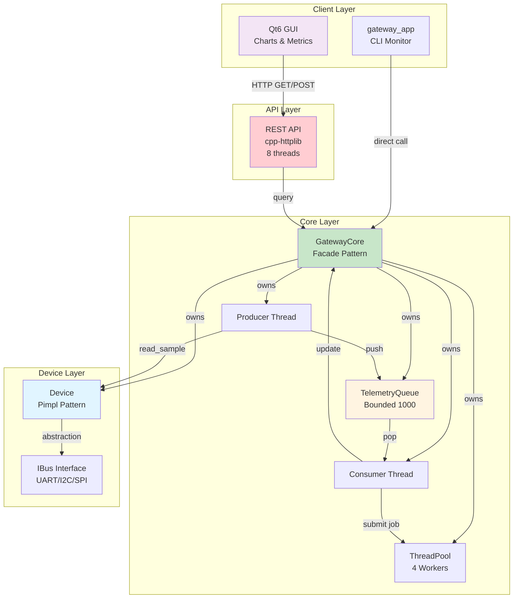

# Telemetry Gateway – Architecture Overview

**Last Updated:** January 2, 2026  
**Version:** 6.2.0  
**For Detailed Code Flow:** See [CODE_FLOW_INTERVIEW_GUIDE.md](CODE_FLOW_INTERVIEW_GUIDE.md)

This project is a production-ready telemetry gateway that sits between simulated/real devices and multiple clients (CLI app, REST API, Qt6 GUI). It continuously reads measurements from devices, tracks the latest value and device state, and exposes this information to the outside world in a thread-safe, performant manner.

## Core Design Principles

- **Decouple device I/O from consumers** using a producer–consumer pattern with bounded queue
- **Keep the public interface simple**: GatewayCore exposes `start()`, `stop()`, `device_state()`, `latest_sample()`, `get_metrics()`
- **Thread Safety**: Mutex for complex types, atomics for simple counters, condition variables for coordination
- **Performance**: 3,720 req/s REST API throughput, p99 <500ms latency, zero-copy move semantics
- **Detect SafeState** and stop monitoring cleanly with graceful shutdown
- **RAII Everywhere**: Threads, file handles, locks managed automatically

---

## High-Level Design



There are four main layers:

1. **Device layer** - Hardware abstraction and simulation
2. **Core layer** - Threading, queue, metrics, state management
3. **API layer** - REST endpoints for external access
4. **Client layer** - CLI and Qt6 GUI consumers

---

## Components

### Device (`Device`)

**Design Pattern:** Pimpl (Pointer to Implementation) for ABI stability

- Represents the underlying hardware or a simulator using `Device::Impl` opaque pointer
- Periodically produces telemetry samples with realistic noise (`std::normal_distribution`)
- Internal **state machine**:
  - `Idle` – device created but not started
  - `Measuring` – normal operation, samples produced every 100ms
  - `SafeState` – fault/safety condition, no more sampling
- Hardware abstraction via `IBus` interface (Strategy pattern):
  - `SerialPortSim` - simulated UART
  - Can add `I2CBus`, `SPIBus` implementations
- Fault injection modes for testing:
  - `None` - normal operation
  - `Random` - probabilistic failures
  - `Intermittent` - consecutive failure threshold  
  - `Deterministic` - fault after N samples
- Move semantics: Samples moved, not copied (zero-copy)

The device doesn't know about queues, threads, or UIs. It provides a clean `read_sample()` interface.

**Key Implementation Details:**
```cpp
std::optional<TelemetrySample> read_sample();  // Returns nullopt on error
DeviceState state() const;                     // Atomic read
void inject_fault(FaultInjectionMode, double probability);
```

---

### TelemetryQueue

- A **bounded** queue (capacity 1000) used to pass samples from producer thread to consumer thread
- Uses `std::deque<TelemetrySample>` with mutex and condition variable for thread synchronization
- Supports operations:
  - `push(sample)` – producer adds samples (blocks if queue full - **backpressure**)
  - `pop()` – consumer retrieves samples (blocks if queue empty)
  - `try_push(sample, timeout)` – non-blocking with timeout
  - `try_pop(timeout)` – non-blocking with timeout
  - `size()`, `capacity()` – monitoring
- Pre-allocated capacity prevents runtime heap allocations
- Move semantics ensure zero-copy sample transfer

The queue decouples "how fast the device produces data" from "how fast the rest of the system consumes it". The bounded nature prevents unbounded memory growth and provides backpressure when consumers can't keep up.

---

### ThreadPool (Day 17 Addition)

- **4 worker threads** (configurable, defaults to `std::thread::hardware_concurrency()`)
- Job queue with `std::function<void()>` for async task execution
- Used for non-critical work like cloud uploads, aggregations, logging
- Prevents spawning threads per request (thread reuse)
- Metrics exposed: `jobs_processed`, `jobs_queued`, `avg_processing_ms`, `num_threads`
- RAII: Destructor waits for all jobs to complete before joining workers

**Pattern:** Object pool for threads, prevents overhead of thread creation/destruction

---

### GatewayCore

`GatewayCore` is the heart of the system. It:

- Owns:
  - The `Device`
  - The `TelemetryQueue`
  - Internal threads (producer/consumer)
  - The current `state` and `latest_sample`

- Provides a **simple public API** to the outside world:
  - `start()`
  - `stop()`
  - `device_state()`
  - `latest_sample()`

Internally, `GatewayCore` runs two main loops:

1. **Producer thread**
   - Reads from the `Device` in a loop.
   - For each iteration:
     - Calls something like `device.read_sample()` / `poll()`.
     - Pushes the sample into `TelemetryQueue`.
   - When the `Device` transitions to `SafeState`, the producer stops producing and exits.

2. **Consumer thread**
   - Pops samples from `TelemetryQueue`.
   - Updates:
     - `latest_sample`
     - `state` (for example, based on device state or special conditions)
   - This is what keeps `GatewayCore`’s public view (`state`, `latest_sample`) up to date.

The rest of the system never talks directly to the `Device`. It only talks to `GatewayCore`, which hides threading and device I/O behind a simple interface.

---

### gateway_app (CLI)

`gateway_app` is a simple command-line program that drives the core. Its main responsibilities:

1. Startup:
   - Print a banner (e.g. “Starting TelemetryHub gateway_app…”).
   - Create a `GatewayCore` instance.
   - Call `core.start()`, which:
     - Starts the device.
     - Launches the producer and consumer threads.

2. Monitoring loop:
   - In a loop (e.g. once per second):
     - Call `core.device_state()` and `core.latest_sample()`.
     - Log the current tick, state, and latest sample.
   - Example from the logs:
     - `[tick 0] state=Measuring | no sample yet`
     - `[tick 1] state=SafeState | latest sample #7 value=42.7 arb.units`

3. SafeState handling:
   - As soon as it sees `state == SafeState`:
     - Log “Device reached SafeState, breaking monitoring loop.”
     - Break out of the monitoring loop.

4. Shutdown:
   - Call `core.stop()`, which:
     - Stops the consumer and producer.
     - Stops the device.

This simple loop demonstrates **how a client can safely interact with `GatewayCore`** without worrying about threads or low-level device I/O.

---

### REST API (Planned / Designed)

The design includes a REST API layer that sits on top of `GatewayCore` and exposes telemetry over HTTP.

Typical interaction (see `telemetry_path.mmd`):

- `Qt UI` → `REST API` → `GatewayCore`

Example flow:

1. **Qt UI** calls:
   - `GET /status`
2. **REST API** handler:
   - Calls `core.device_state()` and `core.latest_sample()`.
3. **GatewayCore** returns:
   - `state` + `latest_sample`
4. **REST API** returns JSON:
   - e.g. `{ "state": "Measuring", "sample": { "id": 7, "value": 42.71 } }`
5. **Qt UI**:
   - Updates labels, graphs, etc.

This keeps the UI stateless and the core logic centralized in `GatewayCore`.

---

### Qt UI (Planned / Designed)

- A Qt-based GUI that:
  - Periodically calls the REST API (`GET /status`).
  - Displays:
    - Device state (e.g. Measur­ing / SafeState).
    - Latest sample value(s).
    - Possibly a history chart.

The GUI never talks directly to `Device` or `GatewayCore`.  
It only calls the API, which makes it easy to change internals without breaking the UI.

---

## Data Flow – Telemetry Path

See `docs/mermaid/Telemetry Path_day12.mmd` (Mermaid sequence diagram) for the current Day 12 view including the Qt GUI’s 1s polling via QNetworkAccessManager.

Logical path:

1. `Device` (or `DeviceSim`) generates samples.
2. `GatewayCore` receives samples via the producer/consumer mechanism and updates `latest_sample`.
3. Clients (CLI, REST API, Qt UI) query `GatewayCore` for:
   - `device_state()`
   - `latest_sample()`

---

## Control Flow – Lifecycle

See `docs/mermaid/Control flow_day12.mmd` for the updated start/stop flow and periodic status polling.

For a high-level component view, also see `docs/mermaid/High level diagram_day12.mmd`.

High-level control flow:

1. User starts the program:
   - `User -> gateway_app -> GatewayCore -> Device`

2. `gateway_app` monitoring loop:
   - Calls `device_state()` + `latest_sample()` in a loop.
   - Logs or displays the current state and sample.

3. When `GatewayCore` reports `SafeState`:
   - `gateway_app` logs “Device reached SafeState”  
   - Breaks out of the monitoring loop.

4. Shutdown:
   - `gateway_app` calls `core.stop()`.
   - `GatewayCore` stops threads and stops the `Device`.

This gives a clean, predictable lifecycle:
- Start → Run → Hit SafeState → Stop.

---

## States and SafeState

The core concept is the **SafeState**:

- The device or system has reached a condition where normal operation should stop.
- Once in `SafeState`:
  - Producer stops generating samples.
  - `GatewayCore` reports `state = SafeState`.
  - Clients (e.g. `gateway_app`) can react appropriately:
    - Show a message.
    - Stop monitoring.
    - Trigger alerts or further actions.

This pattern mimics real systems where devices have safety or fault states and the rest of the software must handle them gracefully.

---

## Summary

- The **Device** generates telemetry and can switch to `SafeState`.
- **GatewayCore**:
  - Owns the device.
  - Uses producer/consumer threads to keep `latest_sample` and `state` up to date.
  - Exposes a simple, thread-safe API: `start()`, `stop()`, `device_state()`, `latest_sample()`.

- **Clients**:
  - `gateway_app` (CLI) demonstrates a simple monitoring loop.
  - A REST API + Qt UI are designed to sit on top using `GET /status`.

The design shows how to:
- Wrap a device in a clean C++ core.
- Use a queue and threads to decouple sampling from consumption.
- Provide a simple façade for other components (apps, APIs, UIs) to use.
