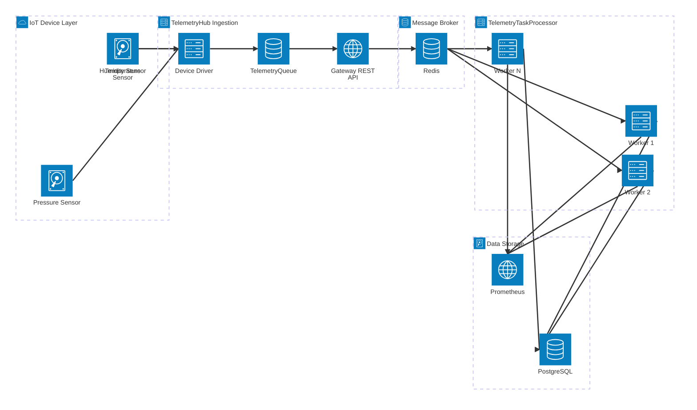
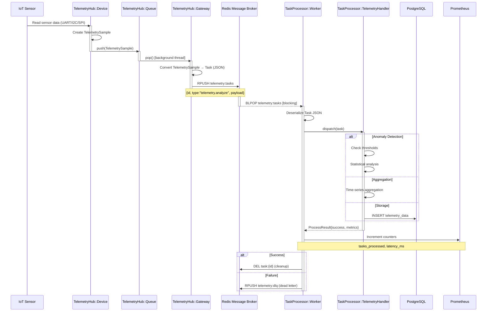
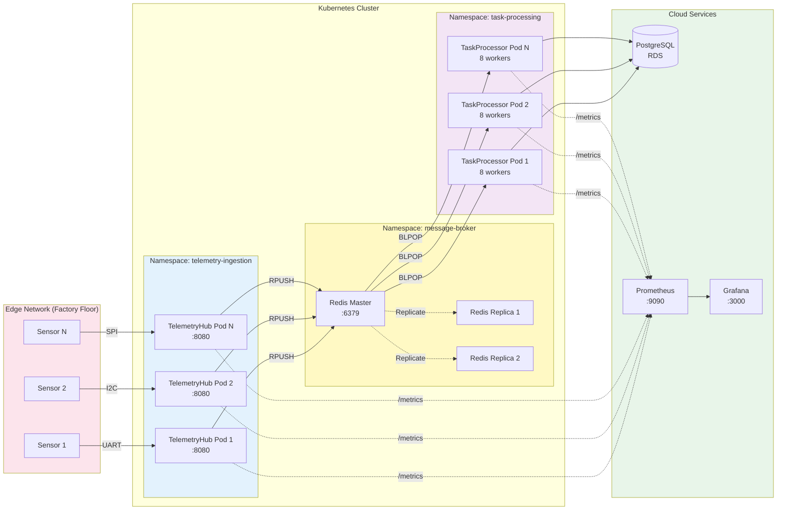
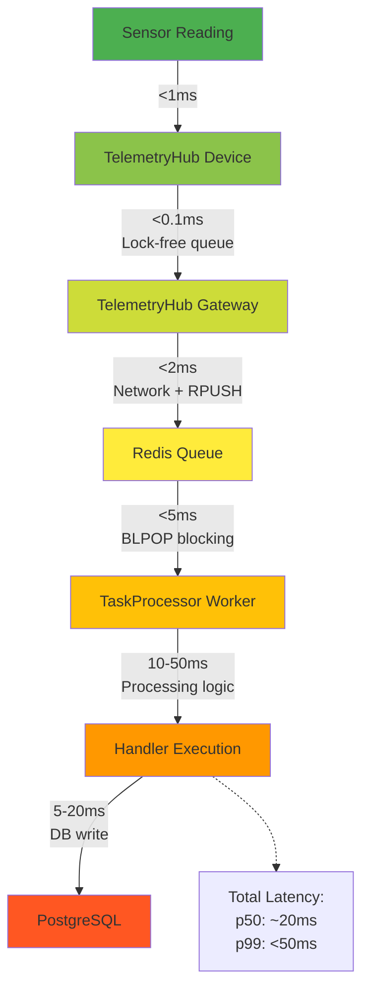
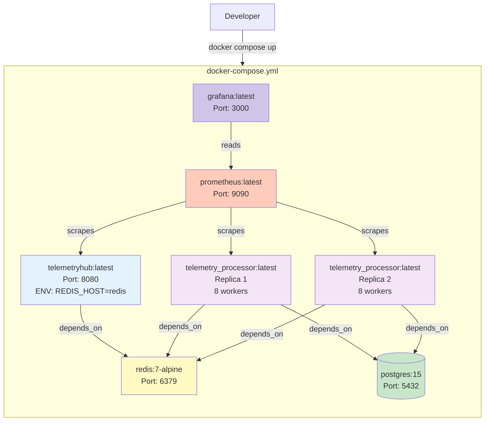
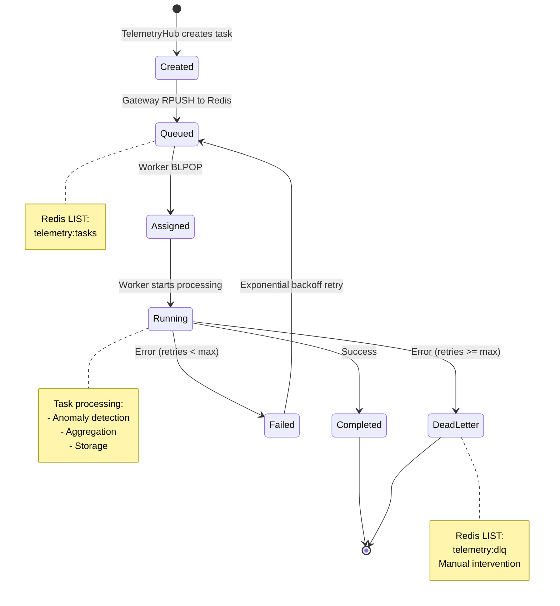

# TelemetryHub + TelemetryTaskProcessor Integration Diagram

## High-Level Architecture



## Detailed Data Flow



## Component Integration View

```mermaid
flowchart TB
    subgraph TelemetryHub["TelemetryHub (Data Ingestion)"]
        direction TB
        A[Device Layer<br/>UART/I2C/SPI] --> B[TelemetrySample Generator<br/>9.1M ops/sec]
        B --> C[Thread-Safe Queue<br/>Bounded/Unbounded]
        C --> D[Gateway Core<br/>REST API]
        D --> E[Redis Publisher<br/>NEW COMPONENT]
    end
    
    subgraph Redis["Redis (Message Broker)"]
        direction TB
        F[Task Queue<br/>LIST: telemetry:tasks]
        G[Dead Letter Queue<br/>LIST: telemetry:dlq]
        H[Task State<br/>HASH: task:{id}]
    end
    
    subgraph TelemetryTaskProcessor["TelemetryTaskProcessor (Async Processing)"]
        direction TB
        I[Redis Client<br/>BLPOP consumer]
        I --> J[Task Dispatcher<br/>Priority routing]
        J --> K[Worker Pool<br/>8 workers]
        K --> L1[TelemetryHandler<br/>Analyze]
        K --> L2[TelemetryHandler<br/>Anomaly Detect]
        K --> L3[TelemetryHandler<br/>Aggregate]
    end
    
    subgraph Downstream["Downstream Systems"]
        direction TB
        M[PostgreSQL<br/>Time-series data]
        N[Prometheus<br/>Metrics]
        O[Alert Service<br/>Notifications]
    end
    
    E -->|RPUSH| F
    F -->|BLPOP| I
    K -->|Failed tasks| G
    
    L1 --> M
    L2 --> O
    L3 --> M
    
    K --> N
    D --> N
    
    style E fill:#ff6b6b
    style I fill:#ff6b6b
    style TelemetryHub fill:#e3f2fd
    style TelemetryTaskProcessor fill:#f3e5f5
    style Redis fill:#fff9c4
    style Downstream fill:#e8f5e9
```

## Deployment Architecture



## Performance Profile



## Docker Compose Setup



## Task State Machine



## Key Integration Points

| Component | Technology | Purpose | Performance |
|-----------|-----------|---------|-------------|
| **TelemetryHub Device** | C++20, UART/I2C/SPI | Sensor data collection | 9.1M ops/sec |
| **TelemetryHub Gateway** | C++20, cpp-httplib | REST API, Redis publisher | 50k req/sec |
| **Redis** | Redis 7.x | Message broker, task queue | 100k ops/sec |
| **TelemetryTaskProcessor** | C++17, redis++ | Async task processing | 10k tasks/sec |
| **Worker Pool** | C++17, std::thread | Concurrent processing | 8-16 workers |
| **PostgreSQL** | PostgreSQL 15 | Time-series storage | 10k writes/sec |
| **Prometheus** | Prometheus 2.x | Metrics collection | Real-time monitoring |

---

**Integration Benefits:**
- ✅ Decoupled architecture (loosely coupled via Redis)
- ✅ Horizontal scalability (scale ingestion & processing independently)
- ✅ High throughput (9.1M ingestion + 10k processing)
- ✅ Fault tolerance (Redis persistence, task retries, DLQ)
- ✅ Observability (Prometheus metrics, structured logging)
- ✅ Production-ready (Docker Compose, K8s deployment)

**Next Steps:**
1. Implement RedisPublisher in TelemetryHub Gateway
2. Create TelemetryHandler in TelemetryTaskProcessor
3. Set up Docker Compose environment
4. Integration testing with real Redis
5. Load testing (1M telemetry samples/sec)
