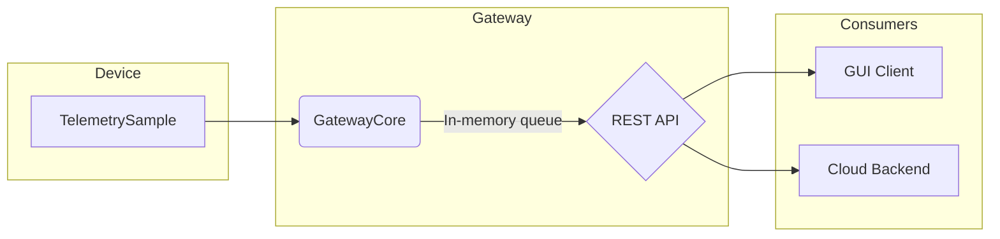

# TelemetryHub System Overview

**Project Repository**: [amareshkumar/telemetryhub](https://github.com/amareshkumar/telemetryhub)

This document provides a high-level overview of the TelemetryHub system, including its architecture, threading model, and error handling strategies. It's intended as a technical introduction for new developers and a reference for system design discussions.

## Architecture

The TelemetryHub system is designed to be a modular and scalable platform for collecting, processing, and distributing telemetry data from various devices. The core components are the Device, Gateway, and Consumers (GUI and Cloud).

### Components

*   **Device**: Represents the source of telemetry data. It produces `TelemetrySample` objects containing sensor readings and other metrics. In our current implementation, this is simulated, but it's designed to represent a real-world IoT device or sensor array.

*   **GatewayCore**: The heart of the system. It receives telemetry samples from devices and pushes them into a thread-safe, in-memory queue (`TelemetryQueue`). This component decouples data ingestion from data consumption.

*   **REST API**: Exposes endpoints for consumers to retrieve telemetry data. It fetches data from the `GatewayCore`'s queue. This allows for multiple, disparate clients to access the data in a standardized way.

*   **Consumers**:
    *   **GUI Client**: A graphical user interface (built with Qt) that visualizes the telemetry data in real-time by polling the REST API.
    *   **Cloud Backend**: A hypothetical consumer representing a cloud service that would pull data from the REST API for long-term storage, analysis, or alerting.

## Threading Overview

Concurrency is a critical aspect of TelemetryHub, ensuring that data ingestion from devices does not block data consumption by clients.

*   **Device Thread(s)**: Each device (or data source) is expected to run in its own thread. In our simulation, we have a main thread that generates data, but in a real-world scenario, you could have multiple threads for multiple devices. These threads are the **producers**.

*   **GatewayCore's `TelemetryQueue`**: This is the primary synchronization point. It is a thread-safe queue that uses a `std::mutex` to protect its internal `std::queue`.
    *   **Producers** (`Device` threads) call `TelemetryQueue::push()`. This locks the mutex, adds a `TelemetrySample` to the queue, and then unlocks the mutex.
    *   **Consumers** (via the REST API) will eventually cause a call to `TelemetryQueue::pop()` (or a similar retrieval method). This also locks the mutex to safely remove an item from the queue.

*   **REST API Thread Pool**: The web server hosting the REST API (e.g., using a library like `httplib.h`) typically manages a pool of worker threads to handle incoming HTTP requests. When a request comes in to fetch telemetry data, one of these threads will interact with the `GatewayCore`.

This producer-consumer pattern allows the system to handle bursts of data from devices without losing samples, as they can be buffered in the queue.

## Error Handling & Safe State

The system is designed to be resilient and fail gracefully.

*   **File Handles (`FileHandle.cpp`)**: The `device` component uses a RAII (Resource Acquisition Is Initialization) wrapper for file handles. The `FileHandle` class ensures that a file is automatically closed when the object goes out of scope, even if an exception is thrown. This prevents resource leaks.

*   **Thread Safety**: The primary mechanism for maintaining a safe state is the `TelemetryQueue`'s mutex. By ensuring that only one thread can modify the queue at a time, we prevent data corruption, race conditions, and inconsistent states.

*   **Bounded Queue (Future Enhancement)**: Currently, the in-memory queue is unbounded. In a production scenario, this could lead to excessive memory usage if consumers fall behind producers. A key improvement would be to make the queue bounded.
    *   When the queue is full, a `push` operation could either:
        1.  **Block**: The producer thread waits until space is available. This is simple but can halt data collection.
        2.  **Drop Oldest Data**: Discard the oldest sample to make room for the new one. This is often acceptable for real-time telemetry where the latest data is most valuable.
        3.  **Return an Error**: Immediately return an error to the producer, letting it decide how to handle the situation (e.g., retry, log the error).

*   **REST API Robustness**: The REST server should handle errors gracefully, such as returning appropriate HTTP status codes (e.g., `204 No Content` if the queue is empty, `500 Internal Server Error` for unexpected issues).

## Interview Dry-Run: Explaining TelemetryHub

**(Imagine you are asked in an interview: "Can you tell me about a recent project you've worked on?")**

"Absolutely. I've been developing a project called TelemetryHub, which is a C++-based platform for ingesting, processing, and distributing telemetry data from IoT devices.

**The core problem** it solves is decoupling high-frequency data producers from the various consumers that need the data. For example, you might have sensors sending updates multiple times per second, but a GUI dashboard that only needs to refresh every few seconds, and a cloud backend that archives data in batches.

**The architecture** is based on a producer-consumer pattern. I have a central `GatewayCore` component that exposes a thread-safe, in-memory queue. Simulated 'Device' clients run in their own threads and act as producers, pushing `TelemetrySample` data into this queue.

On the other side, I've implemented a lightweight REST API that acts as the primary access point for consumers. This API pulls data from the gateway's queue. This design is highly extensible; right now, I have a Qt-based GUI client that polls the API to display real-time data, but you could easily add a cloud service, a data logger, or an alerting system as another consumer.

**From a technical standpoint**, I focused on modern C++ practices. For instance, I used RAII principles for resource management, like a custom `FileHandle` class to ensure files are always closed, even in the presence of exceptions. The core `TelemetryQueue` uses `std::mutex` for thread safety, and I've even implemented move semantics with an rvalue-reference overload for the `push` method to optimize performance by avoiding unnecessary copies on the hot path.

The build system is managed with CMake, using presets for different configurations like release, and even builds with sanitizers like ASAN and TSan, which are run in our CI pipeline on GitHub Actions.

Overall, it's been a great project for applying principles of concurrent system design, API development, and modern C++ best practices in a practical, end-to-end system."
